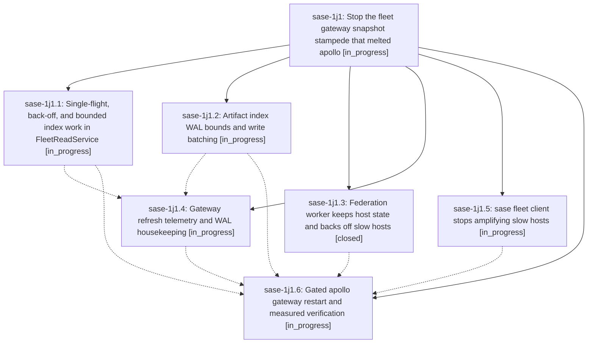

# Bead: sase-1j1 — Stop the fleet gateway snapshot stampede that melted apollo

[Bead Pages](../README.md) / sase-1j1

**Status:** ◐ in_progress · **Type:** ▸ plan · **Tier:** epic
**Owner:** `bryanbugyi34@gmail.com` · **Created by:** [bbugyi200.athena.0yx](https://github.com/sase-org/sase--agents/blob/main/sessions/bbugyi200.athena.0yx.md) · **Assignee:** `sase-1j1.land`
**Created:** 2026-10-09 09:31:11 EDT
**Plan:** [202610/apollo\_gateway\_snapshot\_stampede.md](https://github.com/sase-org/sase--plans/blob/main/202610/apollo_gateway_snapshot_stampede.md)

<!-- sase:links:start -->

## Links

| Relation | Artifact | Why |
| --- | --- | --- |
| implemented-by | [plan:202610/apollo_gateway_snapshot_stampede.md][1] | derived from the plan's `bead_id:` frontmatter field |

[1]: https://github.com/sase-org/sase--plans/blob/main/202610/apollo_gateway_snapshot_stampede.md

<!-- sase:links:end -->

## Description

A slow fleet snapshot rebuild can no longer multiply into hundreds of concurrent index-scanning threads. The gateway runs at most one rebuild per scope, always keeps late results, backs off after failures, bounds its artifact-index work, and logs every build. The artifact index keeps its WAL bounded. Remote clients stop amplifying a slow host. apollo's gateway is restarted only after measurements show it stays healthy under athena's real polling.

## Phases

| Bead | Title | Status | Size | Created | Agents | Commits |
|---|---|---|---|---|---:|---:|
| [sase-1j1.1](sase-1j1.1.md) | Single-flight, back-off, and bounded index work in FleetReadService | ◐ in_progress | medium | 2026-10-09 | 1 | 0 |
| [sase-1j1.2](sase-1j1.2.md) | Artifact index WAL bounds and write batching | ◐ in_progress | medium | 2026-10-09 | 1 | 0 |
| [sase-1j1.3](sase-1j1.3.md) | Federation worker keeps host state and backs off slow hosts | ✓ closed | medium | 2026-10-09 | 1 | 1 |
| [sase-1j1.4](sase-1j1.4.md) | Gateway refresh telemetry and WAL housekeeping | ◐ in_progress | small | 2026-10-09 | 1 | 0 |
| [sase-1j1.5](sase-1j1.5.md) | sase fleet client stops amplifying slow hosts | ◐ in_progress | medium | 2026-10-09 | 1 | 0 |
| [sase-1j1.6](sase-1j1.6.md) | Gated apollo gateway restart and measured verification | ◐ in_progress | small | 2026-10-09 | 1 | 0 |

## Lineage

## Agents

| Agent | Bead | Commits |
|---|---|---:|
| [bbugyi200.athena.sase-1j1.1](https://github.com/sase-org/sase--agents/blob/main/agents/bbugyi200.athena.sase-1j1.1/README.md) | [sase-1j1.1](sase-1j1.1.md) | 0 |
| [bbugyi200.athena.sase-1j1.2](https://github.com/sase-org/sase--agents/blob/main/agents/bbugyi200.athena.sase-1j1.2/README.md) | [sase-1j1.2](sase-1j1.2.md) | 0 |
| [bbugyi200.athena.sase-1j1.3](https://github.com/sase-org/sase--agents/blob/main/agents/bbugyi200.athena.sase-1j1.3/README.md) | [sase-1j1.3](sase-1j1.3.md) | 1 |
| [bbugyi200.athena.sase-1j1.4](https://github.com/sase-org/sase--agents/blob/main/agents/bbugyi200.athena.sase-1j1.4/README.md) | [sase-1j1.4](sase-1j1.4.md) | 0 |
| [bbugyi200.athena.sase-1j1.5](https://github.com/sase-org/sase--agents/blob/main/sessions/bbugyi200.athena.sase-1j1.5.md) | [sase-1j1.5](sase-1j1.5.md) | 0 |
| [bbugyi200.athena.sase-1j1.6](https://github.com/sase-org/sase--agents/blob/main/agents/bbugyi200.athena.sase-1j1.6/README.md) | [sase-1j1.6](sase-1j1.6.md) | 0 |
| [bbugyi200.athena.sase-1j1.land](https://github.com/sase-org/sase--agents/blob/main/agents/bbugyi200.athena.sase-1j1.land/README.md) | [sase-1j1](README.md) | 0 |

## Commits

| Repo | Commit | Subject | Bead | Committed |
|---|---|---|---|---|
| sase-core | [`sase-core@6e56fd5`](https://github.com/sase-org/sase-core/commit/6e56fd514d0a1c1baee5c9edd347bb5921a99238) | fix(federation-worker): keep host state across replace\_config and back off slow hosts | [sase-1j1.3](sase-1j1.3.md) | 2026-10-09 10:18:34 EDT |
