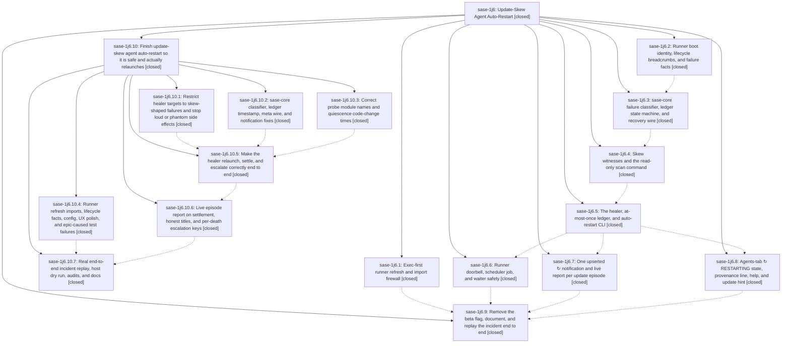

# Bead: sase-1j6 — Update-Skew Agent Auto-Restart

[Bead Pages](../README.md) / sase-1j6

**Status:** ✓ closed · **Resolution:** done · **Type:** ▸ plan · **Tier:** epic
**Owner:** `bryanbugyi34@gmail.com` · **Created by:** [bbugyi200.athena.research.47.linker.w0](https://github.com/sase-org/sase--agents/blob/main/sessions/bbugyi200.athena.research.47.linker.w0.md) · **Assignee:** `sase-1j6.land`
**Created:** 2026-10-09 15:02:04 EDT · **Closed:** 2026-10-10 15:21:13 EDT
**Plan:** [202610/update\_skew\_agent\_auto\_restart.md](https://github.com/sase-org/sase--plans/blob/main/202610/update_skew_agent_auto_restart.md)

<!-- sase:links:start -->

## Links

| Relation | Artifact | Why |
| --- | --- | --- |
| implemented-by | [plan:202610/update_skew_agent_auto_restart.md][1] | derived from the plan's `bead_id:` frontmatter field |

_Plus 4 automatic references — see [Referenced By](#referenced-by)._

[1]: https://github.com/sase-org/sase--plans/blob/main/202610/update_skew_agent_auto_restart.md

<!-- sase:links:end -->

## Description

When a live sase update breaks a running agent before its model turn, sase puts it back once, under the same name, exactly as `,x` plus an unmodified submit would, and tells the user what it did and why in one calm amber ↻ story. Every other update-shaped failure is surfaced with its reason and never silently swallowed. The refresh-path bug behind the 2026-10-09 incident can no longer recur.

## Notes

[2026-10-10T03:23:49Z · sase-1j6.land] LAND TRIAGE (sase-1j6.land, 2026-10-09) of every child PROPOSED FOLLOW-UP: decisions-web record (all nine phases) -> new memory task sase-1ji (the auto decision had no human review). P1 import-recording test (1j6.9) -> sase-1jd. P2 release pinning (1j6.9) -> sase-1je. Post-provider resume-in-place (1j6.9) -> sase-1jf. Sunset llm_provider.retry.sase (1j6.9) -> sase-1jg. %auto parity for manual ,x and sase agent restart (1j6.9) -> sase-1jh. test_registry_rebuild_keeps_live_identity_pending_claim flake (1j6.2) -> +1 sase-1em. Vim containment gutter KeyError and focus leak (1j6.3) -> +1 sase-ni. DECLINED: the stale sase_core_rs wheel reports (1j6.1, 1j6.2, 1j6.6) are resolved, because the .venv sase_core_rs 0.37.2 exposes all 7 auto-restart bindings and those tests pass; the symvision leftovers (1j6.3, 1j6.4, 1j6.5, 1j6.7, 1j6.8) are resolved, the stage passes at HEAD, and only the refresh_episode_report epic-symbol remains, as epic work; the core pin bump (1j6.3) is resolved, because pin 4ffe48ce contains d4ad8c99; the zsh completion smoke timeout (1j6.3) has no node id and did not reproduce in the land check run. NOT PRE-EXISTING: the check failures that 1j6.6 note 3 and 1j6.9 note 7 called pre-existing were compared against bases that already contained earlier epic phases. Against the true pre-epic base 70c51adbdd, 10 of the 16 scoped-test failures are caused by the epic and 2 partly (completion snapshot x2, mutex groups, agents help sort, config schema, query-profile vocab, wire trailing field, marker mutation audit, timezone guard, pypi lock path; partly: marker path audit, TUI import budget), so they are epic work. The unrelated ones: bob dry-run -> new ci task sase-1jj; sudo canary flake -> +1 sase-1gh; detach watchdog and executor nested-run flakes -> new flake tasks sase-1jk and sase-1jl; non-epic import-budget growth -> +1 sase-1ic; session_root_tab audit rename -> +1 sase-1by. 1j6.7 notes 2 (refresh_episode_report on settlement) and 3 (episode row files) are unmet plan requirements and remain epic work.

[2026-10-10T03:24:04Z · sase-1j6.land] LAND VERIFICATION (sase-1j6.land, 2026-10-09): the epic is NOT complete. All 9 phases are closed, but source review plus the land check run (1cf7efd448d1a406baca9f3dc6a33bd4, 16 scoped failures) found these release-blocking defects. (1) The healer never relaunches: core returns defer/probe_pending without a W4 witness, and healer._heal_claimed defers on mode==defer even after the probe passes; every healer test injects classify=lambda relaunch. (2) resolve_pending_targets feeds every failed row and dismissed bundle from the last 7 days to the healer. Each non-skew decline claims a ledger record and loudly resurface_failure()s it. The disabled/paused path resurfaces every target on each 60 s full sweep. write_recovery's atomic_write_json mkdirs a dismissed or wiped artifacts dir back into existence, including after the relaunch wipe. Installing master would spam loud notifications and create phantom rows. (3) Doorbells are never deleted once claimed, so the job submits a healer proc every tick. (4) Ledger claimed_at and history[].at are always null, so max_defer_seconds, the 30-minute storm limit, and the crash-rule time bound are dead. (5) A replacement's second failure is swallowed (already_launched: no escalation, recovery stays pending). (6) The Rust AgentMetaWire lacks auto_restart, so provenance never reaches production rows. (7) Core classifier: a trailing slash on workspace_dir defeats workspace scoping (197/229 real rows), log_tail substrings make third-party ImportErrors look managed, and the unknown phase relaunches. (8) SASE_AUTO_RESTART_PROVENANCE is never scrubbed from the env, so children inherit it. (9) Probe module names come out as src.sase.* for the editable checkout. (10) Settlement never refreshes the episode report (the refresh_episode_report epic-symbol). Integration: non-epic commits since 6ac3dc734e (166e34eae9 %auto E1, 274c65ec53, eff003d6a9, 1291c48fe3, c836ee5071) do not conflict; the live-autonomy relaunch helper already reads the E1 record. Remaining work is planned as a child epic with parent_bead sase-1j6.

[2026-10-10T19:21:13Z · sase-1j6.10.land--1] NESTED LANDING RECHECK (tale land_update_skew_auto_restart, 2026-10-10): all 9 phases closed, child epic sase-1j6.10 closed with full close note this turn. All ten LAND VERIFICATION defects now fixed in source: (1) healer relaunches (re-classify/probe/env-scrub ordering; real-classifier + relaunch-once tests green); (2) targets restricted to skew-shaped rows, unified quiet_declines, write_recovery creates nothing; (3) doorbells deleted at claim/skip/decline, ticks go idle; (4) ledger timestamps live via core 31544120 + pin 96ccdb35 (all 7 bindings present in installed sase_core_rs) + at=timestamp_for; (5) replacement second failure escalates already_restarted, replay runs the launched path; (6) AgentMetaWire auto_restart provenance in core; (7) classifier slash scoping/substring/unknown-phase fixes in core; (8) provenance env scrubbed; (9) probe module names asserted independently; (10) settlement refreshes report+rows via the tick. Plus this turn's extra fix: ledger writers invalidate the mtime-gated cache (tmpfs freezes dir mtime on rewrites) with regression test. Post-child drift: origin/master is 62a8b95c72, one commit past the tale base e5e58ac3d5 (monitor frozen-outcome preservation, no auto-restart conflict); full auto-restart suites pass on this tree (153 TZ=UTC, 67 host-zone). Remaining reds are owned elsewhere, same list as the sase-1j6.10 close note (sase-1by/1jc/1jj/1ic, flakes 1gh/1jk/1jl, sase-1jc.9 sase-102 removal unmerged, sase-1jm symvision __getattr__). No epic-symbol rows for sase-1j6. Release follow-up: publishing the core bindings needs sase-core release-plz PR 325 (v0.38.0) merged by a human.

## Phases

| Bead | Title | Status | Size | Created | Agents | Commits |
|---|---|---|---|---|---:|---:|
| [sase-1j6.1](sase-1j6.1.md) | Exec-first runner refresh and import firewall | ✓ closed | small | 2026-10-09 | 1 | 1 |
| [sase-1j6.2](sase-1j6.2.md) | Runner boot identity, lifecycle breadcrumbs, and failure facts | ✓ closed | medium | 2026-10-09 | 1 | 1 |
| [sase-1j6.3](sase-1j6.3.md) | sase-core failure classifier, ledger state machine, and recovery wire | ✓ closed | medium | 2026-10-09 | 1 | 2 |
| [sase-1j6.4](sase-1j6.4.md) | Skew witnesses and the read-only scan command | ✓ closed | medium | 2026-10-09 | 1 | 1 |
| [sase-1j6.5](sase-1j6.5.md) | The healer, at-most-once ledger, and auto-restart CLI | ✓ closed | medium | 2026-10-09 | 1 | 1 |
| [sase-1j6.6](sase-1j6.6.md) | Runner doorbell, scheduler job, and waiter safety | ✓ closed | medium | 2026-10-09 | 1 | 1 |
| [sase-1j6.7](sase-1j6.7.md) | One upserted ↻ notification and live report per update episode | ✓ closed | medium | 2026-10-09 | 1 | 1 |
| [sase-1j6.8](sase-1j6.8.md) | Agents-tab ↻ RESTARTING state, provenance line, help, and update hint | ✓ closed | medium | 2026-10-09 | 1 | 1 |
| [sase-1j6.9](sase-1j6.9.md) | Remove the beta flag, document, and replay the incident end to end | ✓ closed | small | 2026-10-09 | 1 | 1 |

## Lineage

## Agents

| Agent | Bead | Commits |
|---|---|---:|
| [bbugyi200.athena.sase-1j6.1](https://github.com/sase-org/sase--agents/blob/main/agents/bbugyi200.athena.sase-1j6.1/README.md) | [sase-1j6.1](sase-1j6.1.md) | 1 |
| [bbugyi200.athena.sase-1j6.10.1](https://github.com/sase-org/sase--agents/blob/main/agents/bbugyi200.athena.sase-1j6.10.1/README.md) | [sase-1j6.10.1](sase-1j6.10.1.md) | 1 |
| [bbugyi200.athena.sase-1j6.10.2](https://github.com/sase-org/sase--agents/blob/main/agents/bbugyi200.athena.sase-1j6.10.2/README.md) | [sase-1j6.10.2](sase-1j6.10.2.md) | 1 |
| [bbugyi200.athena.sase-1j6.10.3](https://github.com/sase-org/sase--agents/blob/main/agents/bbugyi200.athena.sase-1j6.10.3/README.md) | [sase-1j6.10.3](sase-1j6.10.3.md) | 1 |
| [bbugyi200.athena.sase-1j6.10.4](https://github.com/sase-org/sase--agents/blob/main/agents/bbugyi200.athena.sase-1j6.10.4/README.md) | [sase-1j6.10.4](sase-1j6.10.4.md) | 1 |
| [bbugyi200.athena.sase-1j6.10.5](https://github.com/sase-org/sase--agents/blob/main/sessions/bbugyi200.athena.sase-1j6.10.5.md) | [sase-1j6.10.5](sase-1j6.10.5.md) | 1 |
| [bbugyi200.athena.sase-1j6.10.6](https://github.com/sase-org/sase--agents/blob/main/agents/bbugyi200.athena.sase-1j6.10.6/README.md) | [sase-1j6.10.6](sase-1j6.10.6.md) | 1 |
| [bbugyi200.athena.sase-1j6.10.7](https://github.com/sase-org/sase--agents/blob/main/agents/bbugyi200.athena.sase-1j6.10.7/README.md) | [sase-1j6.10.7](sase-1j6.10.7.md) | 1 |
| [bbugyi200.athena.sase-1j6.10.land](https://github.com/sase-org/sase--agents/blob/main/sessions/bbugyi200.athena.sase-1j6.10.land.md) | [sase-1j6.10](sase-1j6.10.md) | 2 |
| [bbugyi200.athena.sase-1j6.2](https://github.com/sase-org/sase--agents/blob/main/agents/bbugyi200.athena.sase-1j6.2/README.md) | [sase-1j6.2](sase-1j6.2.md) | 1 |
| [bbugyi200.athena.sase-1j6.3](https://github.com/sase-org/sase--agents/blob/main/sessions/bbugyi200.athena.sase-1j6.3.md) | [sase-1j6.3](sase-1j6.3.md) | 2 |
| [bbugyi200.athena.sase-1j6.4](https://github.com/sase-org/sase--agents/blob/main/agents/bbugyi200.athena.sase-1j6.4/README.md) | [sase-1j6.4](sase-1j6.4.md) | 1 |
| [bbugyi200.athena.sase-1j6.5](https://github.com/sase-org/sase--agents/blob/main/sessions/bbugyi200.athena.sase-1j6.5.md) | [sase-1j6.5](sase-1j6.5.md) | 1 |
| [bbugyi200.athena.sase-1j6.6](https://github.com/sase-org/sase--agents/blob/main/agents/bbugyi200.athena.sase-1j6.6/README.md) | [sase-1j6.6](sase-1j6.6.md) | 1 |
| [bbugyi200.athena.sase-1j6.7](https://github.com/sase-org/sase--agents/blob/main/agents/bbugyi200.athena.sase-1j6.7/README.md) | [sase-1j6.7](sase-1j6.7.md) | 1 |
| [bbugyi200.athena.sase-1j6.8](https://github.com/sase-org/sase--agents/blob/main/agents/bbugyi200.athena.sase-1j6.8/README.md) | [sase-1j6.8](sase-1j6.8.md) | 1 |
| [bbugyi200.athena.sase-1j6.9](https://github.com/sase-org/sase--agents/blob/main/sessions/bbugyi200.athena.sase-1j6.9.md) | [sase-1j6.9](sase-1j6.9.md) | 1 |
| [bbugyi200.athena.sase-1j6.land](https://github.com/sase-org/sase--agents/blob/main/sessions/bbugyi200.athena.sase-1j6.land.md) | [sase-1j6](README.md) | 0 |

## Commits

| Repo | Commit | Subject | Bead | Committed |
|---|---|---|---|---|
| sase | [`6ac3dc7`](https://github.com/sase-org/sase/commit/6ac3dc734e23f597502d011c4b6580ec7720a1fe) | fix(axe): keep runner code refresh import-free before re-exec | [sase-1j6.1](sase-1j6.1.md) | 2026-10-09 15:19:29 EDT |
| sase | [`6dd92ea`](https://github.com/sase-org/sase/commit/6dd92ea0e37f1ac2d4b2744062013833d6a60b38) | feat(auto-restart): runner boot identity, lifecycle crumbs, failure facts | [sase-1j6.2](sase-1j6.2.md) | 2026-10-09 15:56:34 EDT |
| sase-core | [`sase-core@d4ad8c9`](https://github.com/sase-org/sase-core/commit/d4ad8c9953a04d2663f4d406386a97b3376bb8b2) | feat(agent): add agent auto-restart core modules and scan wire | [sase-1j6.3](sase-1j6.3.md) | 2026-10-09 17:40:05 EDT |
| sase | [`f472226`](https://github.com/sase-org/sase/commit/f472226d5610cfb214ff2411b65cf2eef66c8f14) | feat(agent): add agent auto-restart wire with deferred TUI imports | [sase-1j6.3](sase-1j6.3.md) | 2026-10-09 17:45:31 EDT |
| sase | [`3ba224b`](https://github.com/sase-org/sase/commit/3ba224b9c1875fc3b8f60a4ebae9efc922917980) | feat(agent): skew witnesses and read-only auto-restart scan | [sase-1j6.4](sase-1j6.4.md) | 2026-10-09 18:36:41 EDT |
| sase | [`e9f73fb`](https://github.com/sase-org/sase/commit/e9f73fb19a65cd261c082e6a38c223bd73ab9762) | feat(auto-restart): healer, at-most-once ledger, and auto-restart CLI | [sase-1j6.5](sase-1j6.5.md) | 2026-10-09 19:51:33 EDT |
| sase | [`6baeb5c`](https://github.com/sase-org/sase/commit/6baeb5cb4c7b523bcc76f6e1e444ce1dcec05254) | feat(auto-restart): episode-notify experience with single upserted episode row and live report | [sase-1j6.7](sase-1j6.7.md) | 2026-10-09 20:23:21 EDT |
| sase | [`a58036d`](https://github.com/sase-org/sase/commit/a58036da0dec25b28396ed7150696e3b125ec019) | feat(auto-restart): Agents-tab RESTARTING state, provenance line, help, and update hint | [sase-1j6.8](sase-1j6.8.md) | 2026-10-09 20:35:13 EDT |
| sase | [`6cf84c0`](https://github.com/sase-org/sase/commit/6cf84c01cb781bf20680cf3b8639a3cebede20c1) | feat(auto-restart): implement trigger phase with runner doorbell, scheduler sweep, and waiter forwarding | [sase-1j6.6](sase-1j6.6.md) | 2026-10-09 20:48:11 EDT |
| sase | [`05bab36`](https://github.com/sase-org/sase/commit/05bab368afe5275c26ac2e3be12d89dab32ffeef) | feat(auto-restart): remove beta flag, document, and replay incident end to end | [sase-1j6.9](sase-1j6.9.md) | 2026-10-09 22:12:40 EDT |
| sase | [`1728f2b`](https://github.com/sase-org/sase/commit/1728f2bcd0adcc957efc30111e69dcd50a791b32) | fix(runner): finish refresh lifecycle and recovery UX | [sase-1j6.10.4](sase-1j6.10.4.md) | 2026-10-10 08:35:04 EDT |
| sase | [`9b7fb99`](https://github.com/sase-org/sase/commit/9b7fb99ef7b688d23e9c99fef67c1a11835cd7ac) | fix(agent-auto-restart): map probe modules and use ref mtimes for quiescence | [sase-1j6.10.3](sase-1j6.10.3.md) | 2026-10-10 08:43:44 EDT |
| sase | [`35a97a0`](https://github.com/sase-org/sase/commit/35a97a0e1e13c8f0e0d772e5d3c7b9b1cecd2c0f) | feat(auto-restart): restrict healer to skew-shaped failures and stop loud or phantom side effects | [sase-1j6.10.1](sase-1j6.10.1.md) | 2026-10-10 09:07:49 EDT |
| sase-core | [`sase-core@3154412`](https://github.com/sase-org/sase-core/commit/31544120e776e4d1cc3e5d0932502748d352d749) | fix(auto-restart): tighten classifier origin, ledger times, and error routing | [sase-1j6.10.2](sase-1j6.10.2.md) | 2026-10-10 09:17:13 EDT |
| sase | [`ee99123`](https://github.com/sase-org/sase/commit/ee9912307c92a9cb61f236d527fd4e4929c50d6c) | feat(auto-restart): complete healer relaunch and provenance flow | [sase-1j6.10.5](sase-1j6.10.5.md) | 2026-10-10 10:10:49 EDT |
| sase | [`df47dd8`](https://github.com/sase-org/sase/commit/df47dd875b0870815de1adffb4b82163cf260cc3) | feat(auto-restart): polish episode report settlement, titles and dedup | [sase-1j6.10.6](sase-1j6.10.6.md) | 2026-10-10 11:09:05 EDT |
| sase | [`e5e58ac`](https://github.com/sase-org/sase/commit/e5e58ac3d5b84393bd9c0ac77ac700a4da54ba65) | test(auto-restart): replay update-skew restart through real healer paths | [sase-1j6.10.7](sase-1j6.10.7.md) | 2026-10-10 13:00:47 EDT |
| sase | [`20ddc1b`](https://github.com/sase-org/sase/commit/20ddc1b154de7a9bc40283f1c505d690d5c67410) | feat(auto-restart): fix update-skew auto-restart defects and land sase-1j6.10/sase-1j6 | [sase-1j6.10](sase-1j6.10.md) | 2026-10-10 15:40:23 EDT |
| sase--plans | [`sase--plans@4bee985`](https://github.com/sase-org/sase--plans/commit/4bee9857b5e72d66f02e02fbe3cbbab420f4db1f) | docs(plans): mark update-skew auto-restart plans done | [sase-1j6.10](sase-1j6.10.md) | 2026-10-10 15:44:50 EDT |

<!-- sase:referenced-by:start -->

## Referenced By

| Relation | Artifact | Why | Uses |
| --- | --- | --- | ---: |
| read-by | [agent:sase-1j6.10.land--1][1] | Recheck the parent epic before closing it | 2 |
| read-by | [agent:sase-1j6.2][2] | Check epic scope for phase boundaries | 1 |
| read-by | [agent:sase-1j6.4][3] | need epic scope | 1 |
| read-by | [agent:sase-1j6.8][4] | Need epic DECISIONS and scope | 1 |

[1]: https://github.com/sase-org/sase--agents/blob/main/sessions/bbugyi200.athena.sase-1j6.10.land.md
[2]: https://github.com/sase-org/sase--agents/blob/main/agents/bbugyi200.athena.sase-1j6.2/README.md
[3]: https://github.com/sase-org/sase--agents/blob/main/agents/bbugyi200.athena.sase-1j6.4/README.md
[4]: https://github.com/sase-org/sase--agents/blob/main/agents/bbugyi200.athena.sase-1j6.8/README.md

<!-- sase:referenced-by:end -->
