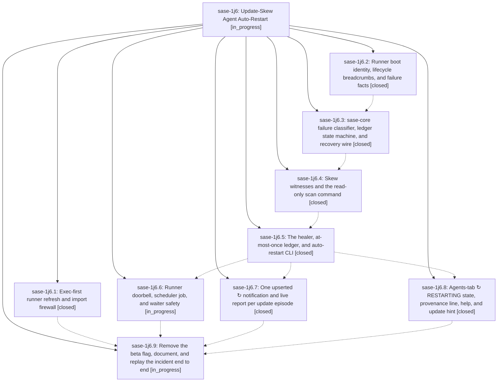

# Bead: sase-1j6 — Update-Skew Agent Auto-Restart

[Bead Pages](../README.md) / sase-1j6

**Status:** ◐ in_progress · **Type:** ▸ plan · **Tier:** epic
**Owner:** `bryanbugyi34@gmail.com` · **Created by:** [bbugyi200.athena.research.47.linker.w0](https://github.com/sase-org/sase--agents/blob/main/sessions/bbugyi200.athena.research.47.linker.w0.md) · **Assignee:** `sase-1j6.land`
**Created:** 2026-10-09 15:02:04 EDT
**Plan:** [202610/update\_skew\_agent\_auto\_restart.md](https://github.com/sase-org/sase--plans/blob/main/202610/update_skew_agent_auto_restart.md)

<!-- sase:links:start -->

## Links

| Relation | Artifact | Why |
| --- | --- | --- |
| implemented-by | [plan:202610/update_skew_agent_auto_restart.md][1] | derived from the plan's `bead_id:` frontmatter field |

_Plus 2 automatic references — see [Referenced By](#referenced-by)._

[1]: https://github.com/sase-org/sase--plans/blob/main/202610/update_skew_agent_auto_restart.md

<!-- sase:links:end -->

## Description

When a live sase update breaks a running agent before its model turn, sase puts it back once, under the same name, exactly as `,x` plus an unmodified submit would, and tells the user what it did and why in one calm amber ↻ story. Every other update-shaped failure is surfaced with its reason and never silently swallowed. The refresh-path bug behind the 2026-10-09 incident can no longer recur.

## Phases

| Bead | Title | Status | Size | Created | Agents | Commits |
|---|---|---|---|---|---:|---:|
| [sase-1j6.1](sase-1j6.1.md) | Exec-first runner refresh and import firewall | ✓ closed | small | 2026-10-09 | 1 | 1 |
| [sase-1j6.2](sase-1j6.2.md) | Runner boot identity, lifecycle breadcrumbs, and failure facts | ✓ closed | medium | 2026-10-09 | 1 | 1 |
| [sase-1j6.3](sase-1j6.3.md) | sase-core failure classifier, ledger state machine, and recovery wire | ✓ closed | medium | 2026-10-09 | 1 | 2 |
| [sase-1j6.4](sase-1j6.4.md) | Skew witnesses and the read-only scan command | ✓ closed | medium | 2026-10-09 | 1 | 1 |
| [sase-1j6.5](sase-1j6.5.md) | The healer, at-most-once ledger, and auto-restart CLI | ✓ closed | medium | 2026-10-09 | 1 | 1 |
| [sase-1j6.6](sase-1j6.6.md) | Runner doorbell, scheduler job, and waiter safety | ◐ in_progress | medium | 2026-10-09 | 1 | 0 |
| [sase-1j6.7](sase-1j6.7.md) | One upserted ↻ notification and live report per update episode | ✓ closed | medium | 2026-10-09 | 1 | 1 |
| [sase-1j6.8](sase-1j6.8.md) | Agents-tab ↻ RESTARTING state, provenance line, help, and update hint | ✓ closed | medium | 2026-10-09 | 1 | 1 |
| [sase-1j6.9](sase-1j6.9.md) | Remove the beta flag, document, and replay the incident end to end | ◐ in_progress | small | 2026-10-09 | 1 | 0 |

## Lineage

## Agents

| Agent | Bead | Commits |
|---|---|---:|
| [bbugyi200.athena.sase-1j6.1](https://github.com/sase-org/sase--agents/blob/main/agents/bbugyi200.athena.sase-1j6.1/README.md) | [sase-1j6.1](sase-1j6.1.md) | 1 |
| [bbugyi200.athena.sase-1j6.2](https://github.com/sase-org/sase--agents/blob/main/agents/bbugyi200.athena.sase-1j6.2/README.md) | [sase-1j6.2](sase-1j6.2.md) | 1 |
| [bbugyi200.athena.sase-1j6.3](https://github.com/sase-org/sase--agents/blob/main/sessions/bbugyi200.athena.sase-1j6.3.md) | [sase-1j6.3](sase-1j6.3.md) | 2 |
| [bbugyi200.athena.sase-1j6.4](https://github.com/sase-org/sase--agents/blob/main/agents/bbugyi200.athena.sase-1j6.4/README.md) | [sase-1j6.4](sase-1j6.4.md) | 1 |
| [bbugyi200.athena.sase-1j6.5](https://github.com/sase-org/sase--agents/blob/main/sessions/bbugyi200.athena.sase-1j6.5.md) | [sase-1j6.5](sase-1j6.5.md) | 1 |
| [bbugyi200.athena.sase-1j6.6](https://github.com/sase-org/sase--agents/blob/main/agents/bbugyi200.athena.sase-1j6.6/README.md) | [sase-1j6.6](sase-1j6.6.md) | 0 |
| [bbugyi200.athena.sase-1j6.7](https://github.com/sase-org/sase--agents/blob/main/agents/bbugyi200.athena.sase-1j6.7/README.md) | [sase-1j6.7](sase-1j6.7.md) | 1 |
| [bbugyi200.athena.sase-1j6.8](https://github.com/sase-org/sase--agents/blob/main/agents/bbugyi200.athena.sase-1j6.8/README.md) | [sase-1j6.8](sase-1j6.8.md) | 1 |
| [bbugyi200.athena.sase-1j6.9](https://github.com/sase-org/sase--agents/blob/main/agents/bbugyi200.athena.sase-1j6.9/README.md) | [sase-1j6.9](sase-1j6.9.md) | 0 |
| [bbugyi200.athena.sase-1j6.land](https://github.com/sase-org/sase--agents/blob/main/agents/bbugyi200.athena.sase-1j6.land/README.md) | [sase-1j6](README.md) | 0 |

## Commits

| Repo | Commit | Subject | Bead | Committed |
|---|---|---|---|---|
| sase | [`6ac3dc7`](https://github.com/sase-org/sase/commit/6ac3dc734e23f597502d011c4b6580ec7720a1fe) | fix(axe): keep runner code refresh import-free before re-exec | [sase-1j6.1](sase-1j6.1.md) | 2026-10-09 15:19:29 EDT |
| sase | [`6dd92ea`](https://github.com/sase-org/sase/commit/6dd92ea0e37f1ac2d4b2744062013833d6a60b38) | feat(auto-restart): runner boot identity, lifecycle crumbs, failure facts | [sase-1j6.2](sase-1j6.2.md) | 2026-10-09 15:56:34 EDT |
| sase-core | [`sase-core@d4ad8c9`](https://github.com/sase-org/sase-core/commit/d4ad8c9953a04d2663f4d406386a97b3376bb8b2) | feat(agent): add agent auto-restart core modules and scan wire | [sase-1j6.3](sase-1j6.3.md) | 2026-10-09 17:40:05 EDT |
| sase | [`f472226`](https://github.com/sase-org/sase/commit/f472226d5610cfb214ff2411b65cf2eef66c8f14) | feat(agent): add agent auto-restart wire with deferred TUI imports | [sase-1j6.3](sase-1j6.3.md) | 2026-10-09 17:45:31 EDT |
| sase | [`3ba224b`](https://github.com/sase-org/sase/commit/3ba224b9c1875fc3b8f60a4ebae9efc922917980) | feat(agent): skew witnesses and read-only auto-restart scan | [sase-1j6.4](sase-1j6.4.md) | 2026-10-09 18:36:41 EDT |
| sase | [`e9f73fb`](https://github.com/sase-org/sase/commit/e9f73fb19a65cd261c082e6a38c223bd73ab9762) | feat(auto-restart): healer, at-most-once ledger, and auto-restart CLI | [sase-1j6.5](sase-1j6.5.md) | 2026-10-09 19:51:33 EDT |
| sase | [`6baeb5c`](https://github.com/sase-org/sase/commit/6baeb5cb4c7b523bcc76f6e1e444ce1dcec05254) | feat(auto-restart): episode-notify experience with single upserted episode row and live report | [sase-1j6.7](sase-1j6.7.md) | 2026-10-09 20:23:21 EDT |
| sase | [`a58036d`](https://github.com/sase-org/sase/commit/a58036da0dec25b28396ed7150696e3b125ec019) | feat(auto-restart): Agents-tab RESTARTING state, provenance line, help, and update hint | [sase-1j6.8](sase-1j6.8.md) | 2026-10-09 20:35:13 EDT |

<!-- sase:referenced-by:start -->

## Referenced By

| Relation | Artifact | Why | Uses |
| --- | --- | --- | ---: |
| read-by | [agent:sase-1j6.2][1] | Check epic scope for phase boundaries | 1 |
| read-by | [agent:sase-1j6.4][2] | need epic scope | 1 |

[1]: https://github.com/sase-org/sase--agents/blob/main/agents/bbugyi200.athena.sase-1j6.2/README.md
[2]: https://github.com/sase-org/sase--agents/blob/main/agents/bbugyi200.athena.sase-1j6.4/README.md

<!-- sase:referenced-by:end -->
