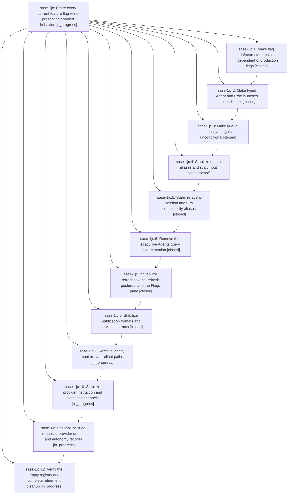

# Bead: sase-1jc — Retire every current feature flag while preserving enabled behavior

[Bead Pages](../README.md) / sase-1jc

**Status:** ◐ in_progress · **Type:** ▸ plan · **Tier:** epic
**Owner:** `bryanbugyi34@gmail.com` · **Created by:** [bbugyi200.athena.0zb](https://github.com/sase-org/sase--agents/blob/main/sessions/bbugyi200.athena.0zb.md) · **Assignee:** `sase-1jc.land`
**Created:** 2026-10-09 22:28:23 EDT
**Plan:** [202610/retire\_all\_feature\_flags.md](https://github.com/sase-org/sase--plans/blob/main/202610/retire_all_feature_flags.md)

<!-- sase:links:start -->

## Links

| Relation | Artifact | Why |
| --- | --- | --- |
| implemented-by | [plan:202610/retire_all_feature_flags.md][1] | derived from the plan's `bead_id:` frontmatter field |

_Plus 4 automatic references — see [Referenced By](#referenced-by)._

[1]: https://github.com/sase-org/sase--plans/blob/main/202610/retire_all_feature_flags.md

<!-- sase:links:end -->

## Description

Remove all 23 registered feature flags and their disabled implementations across sase and sase-core, preserve today's all-enabled behavior, and leave an empty, usable flag registry through strictly sequential implementation phases.

## Notes

[2026-10-10T11:36:52Z · sase-1ip.land] DISCOVERED ISSUE: During the approved %auto E1 closeout,  run ae9a4f90ef6f8edac0a850be51a99ae9 passed fmt, model policy, keep-sorted, Ruff, and mypy, then stopped at lint (feature flags): rule 7 reports closed beads sase-18l and sase-1ar still have definitions legacy_agent_family_syntax and legacy_sase_shell_syntax. No E1 diff touches feature-flag files. The closed bead IDs are the exact flags retired in sase-1jc.5; active phase sase-1jc.12 owns the empty-registry and residual-definition audit. This appears to be workspace-tree/shared-bead-state skew, but this checkout cannot pass the gate until the cleanup tree is reconciled. Routed here because the active retirement epic owns it; no standalone task filed.

[2026-10-10T11:51:24Z · sase-1ip.land] Follow-up verification in SASE ToolRun 426d8fbda51a877454bf690b8ff72495 reproduced the already-owned rule 7 failures: closed flag beads sase-18l and sase-1ar still have legacy_agent_family_syntax and legacy_sase_shell_syntax definitions. fmt, model policy, keep-sorted, Ruff, and mypy passed; lint (feature flags) stopped the guarded check. The surviving definitions remain in the scope of this active retirement epic; no duplicate task filed.

[2026-10-10T13:25:13Z · sase-1io.7.6.land] DISCOVERED ISSUE: flag-retirement lint is still red on current master and blocks the v0.18.0 gates. Full CI 38029274494 lint failed rule 7: closed flag bead sase-s7 still has a surviving typed_launch_units definition (sase-1jc.2 retired it; sase-1jc.12 owns the empty-registry cleanup). This is the same rule 7 class already noted here for sase-18l and sase-1ar, with a new bead. Master Gate 38053026930 lint also failed on unused public ArtifactIndexProjection in src/sase/agents/catalog/_sources.py, which sase-1jc.6 already recorded as a proposed follow-up. Epic sase-1io.7.6 will not edit the flag registry or the agents-query removal while this epic is open. No duplicate task filed.

[2026-10-10T14:49:37Z · 0ze--code] DISCOVERED ISSUE: preserve_monitor_settlement_outcomes check 2905cfc582040e913bbe004cd73ee84b passed fmt, model policy, keep-sorted, Ruff, and mypy, then stopped at lint (feature flags) rule 7: closed beads sase-wr, sase-rx, sase-qu, and sase-105 still have surviving definitions ace_refresh_tokens, admin_center_flags, ref_sync_gesture, and refresh_panel. No settlement-outcome diff touches feature-flag files. Those closed bead IDs are the exact flags retired in sase-1jc.7; active phase sase-1jc.12 owns the empty-registry and residual-definition audit. Same workspace-tree/shared-bead-state skew already noted here. No duplicate task filed.

[2026-10-10T17:17:00Z · 69] DISCOVERED ISSUE: During implementation of the adaptive update failure dialog, SASE ToolRun 2fe97e8d72a2bb54b2d9167aea5e11a6 passed fmt, model policy, keep-sorted, Ruff, and mypy, then stopped at lint (feature flags) rule 7: closed flag beads sase-1ft, sase-11f, sase-13w, and sase-11p still have definitions agents_session_manifest_compat, axe_routine_job_contract, bgcmd_legacy_slots, and slim_agents_manifest. The modal change touches no feature-flag files. This independently reproduces the same stale-definition class already recorded here; phase sase-1jc.12 owns the empty-registry and residual-definition audit. No separate task filed.

[2026-10-10T17:42:48Z · sase-1j6.10.land] DISCOVERED ISSUE: tests/ace/tui/test_node_finder_snapshot.py:34 still re-exports test_query_hidden_on_both_flag_branches, but b46ecb0a94 (agents_unified_query retirement) renamed it to test_query_hidden_marks_nonmatching_rows in tests/ace/tui/test_node_finder_snapshot_hidden.py. Collection fails with ImportError on master e5e58ac3d5 (reproduced 2026-10-10). That also breaks tests/test_contract_manifest.py::test_contract_manifest_matches_marker_selection (pytest -m contract --collect-only exits 2), and Master Gate 38067967749 test(4)/test(7) are red. Proposed by sase-1j6.10.7 note #6 and routed here by the sase-1j6.10 landing because this retirement epic caused it. No separate task filed.

## Phases

| Bead | Title | Status | Size | Created | Agents | Commits |
|---|---|---|---|---|---:|---:|
| [sase-1jc.1](sase-1jc.1.md) | Make flag infrastructure tests independent of production flags | ✓ closed | medium | 2026-10-09 | 1 | 1 |
| [sase-1jc.10](sase-1jc.10.md) | Stabilize provider instruction and execution channels | ◐ in_progress | medium | 2026-10-09 | 1 | 0 |
| [sase-1jc.11](sase-1jc.11.md) | Stabilize sudo requests, provider drains, and autonomy records | ◐ in_progress | medium | 2026-10-09 | 1 | 0 |
| [sase-1jc.12](sase-1jc.12.md) | Verify the empty registry and complete retirement cleanup | ◐ in_progress | medium | 2026-10-09 | 1 | 0 |
| [sase-1jc.2](sase-1jc.2.md) | Make typed Agent and Proc launches unconditional | ✓ closed | medium | 2026-10-09 | 1 | 2 |
| [sase-1jc.3](sase-1jc.3.md) | Make queue capacity budgets unconditional | ✓ closed | medium | 2026-10-09 | 1 | 2 |
| [sase-1jc.4](sase-1jc.4.md) | Stabilize macro aliases and strict input types | ✓ closed | medium | 2026-10-09 | 1 | 2 |
| [sase-1jc.5](sase-1jc.5.md) | Stabilize agent-session and turn compatibility aliases | ✓ closed | medium | 2026-10-09 | 1 | 1 |
| [sase-1jc.6](sase-1jc.6.md) | Remove the legacy live Agents query implementation | ✓ closed | medium | 2026-10-09 | 1 | 1 |
| [sase-1jc.7](sase-1jc.7.md) | Stabilize refresh tokens, refresh gestures, and the Flags pane | ✓ closed | medium | 2026-10-09 | 1 | 1 |
| [sase-1jc.8](sase-1jc.8.md) | Stabilize publication formats and service contracts | ✓ closed | medium | 2026-10-09 | 1 | 3 |
| [sase-1jc.9](sase-1jc.9.md) | Remove legacy monitor-start rollout paths | ◐ in_progress | medium | 2026-10-09 | 1 | 0 |

## Lineage

## Agents

| Agent | Bead | Commits |
|---|---|---:|
| [bbugyi200.athena.sase-1jc.1](https://github.com/sase-org/sase--agents/blob/main/sessions/bbugyi200.athena.sase-1jc.1.md) | [sase-1jc.1](sase-1jc.1.md) | 1 |
| [bbugyi200.athena.sase-1jc.10](https://github.com/sase-org/sase--agents/blob/main/agents/bbugyi200.athena.sase-1jc.10/README.md) | [sase-1jc.10](sase-1jc.10.md) | 0 |
| [bbugyi200.athena.sase-1jc.11](https://github.com/sase-org/sase--agents/blob/main/agents/bbugyi200.athena.sase-1jc.11/README.md) | [sase-1jc.11](sase-1jc.11.md) | 0 |
| [bbugyi200.athena.sase-1jc.12](https://github.com/sase-org/sase--agents/blob/main/agents/bbugyi200.athena.sase-1jc.12/README.md) | [sase-1jc.12](sase-1jc.12.md) | 0 |
| [bbugyi200.athena.sase-1jc.2](https://github.com/sase-org/sase--agents/blob/main/sessions/bbugyi200.athena.sase-1jc.2.md) | [sase-1jc.2](sase-1jc.2.md) | 2 |
| [bbugyi200.athena.sase-1jc.3](https://github.com/sase-org/sase--agents/blob/main/agents/bbugyi200.athena.sase-1jc.3/README.md) | [sase-1jc.3](sase-1jc.3.md) | 2 |
| [bbugyi200.athena.sase-1jc.4](https://github.com/sase-org/sase--agents/blob/main/agents/bbugyi200.athena.sase-1jc.4/README.md) | [sase-1jc.4](sase-1jc.4.md) | 2 |
| [bbugyi200.athena.sase-1jc.5](https://github.com/sase-org/sase--agents/blob/main/agents/bbugyi200.athena.sase-1jc.5/README.md) | [sase-1jc.5](sase-1jc.5.md) | 1 |
| [bbugyi200.athena.sase-1jc.6](https://github.com/sase-org/sase--agents/blob/main/agents/bbugyi200.athena.sase-1jc.6/README.md) | [sase-1jc.6](sase-1jc.6.md) | 1 |
| [bbugyi200.athena.sase-1jc.7](https://github.com/sase-org/sase--agents/blob/main/sessions/bbugyi200.athena.sase-1jc.7.md) | [sase-1jc.7](sase-1jc.7.md) | 1 |
| [bbugyi200.athena.sase-1jc.8](https://github.com/sase-org/sase--agents/blob/main/sessions/bbugyi200.athena.sase-1jc.8.md) | [sase-1jc.8](sase-1jc.8.md) | 3 |
| [bbugyi200.athena.sase-1jc.9](https://github.com/sase-org/sase--agents/blob/main/agents/bbugyi200.athena.sase-1jc.9/README.md) | [sase-1jc.9](sase-1jc.9.md) | 0 |
| [bbugyi200.athena.sase-1jc.land](https://github.com/sase-org/sase--agents/blob/main/agents/bbugyi200.athena.sase-1jc.land/README.md) | [sase-1jc](README.md) | 0 |

## Commits

| Repo | Commit | Subject | Bead | Committed |
|---|---|---|---|---|
| sase | [`8519047`](https://github.com/sase-org/sase/commit/851904725dd6a0151c2457dd083a25e41f2e1880) | test(flags): make flag infrastructure tests independent of production flags | [sase-1jc.1](sase-1jc.1.md) | 2026-10-09 23:32:35 EDT |
| sase-core | [`sase-core@e42eb5c`](https://github.com/sase-org/sase-core/commit/e42eb5cab5442eaa36eb3850c06277ad90ba86ea) | feat(launch): retire typed launch-units opt-in; unconditional typed diagnostics | [sase-1jc.2](sase-1jc.2.md) | 2026-10-10 02:45:23 EDT |
| sase | [`7b01179`](https://github.com/sase-org/sase/commit/7b01179be9e56529a6440018581488e3752ceb62) | feat(flags): retire typed\_launch\_units; typed agent and proc launches unconditional | [sase-1jc.2](sase-1jc.2.md) | 2026-10-10 02:49:42 EDT |
| sase-core | [`sase-core@c24b650`](https://github.com/sase-org/sase-core/commit/c24b6500d5336de7a7b21b370f37cb85cdb315e1) | feat(launch): retire queue\_capacity\_budget opt-out; unconditional capacity budgets | [sase-1jc.3](sase-1jc.3.md) | 2026-10-10 04:20:58 EDT |
| sase | [`b816732`](https://github.com/sase-org/sase/commit/b81673283a8ff921652a2370f8a6d6f7b55865f8) | feat(flags): retire queue\_capacity\_budget; queue capacity budgets unconditional | [sase-1jc.3](sase-1jc.3.md) | 2026-10-10 04:25:18 EDT |
| sase-core | [`sase-core@e3b0907`](https://github.com/sase-org/sase-core/commit/e3b0907b8d3eafcd3d673b5af0c071d6a9f8370c) | feat(macros): retire legacy-xprompt opt-out; unconditional alias acceptance | [sase-1jc.4](sase-1jc.4.md) | 2026-10-10 06:23:12 EDT |
| sase | [`8a2f344`](https://github.com/sase-org/sase/commit/8a2f344626143a97b29d63d202d3537ac7860587) | feat(flags): retire legacy\_xprompt\_syntax and strict\_macro\_input\_types; macro aliases and strict input types unconditional | [sase-1jc.4](sase-1jc.4.md) | 2026-10-10 06:27:37 EDT |
| sase | [`2f5070d`](https://github.com/sase-org/sase/commit/2f5070d1291c8110b4d9b910cf353d1a47e4b2de) | feat(flags): retire legacy\_agent\_family\_syntax and legacy\_sase\_shell\_syntax; agent-session and turn aliases unconditional | [sase-1jc.5](sase-1jc.5.md) | 2026-10-10 07:32:01 EDT |
| sase | [`b46ecb0`](https://github.com/sase-org/sase/commit/b46ecb0a947539855d69034bd4d1300b999274af) | feat(agents): retire agents\_unified\_query flag, unify live query path | [sase-1jc.6](sase-1jc.6.md) | 2026-10-10 08:26:04 EDT |
| sase | [`3513d91`](https://github.com/sase-org/sase/commit/3513d91b1fbce9f216655ffb50d471bd62de1041) | feat(flags): retire refresh tokens, refresh gestures, and Flags pane flags | [sase-1jc.7](sase-1jc.7.md) | 2026-10-10 09:32:53 EDT |
| sase-core | [`sase-core@9573108`](https://github.com/sase-org/sase-core/commit/9573108dac5dbb5223c05d3c4c1c2f0613b8b2c9) | feat(config): retire legacy axe/config wires in sase-core for publication-services flags | [sase-1jc.8](sase-1jc.8.md) | 2026-10-10 12:09:40 EDT |
| sase | [`b144f62`](https://github.com/sase-org/sase/commit/b144f622cf49a261acece2045008f025bb194c52) | feat(flags): retire publication-services flags slim\_agents\_manifest, agents\_session\_manifest\_compat, bgcmd\_legacy\_slots, axe\_routine\_job\_contract | [sase-1jc.8](sase-1jc.8.md) | 2026-10-10 12:59:12 EDT |
| sase | [`8fdf12a`](https://github.com/sase-org/sase/commit/8fdf12a8a8d43fdbdc100018a881c473485c98e7) | fix(query\_profile): define \_\_dir\_\_ and PEP 562 hooks in profiles package init | [sase-1jc.8](sase-1jc.8.md) | 2026-10-10 14:02:44 EDT |

<!-- sase:referenced-by:start -->

## Referenced By

| Relation | Artifact | Why | Uses |
| --- | --- | --- | ---: |
| read-by | [agent:0ze--code][1] | See if concurrent flag-retirement epic already owns the closed-flag lint failure | 1 |
| read-by | [agent:sase-1j6.10.7][2] | Need whether sase-1jc owns closed flag bead leftovers | 1 |
| read-by | [agent:sase-1jc.4][3] | epic context for phase | 1 |
| read-by | [agent:sase-1jc.6][4] | epic context for phase sase-1jc.6 | 1 |

[1]: https://github.com/sase-org/sase--agents/blob/main/sessions/bbugyi200.athena.0ze.md
[2]: https://github.com/sase-org/sase--agents/blob/main/agents/bbugyi200.athena.sase-1j6.10.7/README.md
[3]: https://github.com/sase-org/sase--agents/blob/main/agents/bbugyi200.athena.sase-1jc.4/README.md
[4]: https://github.com/sase-org/sase--agents/blob/main/agents/bbugyi200.athena.sase-1jc.6/README.md

<!-- sase:referenced-by:end -->
