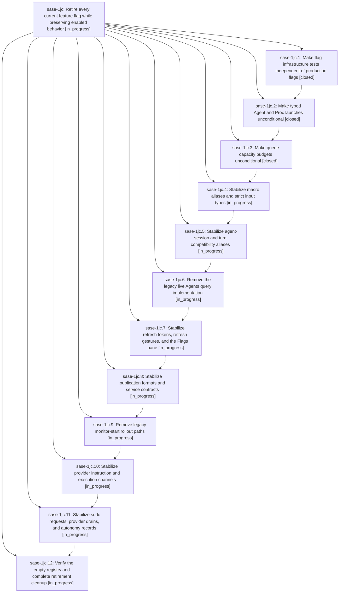

# Bead: sase-1jc — Retire every current feature flag while preserving enabled behavior

[Bead Pages](../README.md) / sase-1jc

**Status:** ◐ in_progress · **Type:** ▸ plan · **Tier:** epic
**Owner:** `bryanbugyi34@gmail.com` · **Created by:** [bbugyi200.athena.0zb](https://github.com/sase-org/sase--agents/blob/main/sessions/bbugyi200.athena.0zb.md) · **Assignee:** `sase-1jc.land`
**Created:** 2026-10-09 22:28:23 EDT
**Plan:** [202610/retire\_all\_feature\_flags.md](https://github.com/sase-org/sase--plans/blob/main/202610/retire_all_feature_flags.md)

<!-- sase:links:start -->

## Links

| Relation | Artifact | Why |
| --- | --- | --- |
| implemented-by | [plan:202610/retire_all_feature_flags.md][1] | derived from the plan's `bead_id:` frontmatter field |

[1]: https://github.com/sase-org/sase--plans/blob/main/202610/retire_all_feature_flags.md

<!-- sase:links:end -->

## Description

Remove all 23 registered feature flags and their disabled implementations across sase and sase-core, preserve today's all-enabled behavior, and leave an empty, usable flag registry through strictly sequential implementation phases.

## Phases

| Bead | Title | Status | Size | Created | Agents | Commits |
|---|---|---|---|---|---:|---:|
| [sase-1jc.1](sase-1jc.1.md) | Make flag infrastructure tests independent of production flags | ✓ closed | medium | 2026-10-09 | 1 | 1 |
| [sase-1jc.10](sase-1jc.10.md) | Stabilize provider instruction and execution channels | ◐ in_progress | medium | 2026-10-09 | 1 | 0 |
| [sase-1jc.11](sase-1jc.11.md) | Stabilize sudo requests, provider drains, and autonomy records | ◐ in_progress | medium | 2026-10-09 | 1 | 0 |
| [sase-1jc.12](sase-1jc.12.md) | Verify the empty registry and complete retirement cleanup | ◐ in_progress | medium | 2026-10-09 | 1 | 0 |
| [sase-1jc.2](sase-1jc.2.md) | Make typed Agent and Proc launches unconditional | ✓ closed | medium | 2026-10-09 | 1 | 2 |
| [sase-1jc.3](sase-1jc.3.md) | Make queue capacity budgets unconditional | ✓ closed | medium | 2026-10-09 | 1 | 1 |
| [sase-1jc.4](sase-1jc.4.md) | Stabilize macro aliases and strict input types | ◐ in_progress | medium | 2026-10-09 | 1 | 0 |
| [sase-1jc.5](sase-1jc.5.md) | Stabilize agent-session and turn compatibility aliases | ◐ in_progress | medium | 2026-10-09 | 1 | 0 |
| [sase-1jc.6](sase-1jc.6.md) | Remove the legacy live Agents query implementation | ◐ in_progress | medium | 2026-10-09 | 1 | 0 |
| [sase-1jc.7](sase-1jc.7.md) | Stabilize refresh tokens, refresh gestures, and the Flags pane | ◐ in_progress | medium | 2026-10-09 | 1 | 0 |
| [sase-1jc.8](sase-1jc.8.md) | Stabilize publication formats and service contracts | ◐ in_progress | medium | 2026-10-09 | 1 | 0 |
| [sase-1jc.9](sase-1jc.9.md) | Remove legacy monitor-start rollout paths | ◐ in_progress | medium | 2026-10-09 | 1 | 0 |

## Lineage

## Agents

| Agent | Bead | Commits |
|---|---|---:|
| [bbugyi200.athena.sase-1jc.1](https://github.com/sase-org/sase--agents/blob/main/sessions/bbugyi200.athena.sase-1jc.1.md) | [sase-1jc.1](sase-1jc.1.md) | 1 |
| [bbugyi200.athena.sase-1jc.10](https://github.com/sase-org/sase--agents/blob/main/agents/bbugyi200.athena.sase-1jc.10/README.md) | [sase-1jc.10](sase-1jc.10.md) | 0 |
| [bbugyi200.athena.sase-1jc.11](https://github.com/sase-org/sase--agents/blob/main/agents/bbugyi200.athena.sase-1jc.11/README.md) | [sase-1jc.11](sase-1jc.11.md) | 0 |
| [bbugyi200.athena.sase-1jc.12](https://github.com/sase-org/sase--agents/blob/main/agents/bbugyi200.athena.sase-1jc.12/README.md) | [sase-1jc.12](sase-1jc.12.md) | 0 |
| [bbugyi200.athena.sase-1jc.2](https://github.com/sase-org/sase--agents/blob/main/sessions/bbugyi200.athena.sase-1jc.2.md) | [sase-1jc.2](sase-1jc.2.md) | 2 |
| [bbugyi200.athena.sase-1jc.3](https://github.com/sase-org/sase--agents/blob/main/agents/bbugyi200.athena.sase-1jc.3/README.md) | [sase-1jc.3](sase-1jc.3.md) | 1 |
| [bbugyi200.athena.sase-1jc.4](https://github.com/sase-org/sase--agents/blob/main/agents/bbugyi200.athena.sase-1jc.4/README.md) | [sase-1jc.4](sase-1jc.4.md) | 0 |
| [bbugyi200.athena.sase-1jc.5](https://github.com/sase-org/sase--agents/blob/main/agents/bbugyi200.athena.sase-1jc.5/README.md) | [sase-1jc.5](sase-1jc.5.md) | 0 |
| [bbugyi200.athena.sase-1jc.6](https://github.com/sase-org/sase--agents/blob/main/agents/bbugyi200.athena.sase-1jc.6/README.md) | [sase-1jc.6](sase-1jc.6.md) | 0 |
| [bbugyi200.athena.sase-1jc.7](https://github.com/sase-org/sase--agents/blob/main/agents/bbugyi200.athena.sase-1jc.7/README.md) | [sase-1jc.7](sase-1jc.7.md) | 0 |
| [bbugyi200.athena.sase-1jc.8](https://github.com/sase-org/sase--agents/blob/main/agents/bbugyi200.athena.sase-1jc.8/README.md) | [sase-1jc.8](sase-1jc.8.md) | 0 |
| [bbugyi200.athena.sase-1jc.9](https://github.com/sase-org/sase--agents/blob/main/agents/bbugyi200.athena.sase-1jc.9/README.md) | [sase-1jc.9](sase-1jc.9.md) | 0 |
| [bbugyi200.athena.sase-1jc.land](https://github.com/sase-org/sase--agents/blob/main/agents/bbugyi200.athena.sase-1jc.land/README.md) | [sase-1jc](README.md) | 0 |

## Commits

| Repo | Commit | Subject | Bead | Committed |
|---|---|---|---|---|
| sase | [`8519047`](https://github.com/sase-org/sase/commit/851904725dd6a0151c2457dd083a25e41f2e1880) | test(flags): make flag infrastructure tests independent of production flags | [sase-1jc.1](sase-1jc.1.md) | 2026-10-09 23:32:35 EDT |
| sase-core | [`sase-core@e42eb5c`](https://github.com/sase-org/sase-core/commit/e42eb5cab5442eaa36eb3850c06277ad90ba86ea) | feat(launch): retire typed launch-units opt-in; unconditional typed diagnostics | [sase-1jc.2](sase-1jc.2.md) | 2026-10-10 02:45:23 EDT |
| sase | [`7b01179`](https://github.com/sase-org/sase/commit/7b01179be9e56529a6440018581488e3752ceb62) | feat(flags): retire typed\_launch\_units; typed agent and proc launches unconditional | [sase-1jc.2](sase-1jc.2.md) | 2026-10-10 02:49:42 EDT |
| sase-core | [`sase-core@c24b650`](https://github.com/sase-org/sase-core/commit/c24b6500d5336de7a7b21b370f37cb85cdb315e1) | feat(launch): retire queue\_capacity\_budget opt-out; unconditional capacity budgets | [sase-1jc.3](sase-1jc.3.md) | 2026-10-10 04:20:58 EDT |
