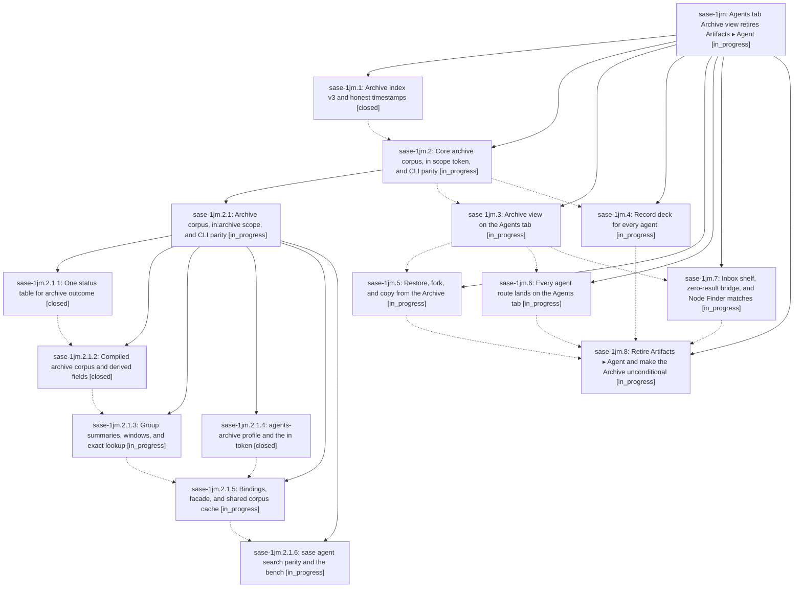

# Bead: sase-1jm — Agents tab Archive view retires Artifacts ▸ Agent

[Bead Pages](../README.md) / sase-1jm

**Status:** ◐ in_progress · **Type:** ▸ plan · **Tier:** epic
**Owner:** `bryanbugyi34@gmail.com` · **Created by:** [bbugyi200.athena.research.45.linker.w0](https://github.com/sase-org/sase--agents/blob/main/sessions/bbugyi200.athena.research.45.linker.w0.md) · **Assignee:** `sase-1jm.land`
**Created:** 2026-10-10 06:41:07 EDT
**Plan:** [202610/agents\_archive\_view.md](https://github.com/sase-org/sase--plans/blob/main/202610/agents_archive_view.md)

<!-- sase:links:start -->

## Links

| Relation | Artifact | Why |
| --- | --- | --- |
| implemented-by | [plan:202610/agents_archive_view.md][1] | derived from the plan's `bead_id:` frontmatter field |

_Plus 1 automatic references — see [Referenced By](#referenced-by)._

[1]: https://github.com/sase-org/sase--plans/blob/main/202610/agents_archive_view.md

<!-- sase:links:end -->

## Description

Every agent that ran on this machine can be found and read on the Agents tab. The Inbox stays exactly as it is today. A new Archive view (`,a`) lists dismissed runs by day and opens any of them read-only in the real decks. Restoring is one deliberate `⏎`. Every `agent:` route lands on the Agents tab. The Artifacts ▸ Agent sub-tab is retired behind a sunset flag.

## Phases

| Bead | Title | Status | Size | Created | Agents | Commits |
|---|---|---|---|---|---:|---:|
| [sase-1jm.1](sase-1jm.1.md) | Archive index v3 and honest timestamps | ✓ closed | medium | 2026-10-10 | 1 | 1 |
| [sase-1jm.2](sase-1jm.2.md) | Core archive corpus, in scope token, and CLI parity | ◐ in_progress | large | 2026-10-10 | 1 | 0 |
| [sase-1jm.3](sase-1jm.3.md) | Archive view on the Agents tab | ◐ in_progress | large | 2026-10-10 | 1 | 0 |
| [sase-1jm.4](sase-1jm.4.md) | Record deck for every agent | ◐ in_progress | medium | 2026-10-10 | 1 | 0 |
| [sase-1jm.5](sase-1jm.5.md) | Restore, fork, and copy from the Archive | ◐ in_progress | medium | 2026-10-10 | 1 | 0 |
| [sase-1jm.6](sase-1jm.6.md) | Every agent route lands on the Agents tab | ◐ in_progress | medium | 2026-10-10 | 1 | 0 |
| [sase-1jm.7](sase-1jm.7.md) | Inbox shelf, zero-result bridge, and Node Finder matches | ◐ in_progress | medium | 2026-10-10 | 1 | 0 |
| [sase-1jm.8](sase-1jm.8.md) | Retire Artifacts ▸ Agent and make the Archive unconditional | ◐ in_progress | medium | 2026-10-10 | 1 | 0 |

## Lineage

## Agents

| Agent | Bead | Commits |
|---|---|---:|
| [bbugyi200.athena.sase-1jm.1](https://github.com/sase-org/sase--agents/blob/main/agents/bbugyi200.athena.sase-1jm.1/README.md) | [sase-1jm.1](sase-1jm.1.md) | 1 |
| [bbugyi200.athena.sase-1jm.2](https://github.com/sase-org/sase--agents/blob/main/sessions/bbugyi200.athena.sase-1jm.2.md) | [sase-1jm.2](sase-1jm.2.md) | 0 |
| [bbugyi200.athena.sase-1jm.2.1.1](https://github.com/sase-org/sase--agents/blob/main/agents/bbugyi200.athena.sase-1jm.2.1.1/README.md) | [sase-1jm.2.1.1](sase-1jm.2.1.1.md) | 2 |
| [bbugyi200.athena.sase-1jm.2.1.2](https://github.com/sase-org/sase--agents/blob/main/agents/bbugyi200.athena.sase-1jm.2.1.2/README.md) | [sase-1jm.2.1.2](sase-1jm.2.1.2.md) | 1 |
| [bbugyi200.athena.sase-1jm.2.1.3](https://github.com/sase-org/sase--agents/blob/main/agents/bbugyi200.athena.sase-1jm.2.1.3/README.md) | [sase-1jm.2.1.3](sase-1jm.2.1.3.md) | 0 |
| [bbugyi200.athena.sase-1jm.2.1.4](https://github.com/sase-org/sase--agents/blob/main/agents/bbugyi200.athena.sase-1jm.2.1.4/README.md) | [sase-1jm.2.1.4](sase-1jm.2.1.4.md) | 0 |
| [bbugyi200.athena.sase-1jm.2.1.5](https://github.com/sase-org/sase--agents/blob/main/agents/bbugyi200.athena.sase-1jm.2.1.5/README.md) | [sase-1jm.2.1.5](sase-1jm.2.1.5.md) | 0 |
| [bbugyi200.athena.sase-1jm.2.1.6](https://github.com/sase-org/sase--agents/blob/main/agents/bbugyi200.athena.sase-1jm.2.1.6/README.md) | [sase-1jm.2.1.6](sase-1jm.2.1.6.md) | 0 |
| [bbugyi200.athena.sase-1jm.2.1.land](https://github.com/sase-org/sase--agents/blob/main/agents/bbugyi200.athena.sase-1jm.2.1.land/README.md) | [sase-1jm.2.1](sase-1jm.2.1.md) | 0 |
| [bbugyi200.athena.sase-1jm.3](https://github.com/sase-org/sase--agents/blob/main/agents/bbugyi200.athena.sase-1jm.3/README.md) | [sase-1jm.3](sase-1jm.3.md) | 0 |
| [bbugyi200.athena.sase-1jm.4](https://github.com/sase-org/sase--agents/blob/main/agents/bbugyi200.athena.sase-1jm.4/README.md) | [sase-1jm.4](sase-1jm.4.md) | 0 |
| [bbugyi200.athena.sase-1jm.5](https://github.com/sase-org/sase--agents/blob/main/agents/bbugyi200.athena.sase-1jm.5/README.md) | [sase-1jm.5](sase-1jm.5.md) | 0 |
| [bbugyi200.athena.sase-1jm.6](https://github.com/sase-org/sase--agents/blob/main/agents/bbugyi200.athena.sase-1jm.6/README.md) | [sase-1jm.6](sase-1jm.6.md) | 0 |
| [bbugyi200.athena.sase-1jm.7](https://github.com/sase-org/sase--agents/blob/main/agents/bbugyi200.athena.sase-1jm.7/README.md) | [sase-1jm.7](sase-1jm.7.md) | 0 |
| [bbugyi200.athena.sase-1jm.8](https://github.com/sase-org/sase--agents/blob/main/agents/bbugyi200.athena.sase-1jm.8/README.md) | [sase-1jm.8](sase-1jm.8.md) | 0 |
| [bbugyi200.athena.sase-1jm.land](https://github.com/sase-org/sase--agents/blob/main/agents/bbugyi200.athena.sase-1jm.land/README.md) | [sase-1jm](README.md) | 0 |

## Commits

| Repo | Commit | Subject | Bead | Committed |
|---|---|---|---|---|
| sase | [`e200cf6`](https://github.com/sase-org/sase/commit/e200cf6d677fcb6473d070d6a9a800f088eac3e6) | feat(agents): add v3 dismissed archive index | [sase-1jm.1](sase-1jm.1.md) | 2026-10-10 07:06:42 EDT |
| sase-core | [`sase-core@9f6ce0c`](https://github.com/sase-org/sase-core/commit/9f6ce0c63e6d4694055e8aa195c331e6db138f6d) | feat(agent-archive): add live status-bucket match with outcome derived from bucket | [sase-1jm.2.1.1](sase-1jm.2.1.1.md) | 2026-10-10 10:12:47 EDT |
| sase | [`166289a`](https://github.com/sase-org/sase/commit/166289ac43de125720807da2c935af04c2470311) | feat(agent): add status\_bucket\_for\_values thin wrapper over Rust status bucket binding | [sase-1jm.2.1.1](sase-1jm.2.1.1.md) | 2026-10-10 11:22:40 EDT |
| sase-core | [`sase-core@e4e72c2`](https://github.com/sase-org/sase-core/commit/e4e72c2a357b230d16af0aecbfdef389213cc7de) | feat(archive): compile v3 archive corpus | [sase-1jm.2.1.2](sase-1jm.2.1.2.md) | 2026-10-10 12:34:13 EDT |

<!-- sase:referenced-by:start -->

## Referenced By

| Relation | Artifact | Why | Uses |
| --- | --- | --- | ---: |
| read-by | [agent:sase-1jm.1][1] | Find the epic design and confirm phase notes and linked plan references | 1 |

[1]: https://github.com/sase-org/sase--agents/blob/main/agents/bbugyi200.athena.sase-1jm.1/README.md

<!-- sase:referenced-by:end -->
