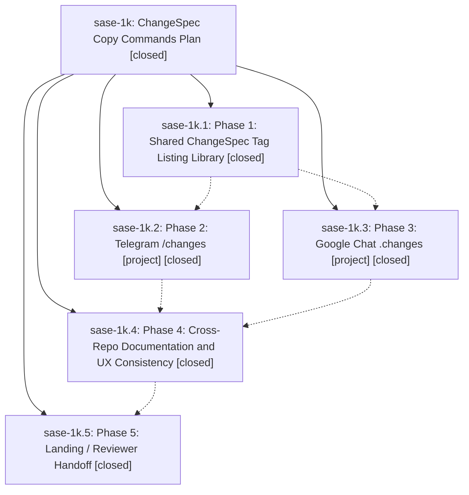

# Bead: sase-1k — ChangeSpec Copy Commands Plan

[Bead Pages](../README.md) / sase-1k

**Status:** ✓ closed · **Resolution:** (unrecorded) · **Type:** plan · **Tier:** epic
**Owner:** `bryanbugyi34@gmail.com`
**Created:** 2026-04-30 15:59:04 UTC · **Closed:** 2026-04-30 16:30:00 UTC
**Plan:** [202604/changes\_commands.md](https://github.com/sase-org/sase--plans/blob/main/202604/changes_commands.md)

## Phases

| Bead | Title | Status | Size | Agents | Commits |
|---|---|---|---|---:|---:|
| [sase-1k.1](sase-1k.1.md) | Phase 1: Shared ChangeSpec Tag Listing Library | ✓ closed | small | 0 | 1 |
| [sase-1k.2](sase-1k.2.md) | Phase 2: Telegram /changes \[project\] | ✓ closed | small | 0 | 0 |
| [sase-1k.3](sase-1k.3.md) | Phase 3: Google Chat .changes \[project\] | ✓ closed | small | 0 | 0 |
| [sase-1k.4](sase-1k.4.md) | Phase 4: Cross-Repo Documentation and UX Consistency | ✓ closed | small | 0 | 0 |
| [sase-1k.5](sase-1k.5.md) | Phase 5: Landing / Reviewer Handoff | ✓ closed | small | 0 | 1 |

## Lineage

## Commits

| Commit | Subject | Bead | Committed (UTC) |
|---|---|---|---|
| [`652a099`](https://github.com/sase-org/sase/commit/652a099bb4386b2d060f6dd934f23a1cd848cb42) | feat: add ChangeSpec xprompt tag listing API (sase-1k.1) | [sase-1k.1](sase-1k.1.md) | 2026-04-30 16:06:06 |
| [`3a3a3c2`](https://github.com/sase-org/sase/commit/3a3a3c2f2674ea2ef89d48de86425310c9f1c3ae) | chore: land changes command handoff (sase-1k.5) | [sase-1k.5](sase-1k.5.md) | 2026-04-30 16:25:23 |
