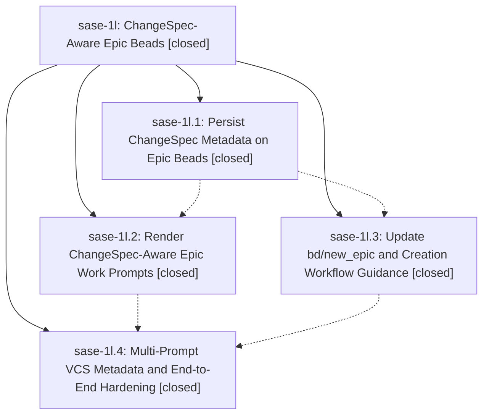

# Bead: sase-1l — ChangeSpec-Aware Epic Beads

[Bead Pages](../README.md) / sase-1l

**Status:** ✓ closed · **Resolution:** (unrecorded) · **Type:** plan · **Tier:** epic
**Owner:** `bryanbugyi34@gmail.com`
**Created:** 2026-04-30 21:25:46 UTC · **Closed:** 2026-04-30 22:01:42 UTC
**Plan:** [202604/epic\_changespec\_beads.md](https://github.com/sase-org/sase--plans/blob/main/202604/epic_changespec_beads.md)

## Phases

| Bead | Title | Status | Size | Agents | Commits |
|---|---|---|---|---:|---:|
| [sase-1l.1](sase-1l.1.md) | Persist ChangeSpec Metadata on Epic Beads | ✓ closed | small | 0 | 1 |
| [sase-1l.2](sase-1l.2.md) | Render ChangeSpec-Aware Epic Work Prompts | ✓ closed | small | 0 | 1 |
| [sase-1l.3](sase-1l.3.md) | Update bd/new\_epic and Creation Workflow Guidance | ✓ closed | small | 0 | 1 |
| [sase-1l.4](sase-1l.4.md) | Multi-Prompt VCS Metadata and End-to-End Hardening | ✓ closed | small | 0 | 1 |

## Lineage

## Commits

| Commit | Subject | Bead | Committed (UTC) |
|---|---|---|---|
| [`ea4b321`](https://github.com/sase-org/sase/commit/ea4b32113bbc080786ec33c3390c823c2935bcf1) | feat: persist ChangeSpec metadata on plan beads (sase-1l.1) | [sase-1l.1](sase-1l.1.md) | 2026-04-30 21:36:30 |
| [`bbac708`](https://github.com/sase-org/sase/commit/bbac70869c33d0f3f18445655d1d370f0a6baf85) | feat: add ChangeSpec inputs to epic bead prompt (sase-1l.3) | [sase-1l.3](sase-1l.3.md) | 2026-04-30 21:44:15 |
| [`1c916fd`](https://github.com/sase-org/sase/commit/1c916fdcceaa489fa7fc3999b25ccecfcfd2373d) | feat: render ChangeSpec-aware epic work prompts (sase-1l.2) | [sase-1l.2](sase-1l.2.md) | 2026-04-30 21:47:47 |
| [`6420c98`](https://github.com/sase-org/sase/commit/6420c98dfefe877e5970cfca484df4a06ea4ea69) | fix: derive multi-prompt VCS metadata per segment (sase-1l.4) | [sase-1l.4](sase-1l.4.md) | 2026-04-30 21:57:54 |
