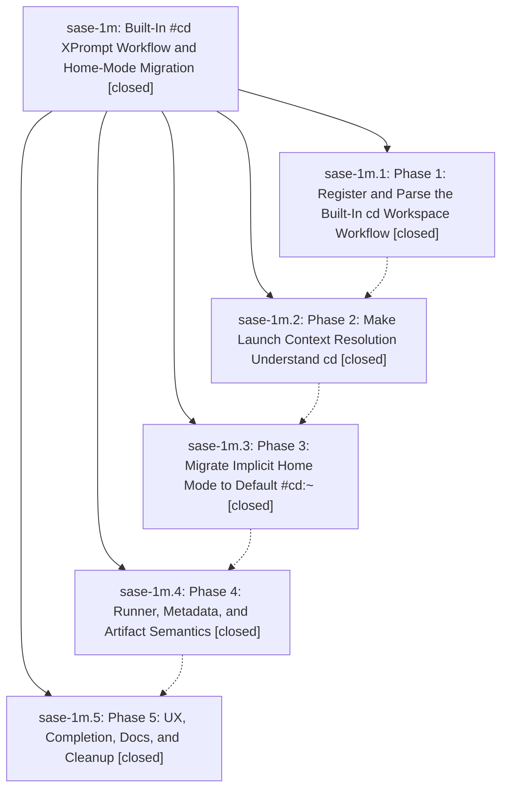

# Bead: sase-1m — Built-In #cd XPrompt Workflow and Home-Mode Migration

[Bead Pages](../README.md) / sase-1m

**Status:** ✓ closed · **Resolution:** (unrecorded) · **Type:** plan · **Tier:** epic
**Owner:** `bryanbugyi34@gmail.com`
**Created:** 2026-04-30 22:18:26 UTC · **Closed:** 2026-04-30 23:19:26 UTC
**Plan:** [202604/cd\_builtin\_vcs\_workflow.md](https://github.com/sase-org/sase--plans/blob/main/202604/cd_builtin_vcs_workflow.md)

## Phases

| Bead | Title | Status | Size | Agents | Commits |
|---|---|---|---|---:|---:|
| [sase-1m.1](sase-1m.1.md) | Phase 1: Register and Parse the Built-In cd Workspace Workflow | ✓ closed | small | 0 | 1 |
| [sase-1m.2](sase-1m.2.md) | Phase 2: Make Launch Context Resolution Understand cd | ✓ closed | small | 0 | 1 |
| [sase-1m.3](sase-1m.3.md) | Phase 3: Migrate Implicit Home Mode to Default #cd:~ | ✓ closed | small | 0 | 1 |
| [sase-1m.4](sase-1m.4.md) | Phase 4: Runner, Metadata, and Artifact Semantics | ✓ closed | small | 0 | 1 |
| [sase-1m.5](sase-1m.5.md) | Phase 5: UX, Completion, Docs, and Cleanup | ✓ closed | small | 0 | 1 |

## Lineage

## Commits

| Commit | Subject | Bead | Committed (UTC) |
|---|---|---|---|
| [`aa88919`](https://github.com/sase-org/sase/commit/aa8891960f320309d07b70f8e1b08d1f1f7c3579) | feat: add built-in cd workspace workflow (sase-1m.1) | [sase-1m.1](sase-1m.1.md) | 2026-04-30 22:28:54 |
| [`3d3dd6c`](https://github.com/sase-org/sase/commit/3d3dd6cacc3e45c9f01ab0ad0cb5081e00fd9fa6) | feat: resolve explicit cd launch contexts (sase-1m.2) | [sase-1m.2](sase-1m.2.md) | 2026-04-30 22:38:49 |
| [`0cde3d7`](https://github.com/sase-org/sase/commit/0cde3d78a5d352f74127821dfc05b38cab2c4a13) | feat: default bare launches to cd home workflow (sase-1m.3) | [sase-1m.3](sase-1m.3.md) | 2026-04-30 22:50:26 |
| [`9f4a817`](https://github.com/sase-org/sase/commit/9f4a817fe84d14390cc0e90e636a4585110e808d) | fix: preserve directory-mode agent workspace metadata (sase-1m.4) | [sase-1m.4](sase-1m.4.md) | 2026-04-30 23:07:59 |
| [`29e3981`](https://github.com/sase-org/sase/commit/29e398191542f920d3250c754401fdb97a055c86) | chore: document cd workspace workflow UX (sase-1m.5) | [sase-1m.5](sase-1m.5.md) | 2026-04-30 23:14:13 |
