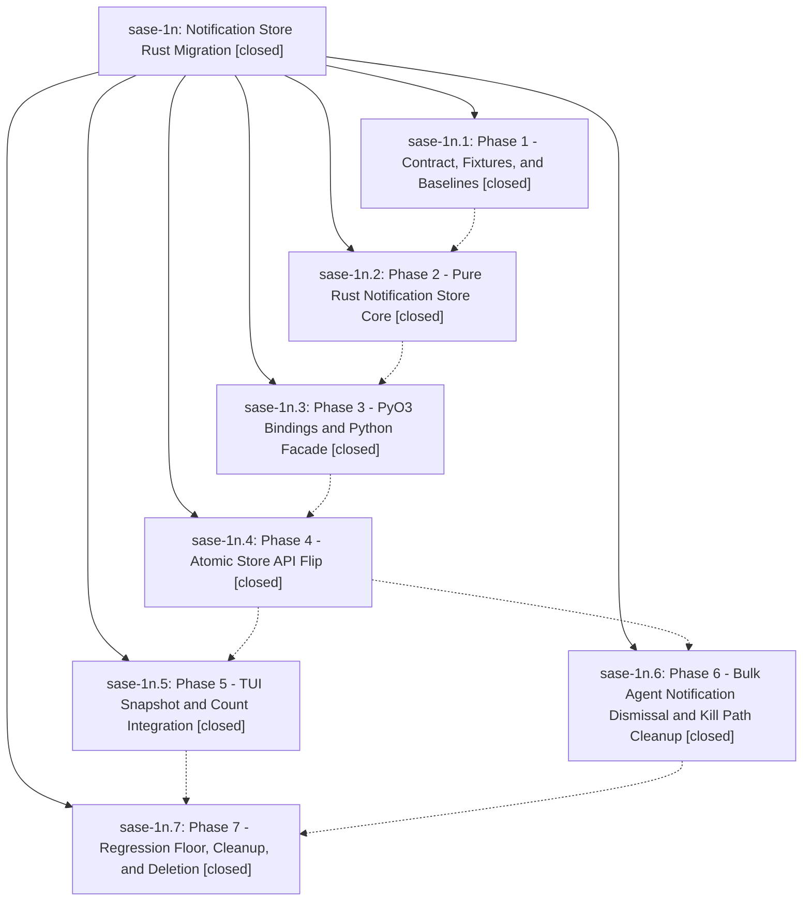

# Bead: sase-1n — Notification Store Rust Migration

[Bead Pages](../README.md) / sase-1n

**Status:** ✓ closed · **Resolution:** (unrecorded) · **Type:** plan · **Tier:** epic
**Owner:** `bryanbugyi34@gmail.com`
**Created:** 2026-05-01 01:15:35 UTC · **Closed:** 2026-05-01 02:27:56 UTC
**Plan:** [202604/notification\_rust\_migration.md](https://github.com/sase-org/sase--plans/blob/main/202604/notification_rust_migration.md)

## Phases

| Bead | Title | Status | Size | Agents | Commits |
|---|---|---|---|---:|---:|
| [sase-1n.1](sase-1n.1.md) | Phase 1 - Contract, Fixtures, and Baselines | ✓ closed | small | 0 | 1 |
| [sase-1n.2](sase-1n.2.md) | Phase 2 - Pure Rust Notification Store Core | ✓ closed | small | 0 | 3 |
| [sase-1n.3](sase-1n.3.md) | Phase 3 - PyO3 Bindings and Python Facade | ✓ closed | small | 0 | 1 |
| [sase-1n.4](sase-1n.4.md) | Phase 4 - Atomic Store API Flip | ✓ closed | small | 0 | 2 |
| [sase-1n.5](sase-1n.5.md) | Phase 5 - TUI Snapshot and Count Integration | ✓ closed | small | 0 | 1 |
| [sase-1n.6](sase-1n.6.md) | Phase 6 - Bulk Agent Notification Dismissal and Kill Path Cleanup | ✓ closed | small | 0 | 1 |
| [sase-1n.7](sase-1n.7.md) | Phase 7 - Regression Floor, Cleanup, and Deletion | ✓ closed | small | 0 | 1 |

## Lineage

## Commits

| Commit | Subject | Bead | Committed (UTC) |
|---|---|---|---|
| [`9cd6eaf`](https://github.com/sase-org/sase/commit/9cd6eafc5a8c1842312664883911a7b6b87a98f5) | chore: add notification store migration baselines (sase-1n.1) | [sase-1n.1](sase-1n.1.md) | 2026-05-01 01:25:52 |
| [`sase-core@ae6f840`](https://github.com/sase-org/sase-core/commit/ae6f840a570f43fd93dd2d14932a8136fc1c4b0c) | feat: add Rust notification store core (sase-1n.2) | [sase-1n.2](sase-1n.2.md) | 2026-05-01 01:35:43 |
| [`sase-core@495faef`](https://github.com/sase-org/sase-core/commit/495faef2a5ed9253e4dd2c605552cc98c0f4e1e1) | test: pin notification store contract fixture (sase-1n.2) | [sase-1n.2](sase-1n.2.md) | 2026-05-01 01:37:10 |
| [`c02c6a1`](https://github.com/sase-org/sase/commit/c02c6a129843e1a63a9d30897fc9e39b292d6d8c) | chore: close notification store core bead (sase-1n.2) | [sase-1n.2](sase-1n.2.md) | 2026-05-01 01:38:22 |
| [`bdd85e6`](https://github.com/sase-org/sase/commit/bdd85e632ad3fe8018fef8a4db9066ead8329d65) | feat: add notification store Python facade (sase-1n.3) | [sase-1n.3](sase-1n.3.md) | 2026-05-01 01:47:47 |
| [`e31e76f`](https://github.com/sase-org/sase/commit/e31e76ff6a41a31e9ad1662d732e5aeae02f89e3) | feat: route notification store writes through Rust (sase-1n.4) | [sase-1n.4](sase-1n.4.md) | 2026-05-01 02:00:29 |
| [`1948257`](https://github.com/sase-org/sase/commit/1948257e72d1142eada91806ad7c85eaf5c2361d) | chore: format notification store facade (sase-1n.4) | [sase-1n.4](sase-1n.4.md) | 2026-05-01 02:01:06 |
| [`eeab1b2`](https://github.com/sase-org/sase/commit/eeab1b25e71eaf60494d608e670a329df36879bf) | fix: clean up bulk notification dismissal refreshes (sase-1n.6) | [sase-1n.6](sase-1n.6.md) | 2026-05-01 02:06:58 |
| [`405ae43`](https://github.com/sase-org/sase/commit/405ae438402973a053760577ecbbc8c46eaa2b6f) | feat: route notification TUI paths through snapshots (sase-1n.5) | [sase-1n.5](sase-1n.5.md) | 2026-05-01 02:10:32 |
| [`0ad8198`](https://github.com/sase-org/sase/commit/0ad8198bf6f5fc393b4f51f0a178351689a5b4c4) | chore: add notification store regression floor (sase-1n.7) | [sase-1n.7](sase-1n.7.md) | 2026-05-01 02:21:17 |
| [`0ffd957`](https://github.com/sase-org/sase/commit/0ffd95725cc2c6b1aecc09c73c78c21d504d84e9) | fix: route notification badge counts through Rust snapshots (sase-1n) | [sase-1n](README.md) | 2026-05-01 02:29:56 |
| [`sase-core@fa52982`](https://github.com/sase-org/sase-core/commit/fa529825f07cbac10090ef3b178b28eb9a3f48fc) | fix: align notification snapshot counts with unread badges (sase-1n) | [sase-1n](README.md) | 2026-05-01 02:30:14 |
