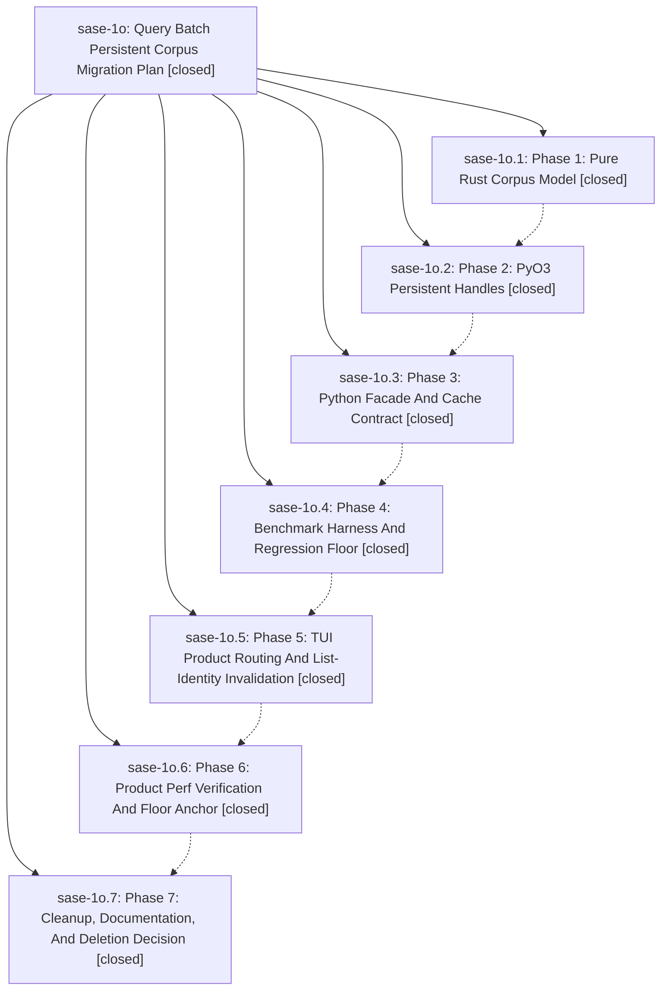

# Bead: sase-1o — Query Batch Persistent Corpus Migration Plan

[Bead Pages](../README.md) / sase-1o

**Status:** ✓ closed · **Resolution:** (unrecorded) · **Type:** plan · **Tier:** epic
**Owner:** `bryanbugyi34@gmail.com`
**Created:** 2026-05-01 02:44:55 UTC · **Closed:** 2026-05-01 04:02:01 UTC
**Plan:** [202604/query\_batch\_persistent\_corpus.md](https://github.com/sase-org/sase--plans/blob/main/202604/query_batch_persistent_corpus.md)

## Phases

| Bead | Title | Status | Size | Agents | Commits |
|---|---|---|---|---:|---:|
| [sase-1o.1](sase-1o.1.md) | Phase 1: Pure Rust Corpus Model | ✓ closed | small | 0 | 1 |
| [sase-1o.2](sase-1o.2.md) | Phase 2: PyO3 Persistent Handles | ✓ closed | small | 0 | 1 |
| [sase-1o.3](sase-1o.3.md) | Phase 3: Python Facade And Cache Contract | ✓ closed | small | 0 | 1 |
| [sase-1o.4](sase-1o.4.md) | Phase 4: Benchmark Harness And Regression Floor | ✓ closed | small | 0 | 1 |
| [sase-1o.5](sase-1o.5.md) | Phase 5: TUI Product Routing And List-Identity Invalidation | ✓ closed | small | 0 | 1 |
| [sase-1o.6](sase-1o.6.md) | Phase 6: Product Perf Verification And Floor Anchor | ✓ closed | small | 0 | 1 |
| [sase-1o.7](sase-1o.7.md) | Phase 7: Cleanup, Documentation, And Deletion Decision | ✓ closed | small | 0 | 1 |

## Lineage

## Commits

| Commit | Subject | Bead | Committed (UTC) |
|---|---|---|---|
| [`8e66b8e`](https://github.com/sase-org/sase/commit/8e66b8e0e5d8372dbb47292746a00e9d0f8d0e22) | chore: hand off query corpus phase 1 (sase-1o.1) | [sase-1o.1](sase-1o.1.md) | 2026-05-01 02:57:30 |
| [`e9192f3`](https://github.com/sase-org/sase/commit/e9192f336487b3652510f48d3f3c2955a49cb0e1) | chore: hand off query corpus phase 2 (sase-1o.2) | [sase-1o.2](sase-1o.2.md) | 2026-05-01 03:05:36 |
| [`ce3fcb2`](https://github.com/sase-org/sase/commit/ce3fcb21a633c5e978df72cfda0375f21a2e5c0a) | feat: add persistent query corpus facade (sase-1o.3) | [sase-1o.3](sase-1o.3.md) | 2026-05-01 03:11:40 |
| [`30514b2`](https://github.com/sase-org/sase/commit/30514b2c0015ac406f57b907bbfd78644cec3df6) | chore: add query corpus perf gate (sase-1o.4) | [sase-1o.4](sase-1o.4.md) | 2026-05-01 03:24:09 |
| [`f35752e`](https://github.com/sase-org/sase/commit/f35752e1034e010381701865671986a024eccc17) | feat: route TUI query filtering through corpus cache (sase-1o.5) | [sase-1o.5](sase-1o.5.md) | 2026-05-01 03:32:59 |
| [`653c2db`](https://github.com/sase-org/sase/commit/653c2db572d8dcaebc01affbe3087519f9b24a0a) | chore(perf): anchor query corpus product path (sase-1o.6) | [sase-1o.6](sase-1o.6.md) | 2026-05-01 03:47:10 |
| [`c3f8b0c`](https://github.com/sase-org/sase/commit/c3f8b0c73cf2e553d5b44e8b51ffdb4e7759758f) | ref: finish query corpus cleanup (sase-1o.7) | [sase-1o.7](sase-1o.7.md) | 2026-05-01 03:58:31 |
