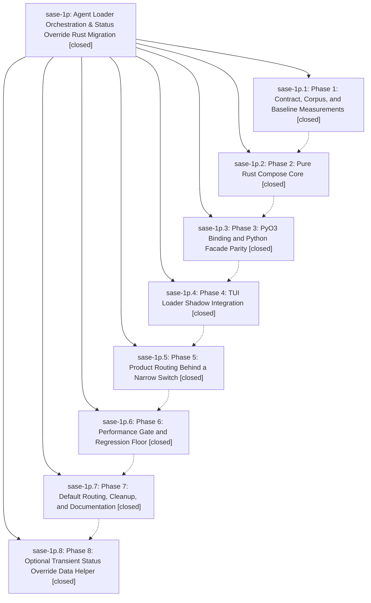

# Bead: sase-1p — Agent Loader Orchestration & Status Override Rust Migration

[Bead Pages](../README.md) / sase-1p

**Status:** ✓ closed · **Resolution:** (unrecorded) · **Type:** plan · **Tier:** epic
**Owner:** `bryanbugyi34@gmail.com`
**Created:** 2026-05-01 04:10:05 UTC · **Closed:** 2026-05-01 06:07:28 UTC
**Plan:** /home/bryan/projects/github/sase-org/sase/plans/202605/agent\_loader\_orchestration\_status\_override\_rust.md

## Phases

| Bead | Title | Status | Size | Agents | Commits |
|---|---|---|---|---:|---:|
| [sase-1p.1](sase-1p.1.md) | Phase 1: Contract, Corpus, and Baseline Measurements | ✓ closed | small | 0 | 1 |
| [sase-1p.2](sase-1p.2.md) | Phase 2: Pure Rust Compose Core | ✓ closed | small | 0 | 1 |
| [sase-1p.3](sase-1p.3.md) | Phase 3: PyO3 Binding and Python Facade Parity | ✓ closed | small | 0 | 1 |
| [sase-1p.4](sase-1p.4.md) | Phase 4: TUI Loader Shadow Integration | ✓ closed | small | 0 | 1 |
| [sase-1p.5](sase-1p.5.md) | Phase 5: Product Routing Behind a Narrow Switch | ✓ closed | small | 0 | 1 |
| [sase-1p.6](sase-1p.6.md) | Phase 6: Performance Gate and Regression Floor | ✓ closed | small | 0 | 1 |
| [sase-1p.7](sase-1p.7.md) | Phase 7: Default Routing, Cleanup, and Documentation | ✓ closed | small | 0 | 1 |
| [sase-1p.8](sase-1p.8.md) | Phase 8: Optional Transient Status Override Data Helper | ✓ closed | small | 0 | 1 |

## Lineage

## Commits

| Commit | Subject | Bead | Committed (UTC) |
|---|---|---|---|
| [`731b25b`](https://github.com/sase-org/sase/commit/731b25b12c69d6cb9620516bd62df3aecf44a606) | feat: add agent compose phase 1 contract (sase-1p.1) | [sase-1p.1](sase-1p.1.md) | 2026-05-01 04:24:04 |
| [`85b8f04`](https://github.com/sase-org/sase/commit/85b8f041b7101ba525b74b4cd3b6aaf571f83c10) | chore: document Rust compose phase handoff (sase-1p.2) | [sase-1p.2](sase-1p.2.md) | 2026-05-01 04:40:02 |
| [`cbb8908`](https://github.com/sase-org/sase/commit/cbb8908e2e82fa649ec0f3c4dcfdc9f853613b7b) | feat: add agent compose facade parity (sase-1p.3) | [sase-1p.3](sase-1p.3.md) | 2026-05-01 04:56:30 |
| [`7bb61f3`](https://github.com/sase-org/sase/commit/7bb61f39ca136f72945c4905c98c4d564eed9ae4) | feat: shadow Rust agent composition in TUI loader (sase-1p.4) | [sase-1p.4](sase-1p.4.md) | 2026-05-01 05:14:48 |
| [`cbbdbe0`](https://github.com/sase-org/sase/commit/cbbdbe00a9b74837c712c7760d613327f8ab1c99) | feat: add opt-in Rust agent compose routing (sase-1p.5) | [sase-1p.5](sase-1p.5.md) | 2026-05-01 05:21:14 |
| [`2c44f11`](https://github.com/sase-org/sase/commit/2c44f11ab27666d076235c480342ad5ec338cda9) | chore: record agent compose phase 6 perf gate (sase-1p.6) | [sase-1p.6](sase-1p.6.md) | 2026-05-01 05:40:48 |
| [`ff74d08`](https://github.com/sase-org/sase/commit/ff74d087bf0da36519d2cf407001644ba90e46cd) | feat: default agent composition to Rust (sase-1p.7) | [sase-1p.7](sase-1p.7.md) | 2026-05-01 05:52:09 |
| [`8db6677`](https://github.com/sase-org/sase/commit/8db667777fcee0586fdce3fb2f8d4a9b587bdfd5) | ref: isolate transient agent status overrides (sase-1p.8) | [sase-1p.8](sase-1p.8.md) | 2026-05-01 05:59:42 |
| [`e4b7fb4`](https://github.com/sase-org/sase/commit/e4b7fb44def5be612f38115d311845a5604681d3) | fix: preserve Rust dismissed loader rows (sase-1p) | [sase-1p](README.md) | 2026-05-01 06:09:41 |
