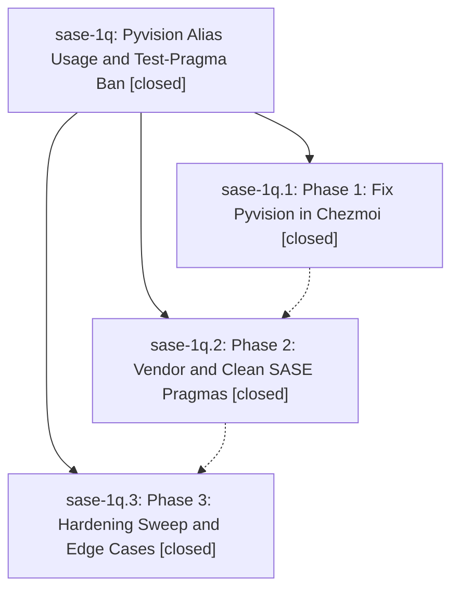

# Bead: sase-1q — Pyvision Alias Usage and Test-Pragma Ban

[Bead Pages](../README.md) / sase-1q

**Status:** ✓ closed · **Resolution:** (unrecorded) · **Type:** plan · **Tier:** epic
**Owner:** `bryanbugyi34@gmail.com`
**Created:** 2026-05-01 06:13:14 UTC · **Closed:** 2026-05-01 06:50:09 UTC
**Plan:** [202605/pyvision\_alias\_pragmas.md](https://github.com/sase-org/sase--plans/blob/main/202605/pyvision_alias_pragmas.md)

## Phases

| Bead | Title | Status | Size | Agents | Commits |
|---|---|---|---|---:|---:|
| [sase-1q.1](sase-1q.1.md) | Phase 1: Fix Pyvision in Chezmoi | ✓ closed | small | 0 | 0 |
| [sase-1q.2](sase-1q.2.md) | Phase 2: Vendor and Clean SASE Pragmas | ✓ closed | small | 0 | 2 |
| [sase-1q.3](sase-1q.3.md) | Phase 3: Hardening Sweep and Edge Cases | ✓ closed | small | 0 | 1 |

## Lineage

## Commits

| Commit | Subject | Bead | Committed (UTC) |
|---|---|---|---|
| [`ba8d90b`](https://github.com/sase-org/sase/commit/ba8d90bc58ef4e01ed7428c7051e9364e233c305) | fix: vendor pyvision test reference scanning (sase-1q.2) | [sase-1q.2](sase-1q.2.md) | 2026-05-01 06:38:24 |
| [`17b8626`](https://github.com/sase-org/sase/commit/17b86264182400b16bde1a51b688f93e687d7722) | fix: apply pyvision pragma cleanup (sase-1q.2) | [sase-1q.2](sase-1q.2.md) | 2026-05-01 06:40:55 |
| [`34ccac3`](https://github.com/sase-org/sase/commit/34ccac3ed1f97c349bfb447a3819fd7e07c918e1) | chore: close pyvision hardening bead (sase-1q.3) | [sase-1q.3](sase-1q.3.md) | 2026-05-01 06:45:37 |
