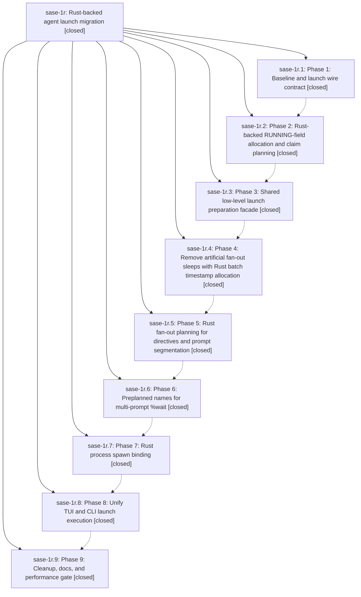

# Bead: sase-1r — Rust-backed agent launch migration

[Bead Pages](../README.md) / sase-1r

**Status:** ✓ closed · **Resolution:** (unrecorded) · **Type:** plan · **Tier:** epic
**Owner:** `bryanbugyi34@gmail.com`
**Created:** 2026-05-01 16:22:43 UTC · **Closed:** 2026-05-01 19:33:12 UTC
**Plan:** [202605/rust\_agent\_launch\_migration.md](https://github.com/sase-org/sase--plans/blob/main/202605/rust_agent_launch_migration.md)

## Phases

| Bead | Title | Status | Size | Agents | Commits |
|---|---|---|---|---:|---:|
| [sase-1r.1](sase-1r.1.md) | Phase 1: Baseline and launch wire contract | ✓ closed | small | 0 | 1 |
| [sase-1r.2](sase-1r.2.md) | Phase 2: Rust-backed RUNNING-field allocation and claim planning | ✓ closed | small | 0 | 1 |
| [sase-1r.3](sase-1r.3.md) | Phase 3: Shared low-level launch preparation facade | ✓ closed | small | 0 | 1 |
| [sase-1r.4](sase-1r.4.md) | Phase 4: Remove artificial fan-out sleeps with Rust batch timestamp allocation | ✓ closed | small | 0 | 1 |
| [sase-1r.5](sase-1r.5.md) | Phase 5: Rust fan-out planning for directives and prompt segmentation | ✓ closed | small | 0 | 1 |
| [sase-1r.6](sase-1r.6.md) | Phase 6: Preplanned names for multi-prompt %wait | ✓ closed | small | 0 | 2 |
| [sase-1r.7](sase-1r.7.md) | Phase 7: Rust process spawn binding | ✓ closed | small | 0 | 1 |
| [sase-1r.8](sase-1r.8.md) | Phase 8: Unify TUI and CLI launch execution | ✓ closed | small | 0 | 1 |
| [sase-1r.9](sase-1r.9.md) | Phase 9: Cleanup, docs, and performance gate | ✓ closed | small | 0 | 1 |

## Lineage

## Commits

| Commit | Subject | Bead | Committed (UTC) |
|---|---|---|---|
| [`96aedeb`](https://github.com/sase-org/sase/commit/96aedebfa021d9dc4a0d86c7b8654938f0124256) | fix: poll multi-prompt names in segment project (sase-1r.6) | [sase-1r.6](sase-1r.6.md) | 2026-05-01 16:55:15 |
| [`345be8f`](https://github.com/sase-org/sase/commit/345be8f011dddf3ed02918152511e28c9f43dc72) | feat: add agent launch baseline contract (sase-1r.1) | [sase-1r.1](sase-1r.1.md) | 2026-05-01 17:22:39 |
| [`c563582`](https://github.com/sase-org/sase/commit/c563582e2070d9b60e4b670c3913372c3a809581) | feat: route launch workspace claims through Rust (sase-1r.2) | [sase-1r.2](sase-1r.2.md) | 2026-05-01 17:36:35 |
| [`c4c0fed`](https://github.com/sase-org/sase/commit/c4c0fed3eb7710cf4ef76dd65e5cb3c49397b4a3) | feat: route agent launch preparation through Rust (sase-1r.3) | [sase-1r.3](sase-1r.3.md) | 2026-05-01 17:51:14 |
| [`dc03dec`](https://github.com/sase-org/sase/commit/dc03dece14d9b121226dd1121f5da443c87e333e) | feat: remove launch fan-out sleeps (sase-1r.4) | [sase-1r.4](sase-1r.4.md) | 2026-05-01 18:05:24 |
| [`2a9c1ce`](https://github.com/sase-org/sase/commit/2a9c1cef634c2b888f396fdedee9e6c1f389b71b) | feat: route launch fanout parsing through Rust (sase-1r.5) | [sase-1r.5](sase-1r.5.md) | 2026-05-01 18:41:09 |
| [`0fa7269`](https://github.com/sase-org/sase/commit/0fa7269bd06e2a5e476e00dbff41cc53cfbe3d70) | feat: preplan multi-prompt wait names (sase-1r.6) | [sase-1r.6](sase-1r.6.md) | 2026-05-01 18:53:56 |
| [`ce6c816`](https://github.com/sase-org/sase/commit/ce6c816e448e9d7b20f65d00b997bfe81eba9f36) | feat: route agent launch spawn through Rust (sase-1r.7) | [sase-1r.7](sase-1r.7.md) | 2026-05-01 19:04:36 |
| [`2f144cd`](https://github.com/sase-org/sase/commit/2f144cd230cc831b2e7ca439136512a8bfaf706d) | feat: unify agent launch execution (sase-1r.8) | [sase-1r.8](sase-1r.8.md) | 2026-05-01 19:19:03 |
| [`0aa51e2`](https://github.com/sase-org/sase/commit/0aa51e2e5a26abb6f14c8a1ede5b5e977a3c8565) | chore: add launch migration health and perf gate (sase-1r.9) | [sase-1r.9](sase-1r.9.md) | 2026-05-01 19:29:14 |
