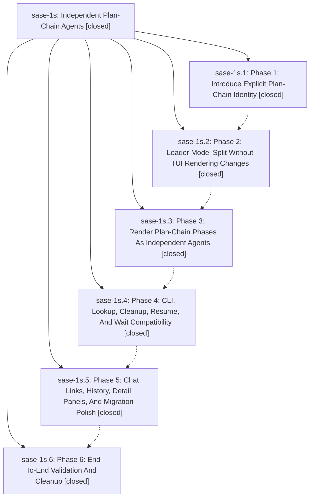

# Bead: sase-1s — Independent Plan-Chain Agents

[Bead Pages](../README.md) / sase-1s

**Status:** ✓ closed · **Resolution:** (unrecorded) · **Type:** plan · **Tier:** epic
**Owner:** `bryanbugyi34@gmail.com`
**Created:** 2026-05-01 16:34:03 UTC · **Closed:** 2026-05-01 18:49:56 UTC
**Plan:** /home/bryan/.sase/plans/202605/independent\_plan\_chain\_agents.md

## Phases

| Bead | Title | Status | Size | Agents | Commits |
|---|---|---|---|---:|---:|
| [sase-1s.1](sase-1s.1.md) | Phase 1: Introduce Explicit Plan-Chain Identity | ✓ closed | small | 0 | 1 |
| [sase-1s.2](sase-1s.2.md) | Phase 2: Loader Model Split Without TUI Rendering Changes | ✓ closed | small | 0 | 1 |
| [sase-1s.3](sase-1s.3.md) | Phase 3: Render Plan-Chain Phases As Independent Agents | ✓ closed | small | 0 | 1 |
| [sase-1s.4](sase-1s.4.md) | Phase 4: CLI, Lookup, Cleanup, Resume, And Wait Compatibility | ✓ closed | small | 0 | 1 |
| [sase-1s.5](sase-1s.5.md) | Phase 5: Chat Links, History, Detail Panels, And Migration Polish | ✓ closed | small | 0 | 1 |
| [sase-1s.6](sase-1s.6.md) | Phase 6: End-To-End Validation And Cleanup | ✓ closed | small | 0 | 0 |

## Lineage

## Commits

| Commit | Subject | Bead | Committed (UTC) |
|---|---|---|---|
| [`5c74565`](https://github.com/sase-org/sase/commit/5c745659ae1230799709570cb6e616d71c266415) | chore: Close plan-chain identity phase bead (sase-1s.1) | [sase-1s.1](sase-1s.1.md) | 2026-05-01 17:08:24 |
| [`133fca7`](https://github.com/sase-org/sase/commit/133fca7bed438360bcb38f97cde88ce8dcff4de5) | ref: split plan-chain loader model (sase-1s.2) | [sase-1s.2](sase-1s.2.md) | 2026-05-01 17:19:50 |
| [`f0ef34e`](https://github.com/sase-org/sase/commit/f0ef34e5813abe86296604680a2770723c33b618) | feat: render plan-chain phases as independent agents (sase-1s.3) | [sase-1s.3](sase-1s.3.md) | 2026-05-01 17:35:32 |
| [`2c88e98`](https://github.com/sase-org/sase/commit/2c88e98d36fcee4117d3c3dcdecfb307ac16ac4c) | feat: support independent plan-chain lifecycle APIs (sase-1s.4) | [sase-1s.4](sase-1s.4.md) | 2026-05-01 17:53:56 |
| [`e87f1c9`](https://github.com/sase-org/sase/commit/e87f1c95671ad82a7d6583b81df80318113d83ea) | feat: Polish plan-chain coder chat history (sase-1s.5) | [sase-1s.5](sase-1s.5.md) | 2026-05-01 18:02:49 |
