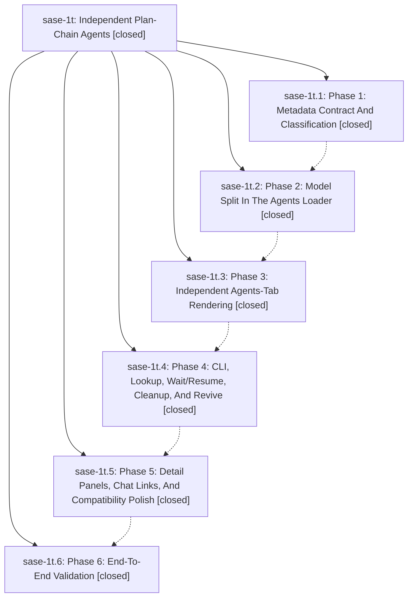

# Bead: sase-1t — Independent Plan-Chain Agents

[Bead Pages](../README.md) / sase-1t

**Status:** ✓ closed · **Resolution:** (unrecorded) · **Type:** plan · **Tier:** epic
**Owner:** `bryanbugyi34@gmail.com`
**Created:** 2026-05-01 17:10:46 UTC · **Closed:** 2026-05-01 18:49:29 UTC
**Plan:** /home/bryan/projects/github/sase-org/sase/plans/202605/independent\_plan\_chain\_agents\_1.md

## Phases

| Bead | Title | Status | Size | Agents | Commits |
|---|---|---|---|---:|---:|
| [sase-1t.1](sase-1t.1.md) | Phase 1: Metadata Contract And Classification | ✓ closed | small | 0 | 1 |
| [sase-1t.2](sase-1t.2.md) | Phase 2: Model Split In The Agents Loader | ✓ closed | small | 0 | 1 |
| [sase-1t.3](sase-1t.3.md) | Phase 3: Independent Agents-Tab Rendering | ✓ closed | small | 0 | 1 |
| [sase-1t.4](sase-1t.4.md) | Phase 4: CLI, Lookup, Wait/Resume, Cleanup, And Revive | ✓ closed | small | 0 | 0 |
| [sase-1t.5](sase-1t.5.md) | Phase 5: Detail Panels, Chat Links, And Compatibility Polish | ✓ closed | small | 0 | 0 |
| [sase-1t.6](sase-1t.6.md) | Phase 6: End-To-End Validation | ✓ closed | small | 0 | 0 |

## Lineage

## Commits

| Commit | Subject | Bead | Committed (UTC) |
|---|---|---|---|
| [`c165bf1`](https://github.com/sase-org/sase/commit/c165bf15f0461364c6a39f2464c33e6cb7d6bf3b) | ref: Normalize plan-chain role metadata (sase-1t.1) | [sase-1t.1](sase-1t.1.md) | 2026-05-01 17:26:04 |
| [`c54092e`](https://github.com/sase-org/sase/commit/c54092e135ca6f64cd44a357010974d2a162b096) | ref: clarify independent plan-chain loader entries (sase-1t.2) | [sase-1t.2](sase-1t.2.md) | 2026-05-01 17:32:37 |
| [`a52d1a2`](https://github.com/sase-org/sase/commit/a52d1a27edb048153c32ec7d7713c873045ec249) | ref: render plan-chain phases independently (sase-1t.3) | [sase-1t.3](sase-1t.3.md) | 2026-05-01 17:48:27 |
