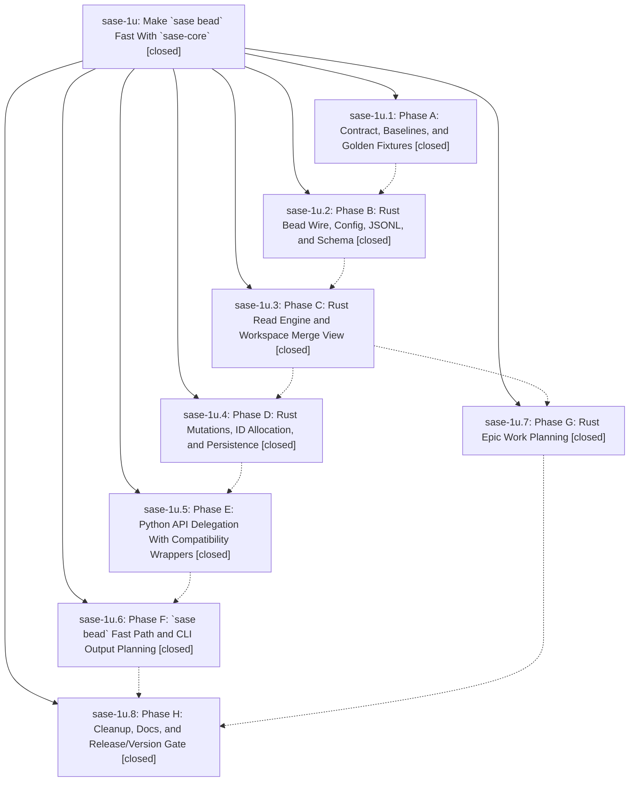

# Bead: sase-1u — Make \`sase bead\` Fast With \`sase-core\`

[Bead Pages](../README.md) / sase-1u

**Status:** ✓ closed · **Resolution:** (unrecorded) · **Type:** plan · **Tier:** epic
**Owner:** `bryanbugyi34@gmail.com`
**Created:** 2026-05-01 20:17:57 UTC · **Closed:** 2026-05-01 22:10:19 UTC
**Plan:** [202605/bead\_rust\_backend\_migration.md](https://github.com/sase-org/sase--plans/blob/main/202605/bead_rust_backend_migration.md)

## Phases

| Bead | Title | Status | Size | Agents | Commits |
|---|---|---|---|---:|---:|
| [sase-1u.1](sase-1u.1.md) | Phase A: Contract, Baselines, and Golden Fixtures | ✓ closed | small | 0 | 1 |
| [sase-1u.2](sase-1u.2.md) | Phase B: Rust Bead Wire, Config, JSONL, and Schema | ✓ closed | small | 0 | 1 |
| [sase-1u.3](sase-1u.3.md) | Phase C: Rust Read Engine and Workspace Merge View | ✓ closed | small | 0 | 1 |
| [sase-1u.4](sase-1u.4.md) | Phase D: Rust Mutations, ID Allocation, and Persistence | ✓ closed | small | 0 | 1 |
| [sase-1u.5](sase-1u.5.md) | Phase E: Python API Delegation With Compatibility Wrappers | ✓ closed | small | 0 | 1 |
| [sase-1u.6](sase-1u.6.md) | Phase F: \`sase bead\` Fast Path and CLI Output Planning | ✓ closed | small | 0 | 1 |
| [sase-1u.7](sase-1u.7.md) | Phase G: Rust Epic Work Planning | ✓ closed | small | 0 | 1 |
| [sase-1u.8](sase-1u.8.md) | Phase H: Cleanup, Docs, and Release/Version Gate | ✓ closed | small | 0 | 1 |

## Lineage

## Commits

| Commit | Subject | Bead | Committed (UTC) |
|---|---|---|---|
| [`f14ac59`](https://github.com/sase-org/sase/commit/f14ac599fbf95440875cbb372c3c312a4fcf1d2d) | chore: add bead migration baselines (sase-1u.1) | [sase-1u.1](sase-1u.1.md) | 2026-05-01 20:33:57 |
| [`774e680`](https://github.com/sase-org/sase/commit/774e6806e3061e519fa3aa6a8a45f30a7eaea202) | chore: close bead sase-1u.2 (sase-1u.2) | [sase-1u.2](sase-1u.2.md) | 2026-05-01 20:44:23 |
| [`440ca21`](https://github.com/sase-org/sase/commit/440ca215811e10ea7be5a9804abed7109c7cf76f) | feat: add bead read facade (sase-1u.3) | [sase-1u.3](sase-1u.3.md) | 2026-05-01 20:57:35 |
| [`8a5a85b`](https://github.com/sase-org/sase/commit/8a5a85b4c06e6e1ba465c502f47bb257cbaedcfc) | feat: route bead work planning through Rust (sase-1u.7) | [sase-1u.7](sase-1u.7.md) | 2026-05-01 21:09:51 |
| [`ca81125`](https://github.com/sase-org/sase/commit/ca81125e0990d987c5594794333b141ebd30eb02) | feat: expose Rust bead mutation facade (sase-1u.4) | [sase-1u.4](sase-1u.4.md) | 2026-05-01 21:19:30 |
| [`a164681`](https://github.com/sase-org/sase/commit/a16468136deafe1d846ddb753c6a55281527b048) | ref: delegate bead API to Rust facades (sase-1u.5) | [sase-1u.5](sase-1u.5.md) | 2026-05-01 21:32:53 |
| [`bef5bc3`](https://github.com/sase-org/sase/commit/bef5bc3d858dc91dd18f0ea5ec1db6c2bbf10295) | feat: fast-path common bead commands (sase-1u.6) | [sase-1u.6](sase-1u.6.md) | 2026-05-01 21:45:28 |
| [`767a488`](https://github.com/sase-org/sase/commit/767a488c4c5efefd4a4b9c6f53c73e9580c7beca) | feat: gate bead Rust backend release (sase-1u.8) | [sase-1u.8](sase-1u.8.md) | 2026-05-01 22:03:36 |
