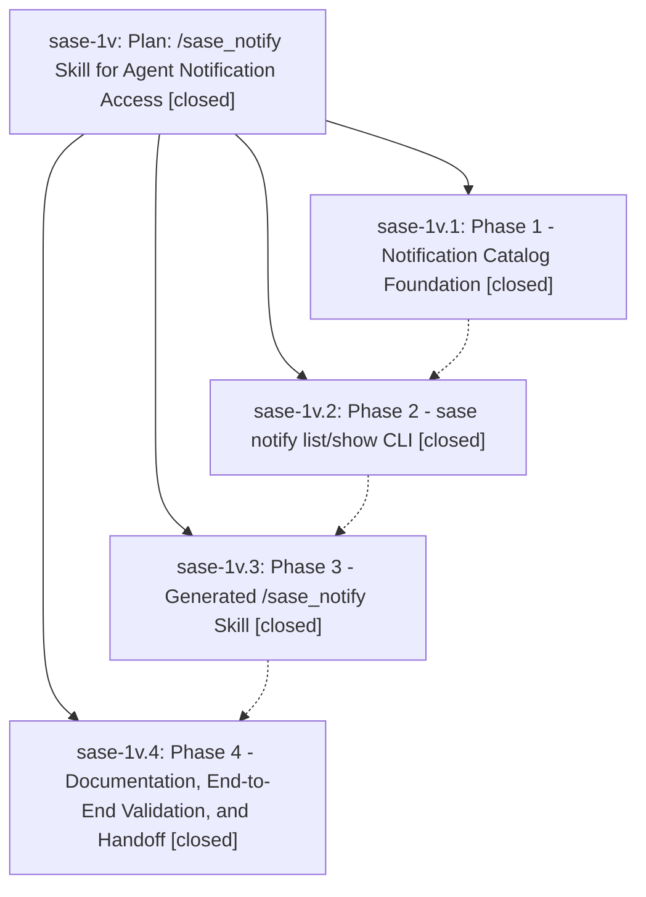

# Bead: sase-1v — Plan: /sase\_notify Skill for Agent Notification Access

[Bead Pages](../README.md) / sase-1v

**Status:** ✓ closed · **Resolution:** (unrecorded) · **Type:** plan · **Tier:** epic
**Owner:** `bryanbugyi34@gmail.com`
**Created:** 2026-05-01 21:49:37 UTC · **Closed:** 2026-05-01 22:42:19 UTC
**Plan:** [202605/sase\_notify\_skill\_1.md](https://github.com/sase-org/sase--plans/blob/main/202605/sase_notify_skill_1.md)

## Phases

| Bead | Title | Status | Size | Agents | Commits |
|---|---|---|---|---:|---:|
| [sase-1v.1](sase-1v.1.md) | Phase 1 - Notification Catalog Foundation | ✓ closed | small | 0 | 1 |
| [sase-1v.2](sase-1v.2.md) | Phase 2 - sase notify list/show CLI | ✓ closed | small | 0 | 1 |
| [sase-1v.3](sase-1v.3.md) | Phase 3 - Generated /sase\_notify Skill | ✓ closed | small | 0 | 1 |
| [sase-1v.4](sase-1v.4.md) | Phase 4 - Documentation, End-to-End Validation, and Handoff | ✓ closed | small | 0 | 1 |

## Lineage

## Commits

| Commit | Subject | Bead | Committed (UTC) |
|---|---|---|---|
| [`38b52a6`](https://github.com/sase-org/sase/commit/38b52a6476d6c0703ab34616a0c9549e40184fee) | feat: add notification catalog helpers (sase-1v.1) | [sase-1v.1](sase-1v.1.md) | 2026-05-01 22:09:08 |
| [`b674725`](https://github.com/sase-org/sase/commit/b674725ae6506f77f0cb7106537d65ba2d25a20e) | feat: add notification list and show CLI (sase-1v.2) | [sase-1v.2](sase-1v.2.md) | 2026-05-01 22:21:51 |
| [`a304f07`](https://github.com/sase-org/sase/commit/a304f070c3b8835b558170657fdd0626ef3b3be4) | feat: add generated sase notify skill (sase-1v.3) | [sase-1v.3](sase-1v.3.md) | 2026-05-01 22:31:52 |
| [`9879fa4`](https://github.com/sase-org/sase/commit/9879fa436ac41df0f7d6e9d24621994b227f39ae) | chore: validate notify skill handoff (sase-1v.4) | [sase-1v.4](sase-1v.4.md) | 2026-05-01 22:37:13 |
