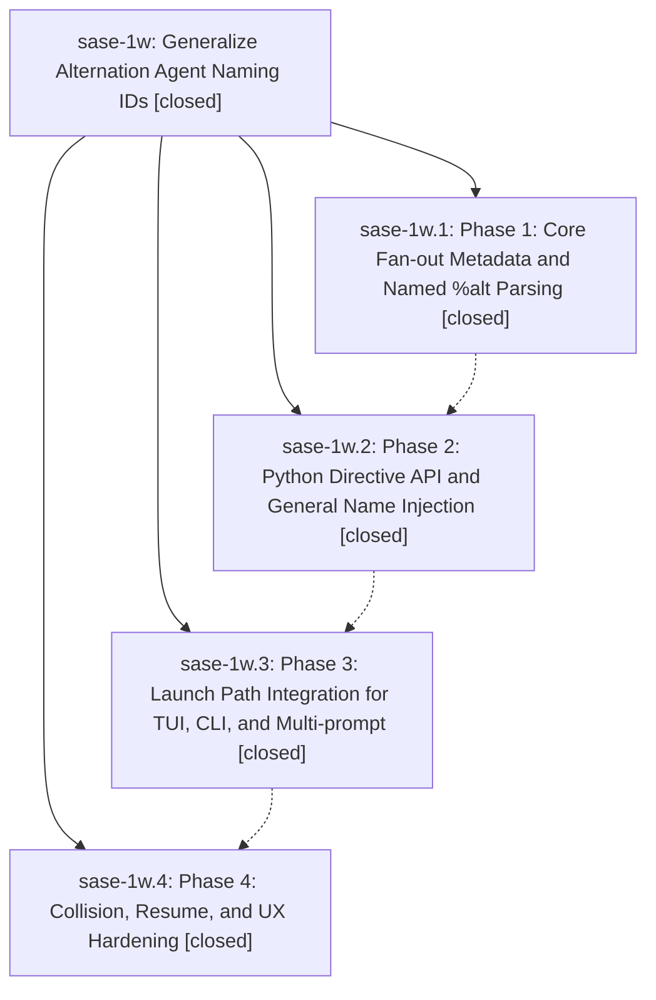

# Bead: sase-1w — Generalize Alternation Agent Naming IDs

[Bead Pages](../README.md) / sase-1w

**Status:** ✓ closed · **Resolution:** (unrecorded) · **Type:** plan · **Tier:** epic
**Owner:** `bryanbugyi34@gmail.com`
**Created:** 2026-05-01 21:52:33 UTC · **Closed:** 2026-05-01 22:45:03 UTC
**Plan:** [202605/alt\_named\_ids.md](https://github.com/sase-org/sase--plans/blob/main/202605/alt_named_ids.md)

## Phases

| Bead | Title | Status | Size | Agents | Commits |
|---|---|---|---|---:|---:|
| [sase-1w.1](sase-1w.1.md) | Phase 1: Core Fan-out Metadata and Named %alt Parsing | ✓ closed | small | 0 | 1 |
| [sase-1w.2](sase-1w.2.md) | Phase 2: Python Directive API and General Name Injection | ✓ closed | small | 0 | 1 |
| [sase-1w.3](sase-1w.3.md) | Phase 3: Launch Path Integration for TUI, CLI, and Multi-prompt | ✓ closed | small | 0 | 1 |
| [sase-1w.4](sase-1w.4.md) | Phase 4: Collision, Resume, and UX Hardening | ✓ closed | small | 0 | 1 |

## Lineage

## Commits

| Commit | Subject | Bead | Committed (UTC) |
|---|---|---|---|
| [`724db2c`](https://github.com/sase-org/sase/commit/724db2cb8eb25ef5eafc771859daa4eecd9bb2ca) | feat: expose fanout alt ids in Python wire (sase-1w.1) | [sase-1w.1](sase-1w.1.md) | 2026-05-01 22:06:09 |
| [`de8803d`](https://github.com/sase-org/sase/commit/de8803d7598ee071de17d01efb14b91522902209) | feat: generalize fanout naming for alt ids (sase-1w.2) | [sase-1w.2](sase-1w.2.md) | 2026-05-01 22:18:19 |
| [`f98fb3d`](https://github.com/sase-org/sase/commit/f98fb3db25739b19f6a8afe2ec6c9d2b0353050d) | feat: integrate named alt fan-out launch paths (sase-1w.3) | [sase-1w.3](sase-1w.3.md) | 2026-05-01 22:29:16 |
| [`5d6eed6`](https://github.com/sase-org/sase/commit/5d6eed627242927eb100ef4bd211a3bf1271c28d) | fix: harden alt fan-out naming (sase-1w.4) | [sase-1w.4](sase-1w.4.md) | 2026-05-01 22:40:17 |
