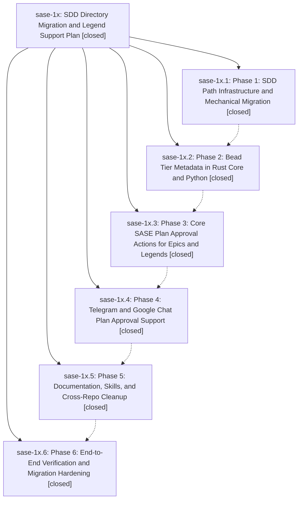

# Bead: sase-1x — SDD Directory Migration and Legend Support Plan

[Bead Pages](../README.md) / sase-1x

**Status:** ✓ closed · **Resolution:** (unrecorded) · **Type:** plan · **Tier:** epic
**Owner:** `bryanbugyi34@gmail.com`
**Created:** 2026-05-02 00:18:07 UTC · **Closed:** 2026-05-02 01:57:55 UTC
**Plan:** [202605/sdd\_legends\_migration\_4.md](https://github.com/sase-org/sase--plans/blob/main/202605/sdd_legends_migration_4.md)

## Phases

| Bead | Title | Status | Size | Agents | Commits |
|---|---|---|---|---:|---:|
| [sase-1x.1](sase-1x.1.md) | Phase 1: SDD Path Infrastructure and Mechanical Migration | ✓ closed | small | 0 | 1 |
| [sase-1x.2](sase-1x.2.md) | Phase 2: Bead Tier Metadata in Rust Core and Python | ✓ closed | small | 0 | 1 |
| [sase-1x.3](sase-1x.3.md) | Phase 3: Core SASE Plan Approval Actions for Epics and Legends | ✓ closed | small | 0 | 1 |
| [sase-1x.4](sase-1x.4.md) | Phase 4: Telegram and Google Chat Plan Approval Support | ✓ closed | small | 0 | 1 |
| [sase-1x.5](sase-1x.5.md) | Phase 5: Documentation, Skills, and Cross-Repo Cleanup | ✓ closed | small | 0 | 1 |
| [sase-1x.6](sase-1x.6.md) | Phase 6: End-to-End Verification and Migration Hardening | ✓ closed | small | 0 | 1 |

## Lineage

## Commits

| Commit | Subject | Bead | Committed (UTC) |
|---|---|---|---|
| [`1182ef5`](https://github.com/sase-org/sase/commit/1182ef5983a56adc9c08da91c78deab7eb50a629) | feat: Migrate SDD paths under sdd (sase-1x.1) | [sase-1x.1](sase-1x.1.md) | 2026-05-02 00:37:25 |
| [`ff30f40`](https://github.com/sase-org/sase/commit/ff30f4014aa65499df2ca7591cc048448c85055f) | feat: Add bead tier metadata to Python facade (sase-1x.2) | [sase-1x.2](sase-1x.2.md) | 2026-05-02 01:07:14 |
| [`cff4f84`](https://github.com/sase-org/sase/commit/cff4f84895fa959fa90f16da9a1ac8533f5a1da6) | feat: Add legend plan approval flow (sase-1x.3) | [sase-1x.3](sase-1x.3.md) | 2026-05-02 01:21:17 |
| [`b754595`](https://github.com/sase-org/sase/commit/b754595c9658800a4076f9bc14626c827ee45194) | chore: record phase 4 plugin work (sase-1x.4) | [sase-1x.4](sase-1x.4.md) | 2026-05-02 01:31:07 |
| [`322f402`](https://github.com/sase-org/sase/commit/322f4022f56701300c27f632c85e37e48882b9c7) | chore: document SDD legend layout and bead tiers (sase-1x.5) | [sase-1x.5](sase-1x.5.md) | 2026-05-02 01:42:32 |
| [`b16c7ea`](https://github.com/sase-org/sase/commit/b16c7eaa609f22464a1551f16ed985a3d4577a8c) | fix: harden SDD legend migration (sase-1x.6) | [sase-1x.6](sase-1x.6.md) | 2026-05-02 01:52:26 |
