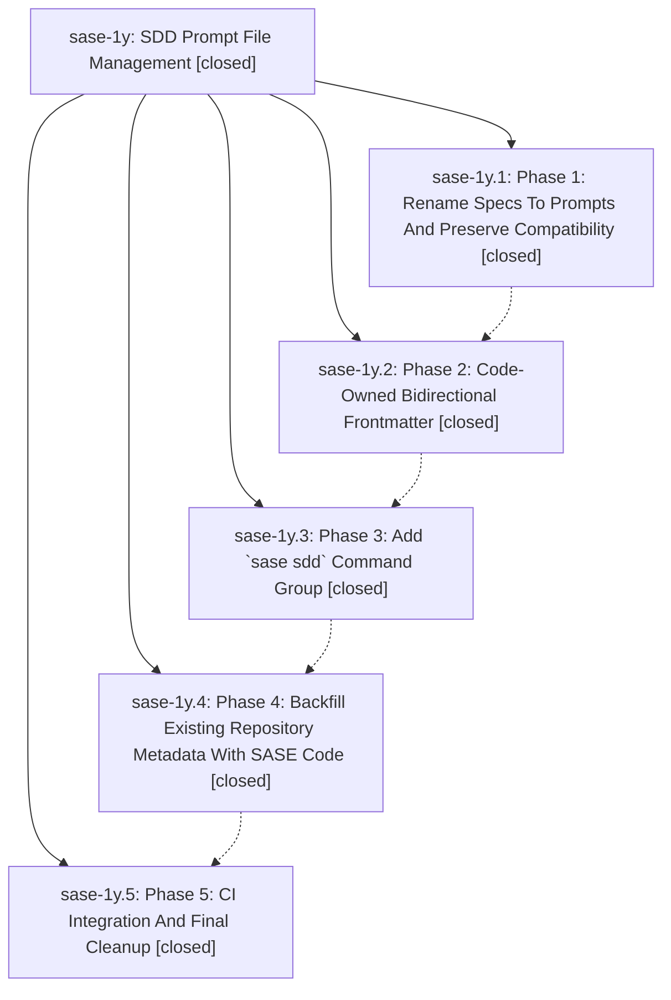

# Bead: sase-1y — SDD Prompt File Management

[Bead Pages](../README.md) / sase-1y

**Status:** ✓ closed · **Resolution:** (unrecorded) · **Type:** plan · **Tier:** epic
**Owner:** `bryanbugyi34@gmail.com`
**Created:** 2026-05-02 02:21:56 UTC · **Closed:** 2026-05-02 03:14:12 UTC
**Plan:** [202605/sdd\_prompt\_management.md](https://github.com/sase-org/sase--plans/blob/main/202605/sdd_prompt_management.md)

## Phases

| Bead | Title | Status | Size | Agents | Commits |
|---|---|---|---|---:|---:|
| [sase-1y.1](sase-1y.1.md) | Phase 1: Rename Specs To Prompts And Preserve Compatibility | ✓ closed | small | 0 | 1 |
| [sase-1y.2](sase-1y.2.md) | Phase 2: Code-Owned Bidirectional Frontmatter | ✓ closed | small | 0 | 1 |
| [sase-1y.3](sase-1y.3.md) | Phase 3: Add \`sase sdd\` Command Group | ✓ closed | small | 0 | 1 |
| [sase-1y.4](sase-1y.4.md) | Phase 4: Backfill Existing Repository Metadata With SASE Code | ✓ closed | small | 0 | 1 |
| [sase-1y.5](sase-1y.5.md) | Phase 5: CI Integration And Final Cleanup | ✓ closed | small | 0 | 1 |

## Lineage

## Commits

| Commit | Subject | Bead | Committed (UTC) |
|---|---|---|---|
| [`144851c`](https://github.com/sase-org/sase/commit/144851c0e270b8a7fc74aa675ac9db094a46b6a2) | feat: Rename SDD specs to prompts (sase-1y.1) | [sase-1y.1](sase-1y.1.md) | 2026-05-02 02:43:53 |
| [`868d09e`](https://github.com/sase-org/sase/commit/868d09ec3b8b6d915909534a8d5da92fda8210ac) | feat: Link SDD prompts and plans with frontmatter (sase-1y.2) | [sase-1y.2](sase-1y.2.md) | 2026-05-02 02:50:13 |
| [`52a0163`](https://github.com/sase-org/sase/commit/52a01635c0434caa31c7ac0144fac98a60032695) | feat: add SDD validation CLI (sase-1y.3) | [sase-1y.3](sase-1y.3.md) | 2026-05-02 02:58:31 |
| [`159d79d`](https://github.com/sase-org/sase/commit/159d79dd03bfd19e07a496fce9469a0059b9d8fd) | chore: backfill SDD prompt and plan links (sase-1y.4) | [sase-1y.4](sase-1y.4.md) | 2026-05-02 03:06:45 |
| [`c6dbcff`](https://github.com/sase-org/sase/commit/c6dbcffc9316545e325a3dd78c2771bc38f86113) | chore: Gate CI on SDD validation (sase-1y.5) | [sase-1y.5](sase-1y.5.md) | 2026-05-02 03:10:45 |
