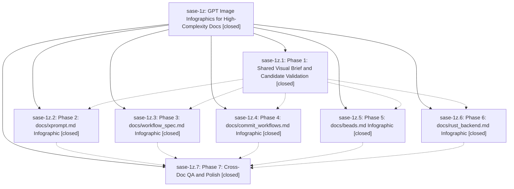

# Bead: sase-1z — GPT Image Infographics for High-Complexity Docs

[Bead Pages](../README.md) / sase-1z

**Status:** ✓ closed · **Resolution:** (unrecorded) · **Type:** plan · **Tier:** epic
**Owner:** `bryanbugyi34@gmail.com`
**Created:** 2026-05-02 04:34:58 UTC · **Closed:** 2026-05-02 05:18:56 UTC
**Plan:** [202605/docs\_gpt\_image\_infographics.md](https://github.com/sase-org/sase--plans/blob/main/202605/docs_gpt_image_infographics.md)

## Phases

| Bead | Title | Status | Size | Agents | Commits |
|---|---|---|---|---:|---:|
| [sase-1z.1](sase-1z.1.md) | Phase 1: Shared Visual Brief and Candidate Validation | ✓ closed | small | 0 | 1 |
| [sase-1z.2](sase-1z.2.md) | Phase 2: docs/xprompt.md Infographic | ✓ closed | small | 0 | 1 |
| [sase-1z.3](sase-1z.3.md) | Phase 3: docs/workflow\_spec.md Infographic | ✓ closed | small | 0 | 1 |
| [sase-1z.4](sase-1z.4.md) | Phase 4: docs/commit\_workflows.md Infographic | ✓ closed | small | 0 | 1 |
| [sase-1z.5](sase-1z.5.md) | Phase 5: docs/beads.md Infographic | ✓ closed | small | 0 | 1 |
| [sase-1z.6](sase-1z.6.md) | Phase 6: docs/rust\_backend.md Infographic | ✓ closed | small | 0 | 1 |
| [sase-1z.7](sase-1z.7.md) | Phase 7: Cross-Doc QA and Polish | ✓ closed | small | 0 | 1 |

## Lineage

## Commits

| Commit | Subject | Bead | Committed (UTC) |
|---|---|---|---|
| [`df23453`](https://github.com/sase-org/sase/commit/df234530cd001df95f90d44fab249b3f0ded2f3d) | chore: add infographic style brief (sase-1z.1) | [sase-1z.1](sase-1z.1.md) | 2026-05-02 04:46:30 |
| [`bc202aa`](https://github.com/sase-org/sase/commit/bc202aa5c05df0898ff64da1a6b6e7427648e98f) | chore: add commit workflow infographic (sase-1z.4) | [sase-1z.4](sase-1z.4.md) | 2026-05-02 04:51:18 |
| [`004250f`](https://github.com/sase-org/sase/commit/004250fad8bfe3f2350f3885eac61fde7c825af7) | chore: add workflow spec infographic (sase-1z.3) | [sase-1z.3](sase-1z.3.md) | 2026-05-02 04:55:13 |
| [`e4e5c74`](https://github.com/sase-org/sase/commit/e4e5c74ac619f6536615def93435d203ed6a5286) | docs: add rust backend boundary infographic (sase-1z.6) | [sase-1z.6](sase-1z.6.md) | 2026-05-02 04:55:18 |
| [`1c7042a`](https://github.com/sase-org/sase/commit/1c7042a41294248b5d3e833286f72dd686aaed1e) | chore: add xprompt resolution infographic (sase-1z.2) | [sase-1z.2](sase-1z.2.md) | 2026-05-02 04:59:08 |
| [`c6bd4a8`](https://github.com/sase-org/sase/commit/c6bd4a86a607ec970eac1491434911e93dce3683) | chore: add bead epic work infographic (sase-1z.5) | [sase-1z.5](sase-1z.5.md) | 2026-05-02 05:02:26 |
| [`ecfb267`](https://github.com/sase-org/sase/commit/ecfb267a0a02a49bc64e61d8f8964d7e36d0d489) | chore: polish docs infographic readability (sase-1z.7) | [sase-1z.7](sase-1z.7.md) | 2026-05-02 05:13:38 |
