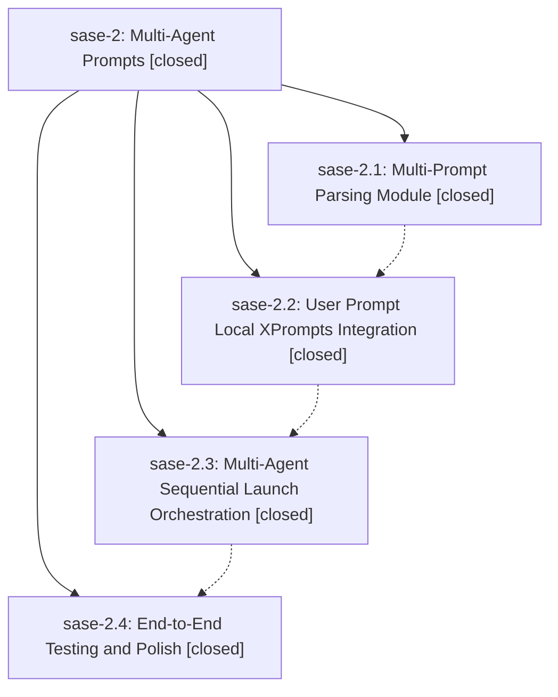

# Bead: sase-2 — Multi-Agent Prompts

[Bead Pages](../README.md) / sase-2

**Status:** ✓ closed · **Resolution:** (unrecorded) · **Type:** plan · **Tier:** epic
**Owner:** `bryanbugyi34@gmail.com`
**Created:** 2026-03-19 01:58:45 UTC · **Closed:** 2026-03-19 03:04:30 UTC
**Plan:** [202603/multi\_agent\_prompts.md](https://github.com/sase-org/sase--plans/blob/main/202603/multi_agent_prompts.md)

## Phases

| Bead | Title | Status | Size | Agents | Commits |
|---|---|---|---|---:|---:|
| [sase-2.1](sase-2.1.md) | Multi-Prompt Parsing Module | ✓ closed | small | 0 | 1 |
| [sase-2.2](sase-2.2.md) | User Prompt Local XPrompts Integration | ✓ closed | small | 0 | 1 |
| [sase-2.3](sase-2.3.md) | Multi-Agent Sequential Launch Orchestration | ✓ closed | small | 0 | 1 |
| [sase-2.4](sase-2.4.md) | End-to-End Testing and Polish | ✓ closed | small | 0 | 1 |

## Lineage

## Commits

| Commit | Subject | Bead | Committed (UTC) |
|---|---|---|---|
| [`d824dd2`](https://github.com/sase-org/sase/commit/d824dd240f3d6eaca899eae16eb7cc37bb80f4d1) | feat: Add multi-prompt parsing module (sase-2.1) | [sase-2.1](sase-2.1.md) | 2026-03-19 02:10:23 |
| [`31c31b3`](https://github.com/sase-org/sase/commit/31c31b375d752d26eafb36f529e2ecdcac292008) | feat: Wire up frontmatter-defined local xprompts in all prompt preprocessing paths (sase-2.2) | [sase-2.2](sase-2.2.md) | 2026-03-19 02:21:34 |
| [`9415fb2`](https://github.com/sase-org/sase/commit/9415fb203982af930cdee3ce5a2defc3597d09ed) | feat: Add multi-agent sequential launch orchestration (sase-2.3) | [sase-2.3](sase-2.3.md) | 2026-03-19 02:50:15 |
| [`c28b9fc`](https://github.com/sase-org/sase/commit/c28b9fc362dab991b93a71fdd0914fba060af0a2) | feat: Add E2E tests and polish for multi-agent prompts (sase-2.4) | [sase-2.4](sase-2.4.md) | 2026-03-19 03:04:22 |
