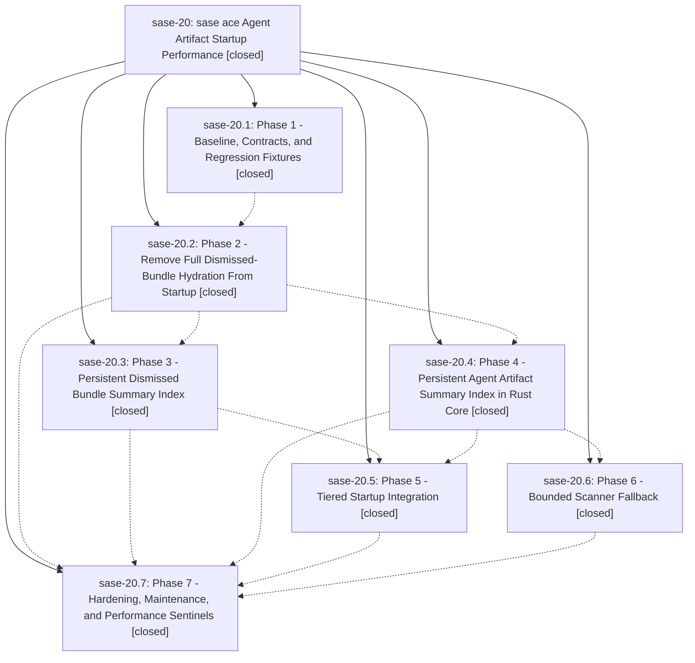

# Bead: sase-20 — sase ace Agent Artifact Startup Performance

[Bead Pages](../README.md) / sase-20

**Status:** ✓ closed · **Resolution:** (unrecorded) · **Type:** plan · **Tier:** epic
**Owner:** `bryanbugyi34@gmail.com`
**Created:** 2026-05-04 16:58:10 UTC · **Closed:** 2026-05-04 18:06:51 UTC
**Plan:** [202605/agent\_artifact\_startup\_perf.md](https://github.com/sase-org/sase--plans/blob/main/202605/agent_artifact_startup_perf.md)

## Phases

| Bead | Title | Status | Size | Agents | Commits |
|---|---|---|---|---:|---:|
| [sase-20.1](sase-20.1.md) | Phase 1 - Baseline, Contracts, and Regression Fixtures | ✓ closed | small | 0 | 1 |
| [sase-20.2](sase-20.2.md) | Phase 2 - Remove Full Dismissed-Bundle Hydration From Startup | ✓ closed | small | 0 | 1 |
| [sase-20.3](sase-20.3.md) | Phase 3 - Persistent Dismissed Bundle Summary Index | ✓ closed | small | 0 | 1 |
| [sase-20.4](sase-20.4.md) | Phase 4 - Persistent Agent Artifact Summary Index in Rust Core | ✓ closed | small | 0 | 1 |
| [sase-20.5](sase-20.5.md) | Phase 5 - Tiered Startup Integration | ✓ closed | small | 0 | 1 |
| [sase-20.6](sase-20.6.md) | Phase 6 - Bounded Scanner Fallback | ✓ closed | small | 0 | 1 |
| [sase-20.7](sase-20.7.md) | Phase 7 - Hardening, Maintenance, and Performance Sentinels | ✓ closed | small | 0 | 1 |

## Lineage

## Commits

| Commit | Subject | Bead | Committed (UTC) |
|---|---|---|---|
| [`90b9fdd`](https://github.com/sase-org/sase/commit/90b9fdd7fc1513480faf667202a968b0ab19de1b) | chore: add agent artifact startup regression fixtures (sase-20.1) | [sase-20.1](sase-20.1.md) | 2026-05-04 17:11:37 |
| [`ba62150`](https://github.com/sase-org/sase/commit/ba62150098500bd617de20daaf3948ce9d5f057d) | feat: lazy-load dismissed agent archive (sase-20.2) | [sase-20.2](sase-20.2.md) | 2026-05-04 17:18:59 |
| [`0d66e95`](https://github.com/sase-org/sase/commit/0d66e95441a65140903d11defb4b4e3929e8a92b) | feat: index dismissed bundle summaries (sase-20.3) | [sase-20.3](sase-20.3.md) | 2026-05-04 17:30:13 |
| [`8af625d`](https://github.com/sase-org/sase/commit/8af625d6f96e6c844004b5877c1ff07446a39de9) | feat: expose agent artifact index maintenance (sase-20.4) | [sase-20.4](sase-20.4.md) | 2026-05-04 17:33:44 |
| [`9405074`](https://github.com/sase-org/sase/commit/94050744b46f7988ddd2517c149e659a02746a10) | feat: wire bounded agent artifact scan options (sase-20.6) | [sase-20.6](sase-20.6.md) | 2026-05-04 17:47:04 |
| [`e39fdb2`](https://github.com/sase-org/sase/commit/e39fdb281f9fbb4e6beb2edaafa791f2c871a9d7) | feat: wire tiered agent artifact startup (sase-20.5) | [sase-20.5](sase-20.5.md) | 2026-05-04 17:49:12 |
| [`21618c9`](https://github.com/sase-org/sase/commit/21618c9af6392b6a6ca5b1b560b1b999bb8a2278) | feat: Harden agent artifact index maintenance (sase-20.7) | [sase-20.7](sase-20.7.md) | 2026-05-04 17:59:49 |
| [`523a11b`](https://github.com/sase-org/sase/commit/523a11b2adcd80283b79815699bf47678ff99efc) | fix: reconcile tiered artifact loader from source (sase-20) | [sase-20](README.md) | 2026-05-04 18:07:57 |
