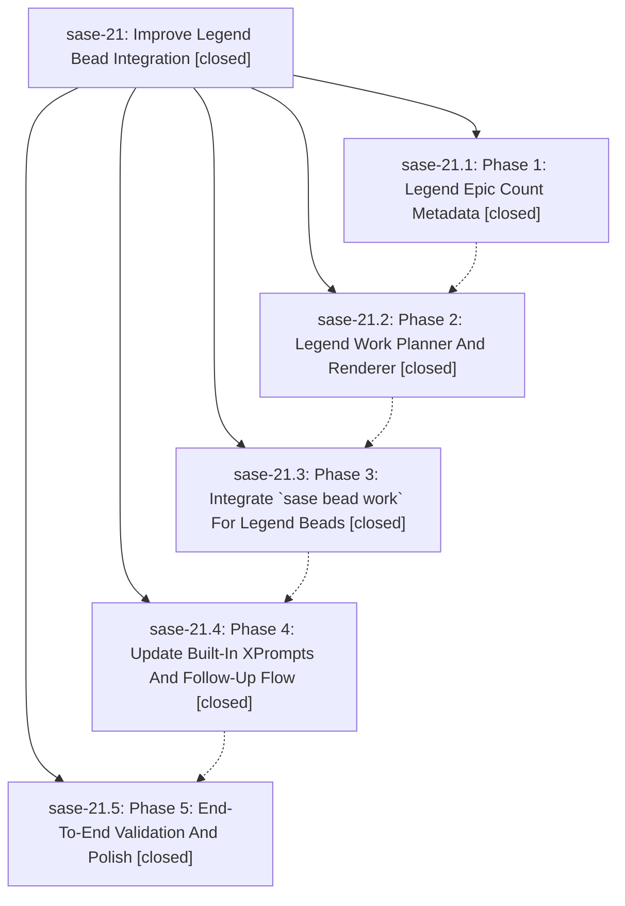

# Bead: sase-21 — Improve Legend Bead Integration

[Bead Pages](../README.md) / sase-21

**Status:** ✓ closed · **Resolution:** (unrecorded) · **Type:** plan · **Tier:** epic
**Owner:** `bryanbugyi34@gmail.com`
**Created:** 2026-05-04 17:44:10 UTC · **Closed:** 2026-05-04 18:49:25 UTC
**Plan:** [202605/legend\_bead\_integration.md](https://github.com/sase-org/sase--plans/blob/main/202605/legend_bead_integration.md)

## Phases

| Bead | Title | Status | Size | Agents | Commits |
|---|---|---|---|---:|---:|
| [sase-21.1](sase-21.1.md) | Phase 1: Legend Epic Count Metadata | ✓ closed | small | 0 | 1 |
| [sase-21.2](sase-21.2.md) | Phase 2: Legend Work Planner And Renderer | ✓ closed | small | 0 | 1 |
| [sase-21.3](sase-21.3.md) | Phase 3: Integrate \`sase bead work\` For Legend Beads | ✓ closed | small | 0 | 1 |
| [sase-21.4](sase-21.4.md) | Phase 4: Update Built-In XPrompts And Follow-Up Flow | ✓ closed | small | 0 | 1 |
| [sase-21.5](sase-21.5.md) | Phase 5: End-To-End Validation And Polish | ✓ closed | small | 0 | 1 |

## Lineage

## Commits

| Commit | Subject | Bead | Committed (UTC) |
|---|---|---|---|
| [`059c24a`](https://github.com/sase-org/sase/commit/059c24a20ffc029d6ef6f6fc93b604730050a042) | feat: add legend epic count bead metadata (sase-21.1) | [sase-21.1](sase-21.1.md) | 2026-05-04 18:10:47 |
| [`6774bd6`](https://github.com/sase-org/sase/commit/6774bd6c6bdc3a251de803b21128a0f286fb4629) | feat: add legend work rendering (sase-21.2) | [sase-21.2](sase-21.2.md) | 2026-05-04 18:20:19 |
| [`6798461`](https://github.com/sase-org/sase/commit/679846158a8774352209d4b5b8dc9eb9f74d491d) | feat: integrate legend bead work launches (sase-21.3) | [sase-21.3](sase-21.3.md) | 2026-05-04 18:30:14 |
| [`426ffd6`](https://github.com/sase-org/sase/commit/426ffd6c13f4456b978dedae4322a088f4a07fa9) | feat: update legend bead kickoff prompt (sase-21.4) | [sase-21.4](sase-21.4.md) | 2026-05-04 18:40:35 |
| [`9a15663`](https://github.com/sase-org/sase/commit/9a156634f0a7d32f9817102cb0d61856a8f02386) | chore: validate legend bead work launch flow (sase-21.5) | [sase-21.5](sase-21.5.md) | 2026-05-04 18:46:23 |
