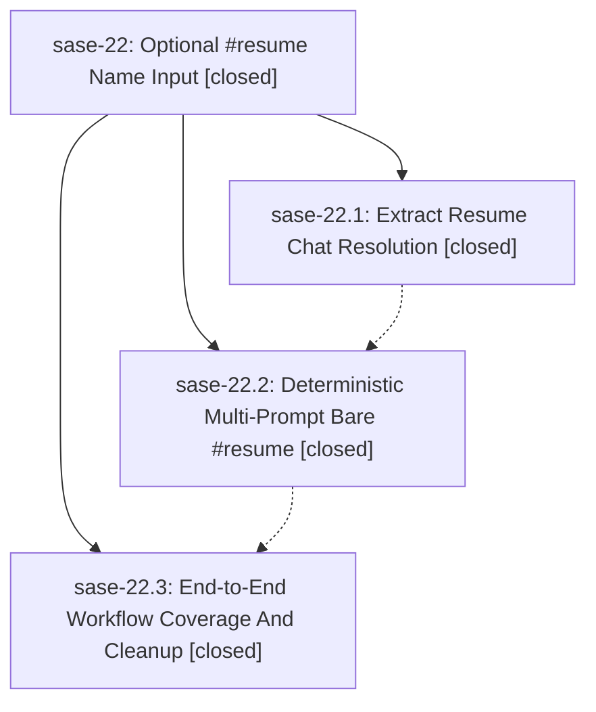

# Bead: sase-22 — Optional #resume Name Input

[Bead Pages](../README.md) / sase-22

**Status:** ✓ closed · **Resolution:** (unrecorded) · **Type:** plan · **Tier:** epic
**Owner:** `bryanbugyi34@gmail.com`
**Created:** 2026-05-04 19:55:32 UTC · **Closed:** 2026-05-04 20:28:28 UTC
**Plan:** [202605/resume\_optional\_name.md](https://github.com/sase-org/sase--plans/blob/main/202605/resume_optional_name.md)

## Phases

| Bead | Title | Status | Size | Agents | Commits |
|---|---|---|---|---:|---:|
| [sase-22.1](sase-22.1.md) | Extract Resume Chat Resolution | ✓ closed | small | 0 | 1 |
| [sase-22.2](sase-22.2.md) | Deterministic Multi-Prompt Bare #resume | ✓ closed | small | 0 | 1 |
| [sase-22.3](sase-22.3.md) | End-to-End Workflow Coverage And Cleanup | ✓ closed | small | 0 | 1 |

## Lineage

## Commits

| Commit | Subject | Bead | Committed (UTC) |
|---|---|---|---|
| [`f8b8a4f`](https://github.com/sase-org/sase/commit/f8b8a4f9abff88ea9fe524216eecd1474ebd9e52) | feat: extract resume chat resolution (sase-22.1) | [sase-22.1](sase-22.1.md) | 2026-05-04 20:07:40 |
| [`2b477f7`](https://github.com/sase-org/sase/commit/2b477f75040da4426019c9fdbcfe632cb0365992) | feat: make multi-prompt bare resume deterministic (sase-22.2) | [sase-22.2](sase-22.2.md) | 2026-05-04 20:15:21 |
| [`083a40f`](https://github.com/sase-org/sase/commit/083a40ff8b246a2bebe7b73eefdc0d463064adb7) | test: cover bare resume workflow execution (sase-22.3) | [sase-22.3](sase-22.3.md) | 2026-05-04 20:24:40 |
