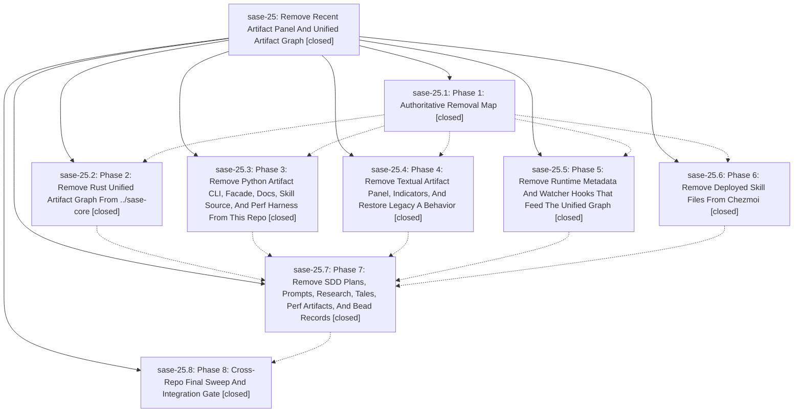

# Bead: sase-25 — Remove Recent Artifact Panel And Unified Artifact Graph

[Bead Pages](../README.md) / sase-25

**Status:** ✓ closed · **Resolution:** (unrecorded) · **Type:** plan · **Tier:** epic
**Owner:** `bryanbugyi34@gmail.com`
**Created:** 2026-05-06 06:53:17 UTC
**Plan:** [202605/remove\_recent\_artifact\_panel.md](https://github.com/sase-org/sase--plans/blob/main/202605/remove_recent_artifact_panel.md)

## Phases

| Bead | Title | Status | Size | Agents | Commits |
|---|---|---|---|---:|---:|
| [sase-25.1](sase-25.1.md) | Phase 1: Authoritative Removal Map | ✓ closed | small | 0 | 1 |
| [sase-25.2](sase-25.2.md) | Phase 2: Remove Rust Unified Artifact Graph From ../sase-core | ✓ closed | small | 0 | 0 |
| [sase-25.3](sase-25.3.md) | Phase 3: Remove Python Artifact CLI, Facade, Docs, Skill Source, And Perf Harness From This Repo | ✓ closed | small | 0 | 0 |
| [sase-25.4](sase-25.4.md) | Phase 4: Remove Textual Artifact Panel, Indicators, And Restore Legacy A Behavior | ✓ closed | small | 0 | 1 |
| [sase-25.5](sase-25.5.md) | Phase 5: Remove Runtime Metadata And Watcher Hooks That Feed The Unified Graph | ✓ closed | small | 0 | 1 |
| [sase-25.6](sase-25.6.md) | Phase 6: Remove Deployed Skill Files From Chezmoi | ✓ closed | small | 0 | 1 |
| [sase-25.7](sase-25.7.md) | Phase 7: Remove SDD Plans, Prompts, Research, Tales, Perf Artifacts, And Bead Records | ✓ closed | small | 0 | 1 |
| [sase-25.8](sase-25.8.md) | Phase 8: Cross-Repo Final Sweep And Integration Gate | ✓ closed | small | 0 | 1 |

## Lineage

## Commits

| Commit | Subject | Bead | Committed (UTC) |
|---|---|---|---|
| [`13eec93`](https://github.com/sase-org/sase/commit/13eec932b5a21f7690be6f0dc2c82d3d5b00e601) | chore: map artifact panel removal scope (sase-25.1) | [sase-25.1](sase-25.1.md) | 2026-05-06 07:04:59 |
| [`c1926d4`](https://github.com/sase-org/sase/commit/c1926d458475e2899a165c7484c4cc165265f0fa) | chore: close deployed artifact skill bead (sase-25.6) | [sase-25.6](sase-25.6.md) | 2026-05-06 07:10:00 |
| [`e8b4930`](https://github.com/sase-org/sase/commit/e8b4930237c1f3a03ba5f51c99bc8e1701d39c02) | ref: remove artifact graph runtime metadata hooks (sase-25.5) | [sase-25.5](sase-25.5.md) | 2026-05-06 07:19:36 |
| [`3d0b755`](https://github.com/sase-org/sase/commit/3d0b75597d521cd605160ecc0b422be229f162be) | feat: remove TUI artifact panel (sase-25.4) | [sase-25.4](sase-25.4.md) | 2026-05-06 07:25:50 |
| [`6906585`](https://github.com/sase-org/sase/commit/6906585197b4033395a96ec44ad89cc84ff0bbe6) | chore: remove historical artifact SDD records (sase-25.7) | [sase-25.7](sase-25.7.md) | 2026-05-06 07:35:02 |
| [`9c5cc42`](https://github.com/sase-org/sase/commit/9c5cc425d678bf4c9ca17436788ba4bff75ab8e8) | chore: complete artifact panel removal gate (sase-25.8) | [sase-25.8](sase-25.8.md) | 2026-05-06 07:42:05 |
