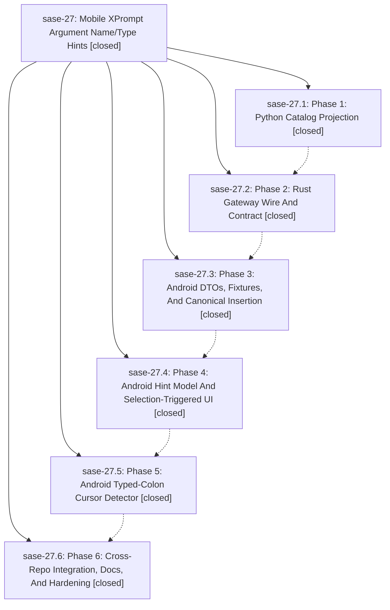

# Bead: sase-27 — Mobile XPrompt Argument Name/Type Hints

[Bead Pages](../README.md) / sase-27

**Status:** ✓ closed · **Resolution:** (unrecorded) · **Type:** plan · **Tier:** epic
**Owner:** `bryanbugyi34@gmail.com`
**Created:** 2026-05-07 01:48:04 UTC · **Closed:** 2026-05-07 02:39:14 UTC
**Plan:** [202605/mobile\_xprompt\_argument\_hints.md](https://github.com/sase-org/sase--plans/blob/main/202605/mobile_xprompt_argument_hints.md)

## Phases

| Bead | Title | Status | Size | Agents | Commits |
|---|---|---|---|---:|---:|
| [sase-27.1](sase-27.1.md) | Phase 1: Python Catalog Projection | ✓ closed | small | 0 | 0 |
| [sase-27.2](sase-27.2.md) | Phase 2: Rust Gateway Wire And Contract | ✓ closed | small | 0 | 0 |
| [sase-27.3](sase-27.3.md) | Phase 3: Android DTOs, Fixtures, And Canonical Insertion | ✓ closed | small | 0 | 0 |
| [sase-27.4](sase-27.4.md) | Phase 4: Android Hint Model And Selection-Triggered UI | ✓ closed | small | 0 | 0 |
| [sase-27.5](sase-27.5.md) | Phase 5: Android Typed-Colon Cursor Detector | ✓ closed | small | 0 | 0 |
| [sase-27.6](sase-27.6.md) | Phase 6: Cross-Repo Integration, Docs, And Hardening | ✓ closed | small | 0 | 0 |

## Lineage

