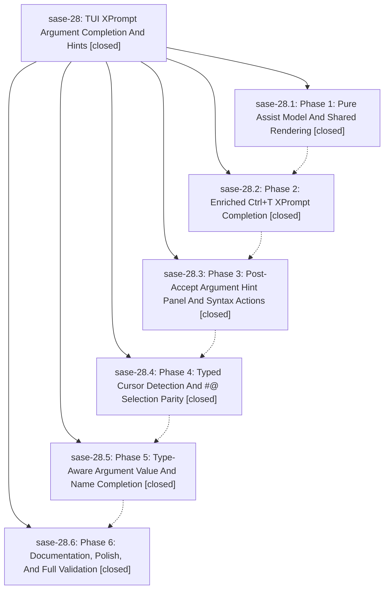

# Bead: sase-28 — TUI XPrompt Argument Completion And Hints

[Bead Pages](../README.md) / sase-28

**Status:** ✓ closed · **Resolution:** (unrecorded) · **Type:** plan · **Tier:** epic
**Owner:** `bryanbugyi34@gmail.com`
**Created:** 2026-05-07 04:13:11 UTC · **Closed:** 2026-05-07 05:09:56 UTC
**Plan:** [202605/tui\_xprompt\_argument\_assist.md](https://github.com/sase-org/sase--plans/blob/main/202605/tui_xprompt_argument_assist.md)

## Phases

| Bead | Title | Status | Size | Agents | Commits |
|---|---|---|---|---:|---:|
| [sase-28.1](sase-28.1.md) | Phase 1: Pure Assist Model And Shared Rendering | ✓ closed | small | 0 | 0 |
| [sase-28.2](sase-28.2.md) | Phase 2: Enriched Ctrl+T XPrompt Completion | ✓ closed | small | 0 | 0 |
| [sase-28.3](sase-28.3.md) | Phase 3: Post-Accept Argument Hint Panel And Syntax Actions | ✓ closed | small | 0 | 0 |
| [sase-28.4](sase-28.4.md) | Phase 4: Typed Cursor Detection And #@ Selection Parity | ✓ closed | small | 0 | 0 |
| [sase-28.5](sase-28.5.md) | Phase 5: Type-Aware Argument Value And Name Completion | ✓ closed | small | 0 | 0 |
| [sase-28.6](sase-28.6.md) | Phase 6: Documentation, Polish, And Full Validation | ✓ closed | small | 0 | 0 |

## Lineage

