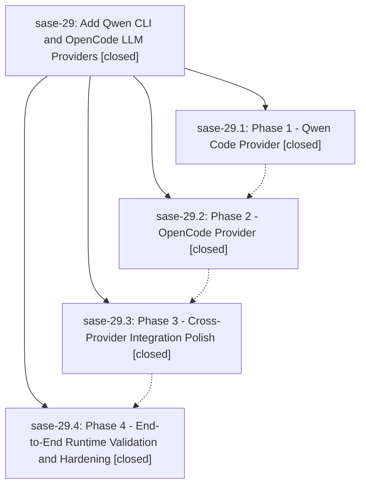

# Bead: sase-29 — Add Qwen CLI and OpenCode LLM Providers

[Bead Pages](../README.md) / sase-29

**Status:** ✓ closed · **Resolution:** (unrecorded) · **Type:** plan · **Tier:** epic
**Owner:** `bryanbugyi34@gmail.com`
**Created:** 2026-05-07 06:02:50 UTC · **Closed:** 2026-05-07 07:00:40 UTC
**Plan:** [202605/qwen\_opencode.md](https://github.com/sase-org/sase--plans/blob/main/202605/qwen_opencode.md)

## Phases

| Bead | Title | Status | Size | Agents | Commits |
|---|---|---|---|---:|---:|
| [sase-29.1](sase-29.1.md) | Phase 1 - Qwen Code Provider | ✓ closed | small | 0 | 0 |
| [sase-29.2](sase-29.2.md) | Phase 2 - OpenCode Provider | ✓ closed | small | 0 | 1 |
| [sase-29.3](sase-29.3.md) | Phase 3 - Cross-Provider Integration Polish | ✓ closed | small | 0 | 0 |
| [sase-29.4](sase-29.4.md) | Phase 4 - End-to-End Runtime Validation and Hardening | ✓ closed | small | 0 | 1 |

## Lineage

## Commits

| Commit | Subject | Bead | Committed (UTC) |
|---|---|---|---|
| [`4d0c348`](https://github.com/sase-org/sase/commit/4d0c348ddbd9b51c7b0c5cf4ca7d72c4773c0555) | feat: add OpenCode LLM provider (sase-29.2) | [sase-29.2](sase-29.2.md) | 2026-05-07 06:30:09 |
| [`822dc3f`](https://github.com/sase-org/sase/commit/822dc3fa9966ba9a1b9404e336742193ca8dc09b) | fix: refresh stale editable metadata before tests (sase-29.4) | [sase-29.4](sase-29.4.md) | 2026-05-07 06:51:37 |
