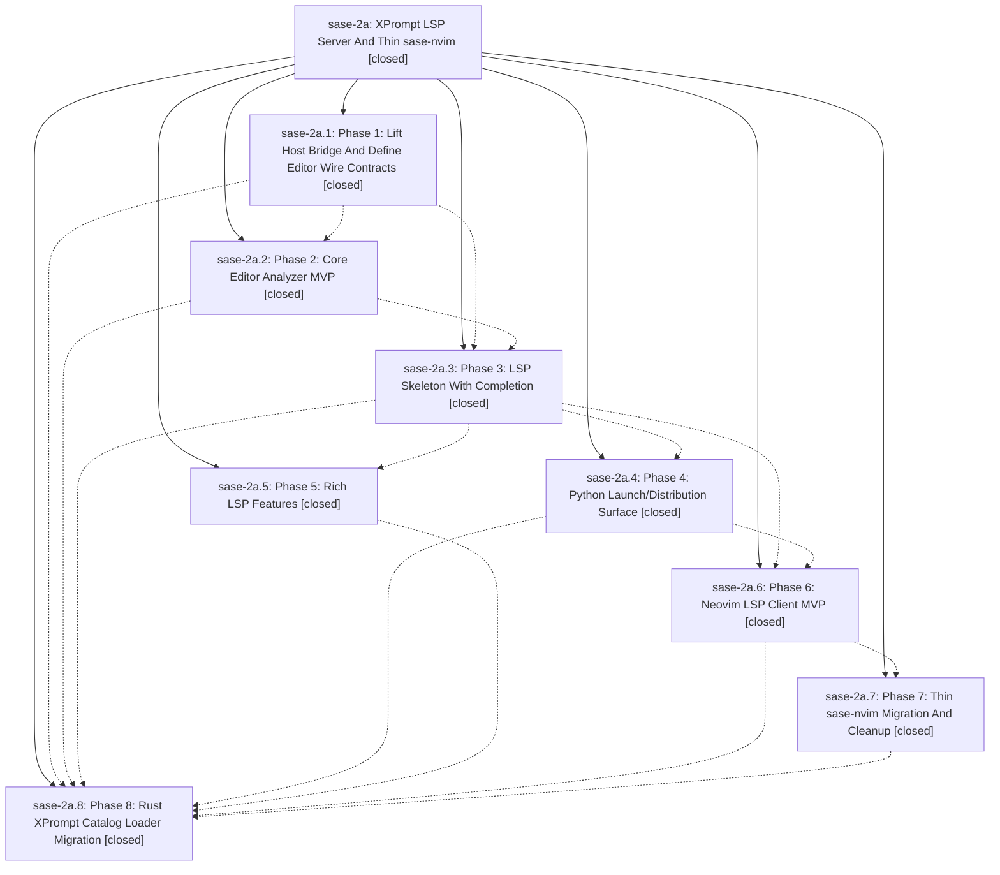

# Bead: sase-2a — XPrompt LSP Server And Thin sase-nvim

[Bead Pages](../README.md) / sase-2a

**Status:** ✓ closed · **Resolution:** (unrecorded) · **Type:** plan · **Tier:** epic
**Owner:** `bryanbugyi34@gmail.com`
**Created:** 2026-05-07 07:38:07 UTC · **Closed:** 2026-05-07 09:08:56 UTC
**Plan:** [202605/xprompt\_lsp\_server.md](https://github.com/sase-org/sase--plans/blob/main/202605/xprompt_lsp_server.md)

## Phases

| Bead | Title | Status | Size | Agents | Commits |
|---|---|---|---|---:|---:|
| [sase-2a.1](sase-2a.1.md) | Phase 1: Lift Host Bridge And Define Editor Wire Contracts | ✓ closed | small | 0 | 0 |
| [sase-2a.2](sase-2a.2.md) | Phase 2: Core Editor Analyzer MVP | ✓ closed | small | 0 | 0 |
| [sase-2a.3](sase-2a.3.md) | Phase 3: LSP Skeleton With Completion | ✓ closed | small | 0 | 0 |
| [sase-2a.4](sase-2a.4.md) | Phase 4: Python Launch/Distribution Surface | ✓ closed | small | 0 | 1 |
| [sase-2a.5](sase-2a.5.md) | Phase 5: Rich LSP Features | ✓ closed | small | 0 | 0 |
| [sase-2a.6](sase-2a.6.md) | Phase 6: Neovim LSP Client MVP | ✓ closed | small | 0 | 0 |
| [sase-2a.7](sase-2a.7.md) | Phase 7: Thin sase-nvim Migration And Cleanup | ✓ closed | small | 0 | 0 |
| [sase-2a.8](sase-2a.8.md) | Phase 8: Rust XPrompt Catalog Loader Migration | ✓ closed | small | 0 | 0 |

## Lineage

## Commits

| Commit | Subject | Bead | Committed (UTC) |
|---|---|---|---|
| [`1b5de15`](https://github.com/sase-org/sase/commit/1b5de15f3f35e735ee6503ad2aca4b67632dad25) | feat: add xprompt LSP launch surface (sase-2a.4) | [sase-2a.4](sase-2a.4.md) | 2026-05-07 08:32:17 |
