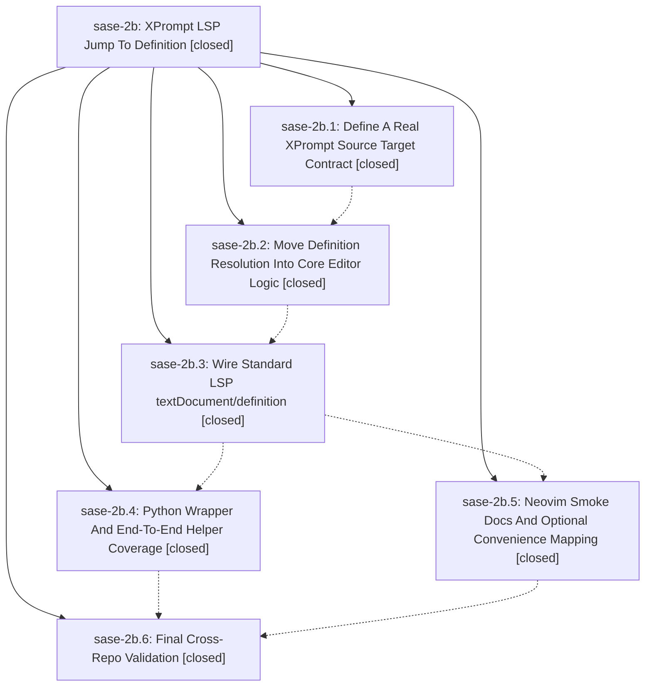

# Bead: sase-2b — XPrompt LSP Jump To Definition

[Bead Pages](../README.md) / sase-2b

**Status:** ✓ closed · **Resolution:** (unrecorded) · **Type:** plan · **Tier:** epic
**Owner:** `bryanbugyi34@gmail.com`
**Created:** 2026-05-07 16:53:03 UTC · **Closed:** 2026-05-07 17:44:03 UTC
**Plan:** [202605/xprompt\_lsp\_jump\_definition.md](https://github.com/sase-org/sase--plans/blob/main/202605/xprompt_lsp_jump_definition.md)

## Phases

| Bead | Title | Status | Size | Agents | Commits |
|---|---|---|---|---:|---:|
| [sase-2b.1](sase-2b.1.md) | Define A Real XPrompt Source Target Contract | ✓ closed | small | 0 | 0 |
| [sase-2b.2](sase-2b.2.md) | Move Definition Resolution Into Core Editor Logic | ✓ closed | small | 0 | 0 |
| [sase-2b.3](sase-2b.3.md) | Wire Standard LSP textDocument/definition | ✓ closed | small | 0 | 0 |
| [sase-2b.4](sase-2b.4.md) | Python Wrapper And End-To-End Helper Coverage | ✓ closed | small | 0 | 1 |
| [sase-2b.5](sase-2b.5.md) | Neovim Smoke Docs And Optional Convenience Mapping | ✓ closed | small | 0 | 0 |
| [sase-2b.6](sase-2b.6.md) | Final Cross-Repo Validation | ✓ closed | small | 0 | 0 |

## Lineage

## Commits

| Commit | Subject | Bead | Committed (UTC) |
|---|---|---|---|
| [`491a286`](https://github.com/sase-org/sase/commit/491a28670a9a29019851bb9d11f7a78a695f36c2) | fix: include xprompt definition paths in helper catalog (sase-2b.4) | [sase-2b.4](sase-2b.4.md) | 2026-05-07 17:32:53 |
