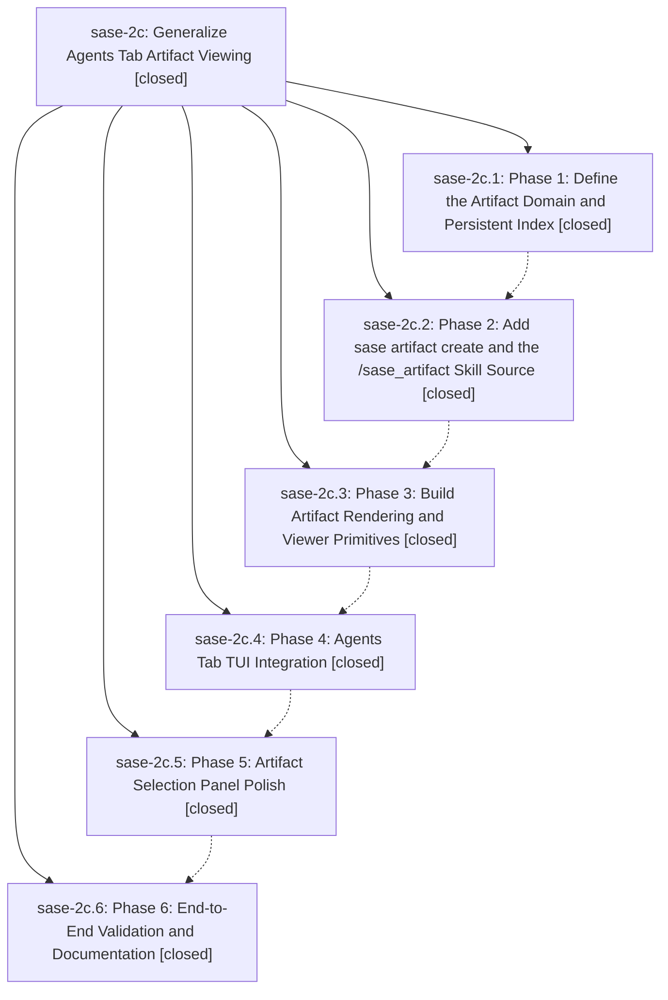

# Bead: sase-2c — Generalize Agents Tab Artifact Viewing

[Bead Pages](../README.md) / sase-2c

**Status:** ✓ closed · **Resolution:** (unrecorded) · **Type:** plan · **Tier:** epic
**Owner:** `bryanbugyi34@gmail.com`
**Created:** 2026-05-08 01:44:19 UTC · **Closed:** 2026-05-08 02:44:54 UTC
**Plan:** [202605/artifacts\_keymap.md](https://github.com/sase-org/sase--plans/blob/main/202605/artifacts_keymap.md)

## Phases

| Bead | Title | Status | Size | Agents | Commits |
|---|---|---|---|---:|---:|
| [sase-2c.1](sase-2c.1.md) | Phase 1: Define the Artifact Domain and Persistent Index | ✓ closed | small | 0 | 0 |
| [sase-2c.2](sase-2c.2.md) | Phase 2: Add sase artifact create and the /sase\_artifact Skill Source | ✓ closed | small | 0 | 0 |
| [sase-2c.3](sase-2c.3.md) | Phase 3: Build Artifact Rendering and Viewer Primitives | ✓ closed | small | 0 | 1 |
| [sase-2c.4](sase-2c.4.md) | Phase 4: Agents Tab TUI Integration | ✓ closed | small | 0 | 0 |
| [sase-2c.5](sase-2c.5.md) | Phase 5: Artifact Selection Panel Polish | ✓ closed | small | 0 | 0 |
| [sase-2c.6](sase-2c.6.md) | Phase 6: End-to-End Validation and Documentation | ✓ closed | small | 0 | 0 |

## Lineage

## Commits

| Commit | Subject | Bead | Committed (UTC) |
|---|---|---|---|
| [`807b969`](https://github.com/sase-org/sase/commit/807b969d838b48d28b431ab1ed22c23e5737df01) | feat: add artifact viewer primitives (sase-2c.3) | [sase-2c.3](sase-2c.3.md) | 2026-05-08 02:16:32 |
