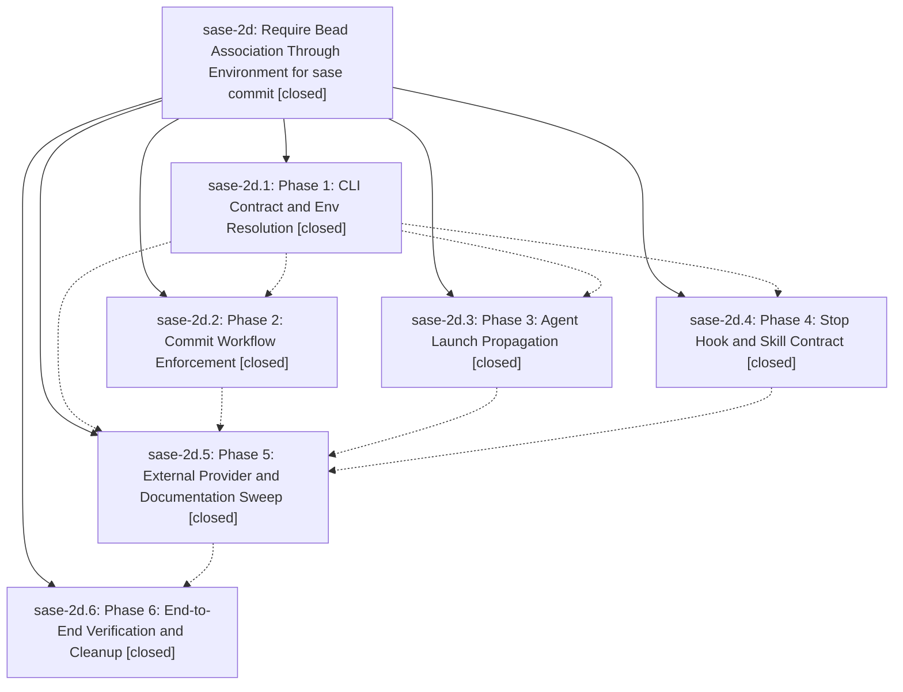

# Bead: sase-2d — Require Bead Association Through Environment for sase commit

[Bead Pages](../README.md) / sase-2d

**Status:** ✓ closed · **Resolution:** (unrecorded) · **Type:** plan · **Tier:** epic
**Owner:** `bryanbugyi34@gmail.com`
**Created:** 2026-05-08 02:54:34 UTC · **Closed:** 2026-05-08 03:37:15 UTC
**Plan:** [202605/bead\_env\_commit\_contract.md](https://github.com/sase-org/sase--plans/blob/main/202605/bead_env_commit_contract.md)

## Phases

| Bead | Title | Status | Size | Agents | Commits |
|---|---|---|---|---:|---:|
| [sase-2d.1](sase-2d.1.md) | Phase 1: CLI Contract and Env Resolution | ✓ closed | small | 0 | 0 |
| [sase-2d.2](sase-2d.2.md) | Phase 2: Commit Workflow Enforcement | ✓ closed | small | 0 | 0 |
| [sase-2d.3](sase-2d.3.md) | Phase 3: Agent Launch Propagation | ✓ closed | small | 0 | 0 |
| [sase-2d.4](sase-2d.4.md) | Phase 4: Stop Hook and Skill Contract | ✓ closed | small | 0 | 0 |
| [sase-2d.5](sase-2d.5.md) | Phase 5: External Provider and Documentation Sweep | ✓ closed | small | 0 | 0 |
| [sase-2d.6](sase-2d.6.md) | Phase 6: End-to-End Verification and Cleanup | ✓ closed | small | 0 | 0 |

## Lineage

## Commits

| Commit | Subject | Bead | Committed (UTC) |
|---|---|---|---|
| [`c3b90b9`](https://github.com/sase-org/sase/commit/c3b90b94c6cf2d2fad471710e00fc505e61466e3) | chore: close bead env commit epic (sase-2d) | [sase-2d](README.md) | 2026-05-08 03:39:22 |
