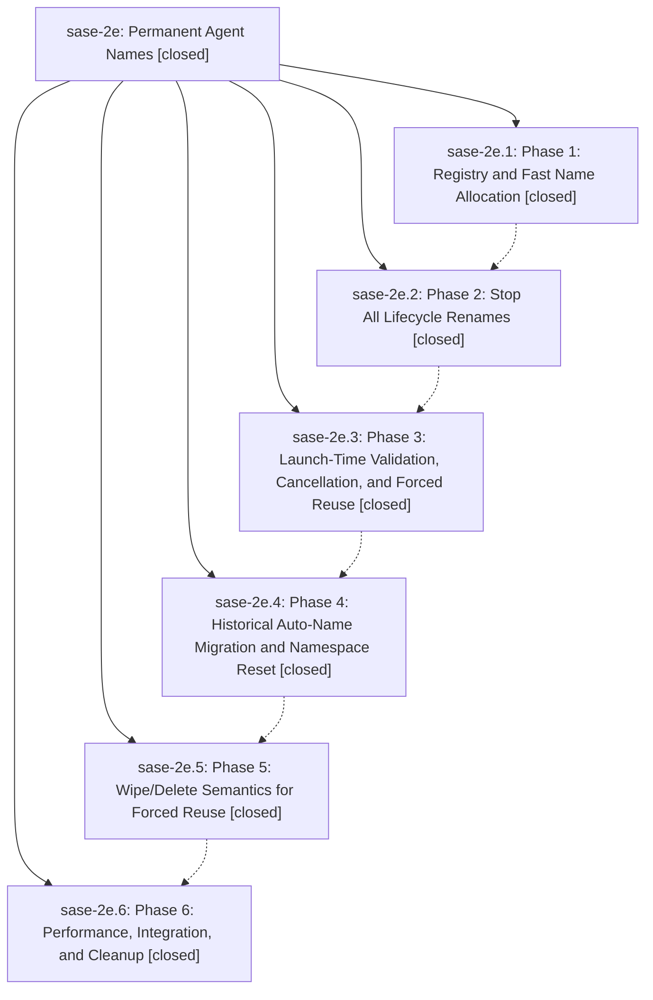

# Bead: sase-2e — Permanent Agent Names

[Bead Pages](../README.md) / sase-2e

**Status:** ✓ closed · **Resolution:** (unrecorded) · **Type:** plan · **Tier:** epic
**Owner:** `bryanbugyi34@gmail.com`
**Created:** 2026-05-09 00:05:29 UTC · **Closed:** 2026-05-09 01:39:32 UTC
**Plan:** [202605/permanent\_agent\_names.md](https://github.com/sase-org/sase--plans/blob/main/202605/permanent_agent_names.md)

## Notes

COMMIT: abf5a861

## Phases

| Bead | Title | Status | Size | Agents | Commits |
|---|---|---|---|---:|---:|
| [sase-2e.1](sase-2e.1.md) | Phase 1: Registry and Fast Name Allocation | ✓ closed | small | 0 | 1 |
| [sase-2e.2](sase-2e.2.md) | Phase 2: Stop All Lifecycle Renames | ✓ closed | small | 0 | 1 |
| [sase-2e.3](sase-2e.3.md) | Phase 3: Launch-Time Validation, Cancellation, and Forced Reuse | ✓ closed | small | 0 | 1 |
| [sase-2e.4](sase-2e.4.md) | Phase 4: Historical Auto-Name Migration and Namespace Reset | ✓ closed | small | 0 | 1 |
| [sase-2e.5](sase-2e.5.md) | Phase 5: Wipe/Delete Semantics for Forced Reuse | ✓ closed | small | 0 | 1 |
| [sase-2e.6](sase-2e.6.md) | Phase 6: Performance, Integration, and Cleanup | ✓ closed | small | 0 | 1 |

## Lineage

## Commits

| Commit | Subject | Bead | Committed (UTC) |
|---|---|---|---|
| [`b891b9d`](https://github.com/sase-org/sase/commit/b891b9df8297b70b3cbe90af792070add6c93ba7) | feat: add permanent agent name registry (sase-2e.1) | [sase-2e.1](sase-2e.1.md) | 2026-05-09 00:22:20 |
| [`3ba650a`](https://github.com/sase-org/sase/commit/3ba650a0d6f439462aa1ca8276f600b81f7a7b26) | feat: stop lifecycle agent renames (sase-2e.2) | [sase-2e.2](sase-2e.2.md) | 2026-05-09 00:38:02 |
| [`db506e9`](https://github.com/sase-org/sase/commit/db506e95b54db50032c9902651eda737bea02dc6) | feat: validate permanent agent names at launch (sase-2e.3) | [sase-2e.3](sase-2e.3.md) | 2026-05-09 00:53:09 |
| [`7a0723c`](https://github.com/sase-org/sase/commit/7a0723c4ef7a3ad626c1b3a5b876525d52d37741) | feat: migrate historical auto agent names (sase-2e.4) | [sase-2e.4](sase-2e.4.md) | 2026-05-09 01:07:03 |
| [`b71b5e1`](https://github.com/sase-org/sase/commit/b71b5e140154eb6878ce6321023a1fad9856dde7) | feat: add forced-reuse agent wipe semantics (sase-2e.5) | [sase-2e.5](sase-2e.5.md) | 2026-05-09 01:18:29 |
| [`4c5eb1e`](https://github.com/sase-org/sase/commit/4c5eb1e8c55b73600f6781be60aff902d258a8fb) | ref: remove legacy agent rename cleanup paths (sase-2e.6) | [sase-2e.6](sase-2e.6.md) | 2026-05-09 01:34:00 |
| [`d051433`](https://github.com/sase-org/sase/commit/d051433259da0776e64feb7e55253d16a2cb3236) | chore: close permanent agent names epic (sase-2e) | [sase-2e](README.md) | 2026-05-09 01:39:44 |
