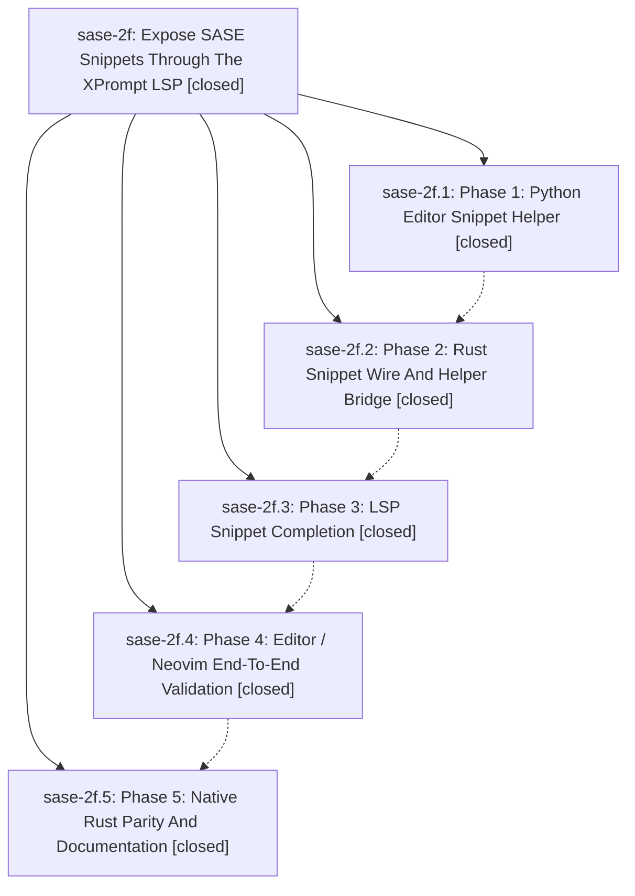

# Bead: sase-2f — Expose SASE Snippets Through The XPrompt LSP

[Bead Pages](../README.md) / sase-2f

**Status:** ✓ closed · **Resolution:** (unrecorded) · **Type:** plan · **Tier:** epic
**Owner:** `bryanbugyi34@gmail.com`
**Created:** 2026-05-09 04:58:40 UTC · **Closed:** 2026-05-09 05:52:46 UTC
**Plan:** [202605/lsp\_sase\_snippets.md](https://github.com/sase-org/sase--plans/blob/main/202605/lsp_sase_snippets.md)

## Notes

COMMIT: 56fcd3ed

## Phases

| Bead | Title | Status | Size | Agents | Commits |
|---|---|---|---|---:|---:|
| [sase-2f.1](sase-2f.1.md) | Phase 1: Python Editor Snippet Helper | ✓ closed | small | 0 | 1 |
| [sase-2f.2](sase-2f.2.md) | Phase 2: Rust Snippet Wire And Helper Bridge | ✓ closed | small | 0 | 1 |
| [sase-2f.3](sase-2f.3.md) | Phase 3: LSP Snippet Completion | ✓ closed | small | 0 | 1 |
| [sase-2f.4](sase-2f.4.md) | Phase 4: Editor / Neovim End-To-End Validation | ✓ closed | small | 0 | 1 |
| [sase-2f.5](sase-2f.5.md) | Phase 5: Native Rust Parity And Documentation | ✓ closed | small | 0 | 2 |

## Lineage

## Commits

| Commit | Subject | Bead | Committed (UTC) |
|---|---|---|---|
| [`c7b4833`](https://github.com/sase-org/sase/commit/c7b4833f2ae23a712bb90ebba1759bdb8a963c20) | feat: add editor snippet catalog helper (sase-2f.1) | [sase-2f.1](sase-2f.1.md) | 2026-05-09 05:09:30 |
| [`sase-core@cc7a563`](https://github.com/sase-org/sase-core/commit/cc7a563c4508f795e623c3888fa7c5983b22aac5) | feat: add editor snippet helper bridge (sase-2f.2) | [sase-2f.2](sase-2f.2.md) | 2026-05-09 05:17:58 |
| [`sase-core@9bcf57c`](https://github.com/sase-org/sase-core/commit/9bcf57cf552d5a4121535e159a19bb6e8d6dc3f3) | feat: add LSP snippet completions (sase-2f.3) | [sase-2f.3](sase-2f.3.md) | 2026-05-09 05:25:50 |
| [`5bc7984`](https://github.com/sase-org/sase/commit/5bc79847c804a5cfd665bb98d026b5372b2f460c) | chore: close lsp snippet neovim validation bead (sase-2f.4) | [sase-2f.4](sase-2f.4.md) | 2026-05-09 05:34:12 |
| [`97fd8d7`](https://github.com/sase-org/sase/commit/97fd8d78ca406700bcea808adf39d7859c931f80) | chore: document editor snippet catalog behavior (sase-2f.5) | [sase-2f.5](sase-2f.5.md) | 2026-05-09 05:45:47 |
| [`sase-core@b5df03f`](https://github.com/sase-org/sase-core/commit/b5df03f4445b3317e549bca2e978318f1c93ed8a) | feat: add native editor snippet catalog fallback (sase-2f.5) | [sase-2f.5](sase-2f.5.md) | 2026-05-09 05:45:55 |
| [`10981f4`](https://github.com/sase-org/sase/commit/10981f4ac290364bddafbcf7b30dd1d33478d92a) | chore: close sase snippet LSP epic bead (sase-2f) | [sase-2f](README.md) | 2026-05-09 05:52:59 |
