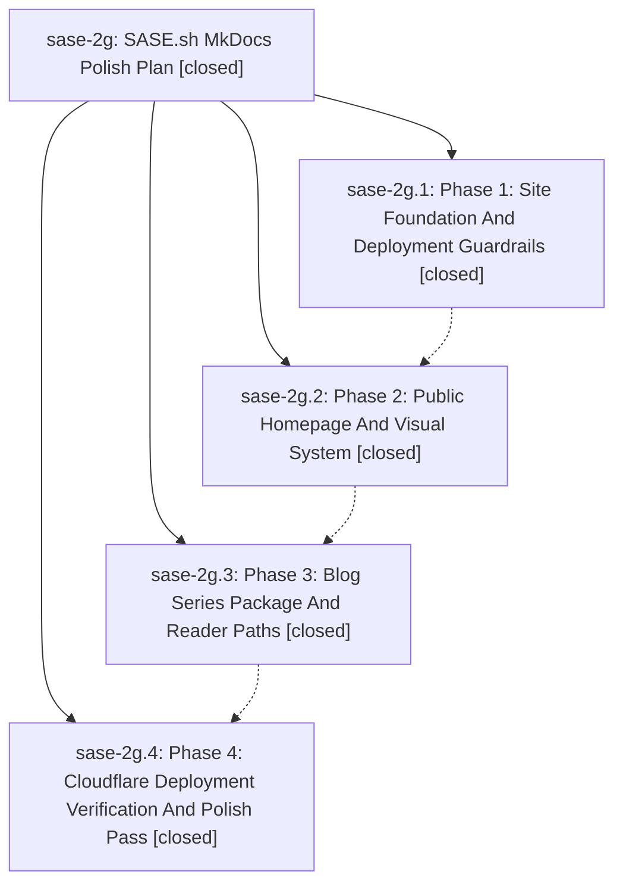

# Bead: sase-2g — SASE.sh MkDocs Polish Plan

[Bead Pages](../README.md) / sase-2g

**Status:** ✓ closed · **Resolution:** (unrecorded) · **Type:** plan · **Tier:** epic
**Owner:** `bryanbugyi34@gmail.com`
**Created:** 2026-05-09 06:56:44 UTC · **Closed:** 2026-05-09 07:37:37 UTC
**Plan:** [202605/sase\_sh\_mkdocs\_polish.md](https://github.com/sase-org/sase--plans/blob/main/202605/sase_sh_mkdocs_polish.md)

## Notes

COMMIT: 09a85771

## Phases

| Bead | Title | Status | Size | Agents | Commits |
|---|---|---|---|---:|---:|
| [sase-2g.1](sase-2g.1.md) | Phase 1: Site Foundation And Deployment Guardrails | ✓ closed | small | 0 | 1 |
| [sase-2g.2](sase-2g.2.md) | Phase 2: Public Homepage And Visual System | ✓ closed | small | 0 | 1 |
| [sase-2g.3](sase-2g.3.md) | Phase 3: Blog Series Package And Reader Paths | ✓ closed | small | 0 | 1 |
| [sase-2g.4](sase-2g.4.md) | Phase 4: Cloudflare Deployment Verification And Polish Pass | ✓ closed | small | 0 | 0 |

## Lineage

## Commits

| Commit | Subject | Bead | Committed (UTC) |
|---|---|---|---|
| [`1113e14`](https://github.com/sase-org/sase/commit/1113e149d1275fa01112ec493ac52a6843b213db) | chore: add MkDocs site guardrails (sase-2g.1) | [sase-2g.1](sase-2g.1.md) | 2026-05-09 07:06:09 |
| [`17c0bff`](https://github.com/sase-org/sase/commit/17c0bffba1b14deb68158c257429590a27efa85c) | feat: polish public homepage (sase-2g.2) | [sase-2g.2](sase-2g.2.md) | 2026-05-09 07:15:31 |
| [`7c60f4c`](https://github.com/sase-org/sase/commit/7c60f4c575622086a7e563368c33eac096f6f62e) | feat: add SASE launch series hub and RSS (sase-2g.3) | [sase-2g.3](sase-2g.3.md) | 2026-05-09 07:22:45 |
| [`1716862`](https://github.com/sase-org/sase/commit/17168628af56a09a563294405d6349eeb6581ad6) | chore: Add SDD prompt and plan for sase\_2g\_deployment\_finish (sase-2g) | [sase-2g](README.md) | 2026-05-09 07:37:50 |
