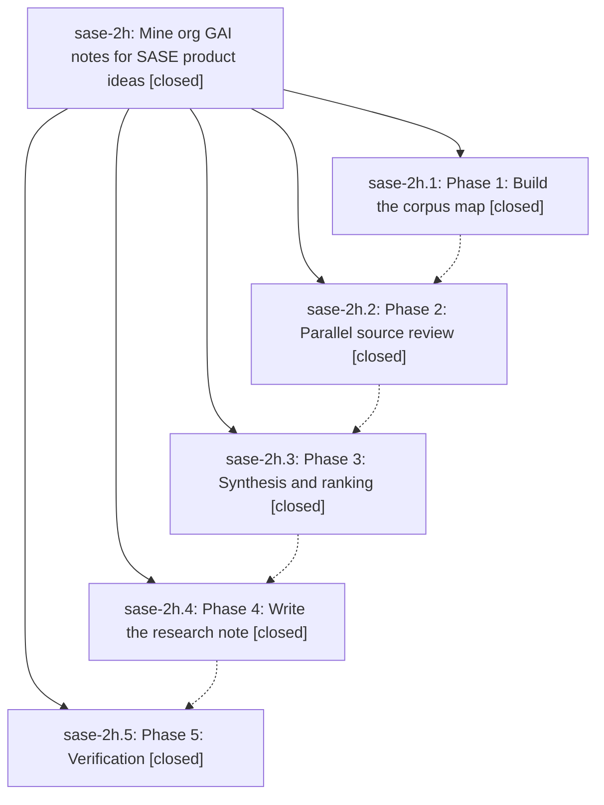

# Bead: sase-2h — Mine org GAI notes for SASE product ideas

[Bead Pages](../README.md) / sase-2h

**Status:** ✓ closed · **Resolution:** (unrecorded) · **Type:** plan · **Tier:** epic
**Owner:** `bryanbugyi34@gmail.com`
**Created:** 2026-05-09 08:31:11 UTC · **Closed:** 2026-05-09 09:14:42 UTC
**Plan:** [202605/gai\_org\_ideas\_research.md](https://github.com/sase-org/sase--plans/blob/main/202605/gai_org_ideas_research.md)

## Notes

COMMIT: 45bc77a3

## Phases

| Bead | Title | Status | Size | Agents | Commits |
|---|---|---|---|---:|---:|
| [sase-2h.1](sase-2h.1.md) | Phase 1: Build the corpus map | ✓ closed | small | 0 | 1 |
| [sase-2h.2](sase-2h.2.md) | Phase 2: Parallel source review | ✓ closed | small | 0 | 1 |
| [sase-2h.3](sase-2h.3.md) | Phase 3: Synthesis and ranking | ✓ closed | small | 0 | 1 |
| [sase-2h.4](sase-2h.4.md) | Phase 4: Write the research note | ✓ closed | small | 0 | 1 |
| [sase-2h.5](sase-2h.5.md) | Phase 5: Verification | ✓ closed | small | 0 | 1 |

## Lineage

## Commits

| Commit | Subject | Bead | Committed (UTC) |
|---|---|---|---|
| [`0c028e7`](https://github.com/sase-org/sase/commit/0c028e7f53dac58e5dc5a3aba23f1e3c5cd6b418) | chore: add GAI org corpus map (sase-2h.1) | [sase-2h.1](sase-2h.1.md) | 2026-05-09 08:43:02 |
| [`4bad766`](https://github.com/sase-org/sase/commit/4bad766686250b5fba4ed521f977e0d15c4e420f) | chore: add GAI phase 2 source review handoff (sase-2h.2) | [sase-2h.2](sase-2h.2.md) | 2026-05-09 08:53:55 |
| [`c97e64a`](https://github.com/sase-org/sase/commit/c97e64ade0c30a980957c4aa0e9095303b96df21) | chore: synthesize GAI org research ideas (sase-2h.3) | [sase-2h.3](sase-2h.3.md) | 2026-05-09 08:59:40 |
| [`b30f4b8`](https://github.com/sase-org/sase/commit/b30f4b89c068155a2be4b757a0021caa4459087e) | chore: finalize GAI org ideas research note (sase-2h.4) | [sase-2h.4](sase-2h.4.md) | 2026-05-09 09:04:43 |
| [`88b6449`](https://github.com/sase-org/sase/commit/88b64494a9e977fe0aa222d5c2b12d7b96d31497) | chore: close gai org research verification bead (sase-2h.5) | [sase-2h.5](sase-2h.5.md) | 2026-05-09 09:09:35 |
| [`d160f6f`](https://github.com/sase-org/sase/commit/d160f6f96c386ec21fa0910cd38cbea89b30ae5a) | chore: close GAI org research epic (sase-2h) | [sase-2h](README.md) | 2026-05-09 09:14:54 |
