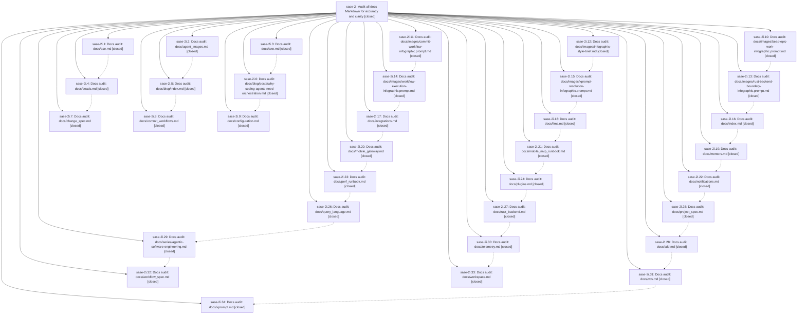

# Bead: sase-2i — Audit all docs Markdown for accuracy and clarity

[Bead Pages](../README.md) / sase-2i

**Status:** ✓ closed · **Resolution:** (unrecorded) · **Type:** plan · **Tier:** epic
**Owner:** `bryanbugyi34@gmail.com`
**Created:** 2026-05-09 18:58:39 UTC · **Closed:** 2026-05-09 21:20:13 UTC
**Plan:** [202605/docs\_markdown\_accuracy\_and\_clarity.md](https://github.com/sase-org/sase--plans/blob/main/202605/docs_markdown_accuracy_and_clarity.md)

## Notes

COMMIT: d39c93c1

## Phases

| Bead | Title | Status | Size | Agents | Commits |
|---|---|---|---|---:|---:|
| [sase-2i.1](sase-2i.1.md) | Docs audit: docs/ace.md | ✓ closed | small | 0 | 1 |
| [sase-2i.10](sase-2i.10.md) | Docs audit: docs/images/bead-epic-work-infographic.prompt.md | ✓ closed | small | 0 | 1 |
| [sase-2i.11](sase-2i.11.md) | Docs audit: docs/images/commit-workflow-infographic.prompt.md | ✓ closed | small | 0 | 1 |
| [sase-2i.12](sase-2i.12.md) | Docs audit: docs/images/infographic-style-brief.md | ✓ closed | small | 0 | 1 |
| [sase-2i.13](sase-2i.13.md) | Docs audit: docs/images/rust-backend-boundary-infographic.prompt.md | ✓ closed | small | 0 | 1 |
| [sase-2i.14](sase-2i.14.md) | Docs audit: docs/images/workflow-execution-infographic.prompt.md | ✓ closed | small | 0 | 1 |
| [sase-2i.15](sase-2i.15.md) | Docs audit: docs/images/xprompt-resolution-infographic.prompt.md | ✓ closed | small | 0 | 1 |
| [sase-2i.16](sase-2i.16.md) | Docs audit: docs/index.md | ✓ closed | small | 0 | 1 |
| [sase-2i.17](sase-2i.17.md) | Docs audit: docs/integrations.md | ✓ closed | small | 0 | 1 |
| [sase-2i.18](sase-2i.18.md) | Docs audit: docs/llms.md | ✓ closed | small | 0 | 1 |
| [sase-2i.19](sase-2i.19.md) | Docs audit: docs/mentors.md | ✓ closed | small | 0 | 1 |
| [sase-2i.2](sase-2i.2.md) | Docs audit: docs/agent\_images.md | ✓ closed | small | 0 | 1 |
| [sase-2i.20](sase-2i.20.md) | Docs audit: docs/mobile\_gateway.md | ✓ closed | small | 0 | 1 |
| [sase-2i.21](sase-2i.21.md) | Docs audit: docs/mobile\_mvp\_runbook.md | ✓ closed | small | 0 | 1 |
| [sase-2i.22](sase-2i.22.md) | Docs audit: docs/notifications.md | ✓ closed | small | 0 | 1 |
| [sase-2i.23](sase-2i.23.md) | Docs audit: docs/perf\_runbook.md | ✓ closed | small | 0 | 1 |
| [sase-2i.24](sase-2i.24.md) | Docs audit: docs/plugins.md | ✓ closed | small | 0 | 1 |
| [sase-2i.25](sase-2i.25.md) | Docs audit: docs/project\_spec.md | ✓ closed | small | 0 | 1 |
| [sase-2i.26](sase-2i.26.md) | Docs audit: docs/query\_language.md | ✓ closed | small | 0 | 1 |
| [sase-2i.27](sase-2i.27.md) | Docs audit: docs/rust\_backend.md | ✓ closed | small | 0 | 1 |
| [sase-2i.28](sase-2i.28.md) | Docs audit: docs/sdd.md | ✓ closed | small | 0 | 1 |
| [sase-2i.29](sase-2i.29.md) | Docs audit: docs/series/agentic-software-engineering.md | ✓ closed | small | 0 | 1 |
| [sase-2i.3](sase-2i.3.md) | Docs audit: docs/axe.md | ✓ closed | small | 0 | 1 |
| [sase-2i.30](sase-2i.30.md) | Docs audit: docs/telemetry.md | ✓ closed | small | 0 | 1 |
| [sase-2i.31](sase-2i.31.md) | Docs audit: docs/vcs.md | ✓ closed | small | 0 | 1 |
| [sase-2i.32](sase-2i.32.md) | Docs audit: docs/workflow\_spec.md | ✓ closed | small | 0 | 1 |
| [sase-2i.33](sase-2i.33.md) | Docs audit: docs/workspace.md | ✓ closed | small | 0 | 1 |
| [sase-2i.34](sase-2i.34.md) | Docs audit: docs/xprompt.md | ✓ closed | small | 0 | 1 |
| [sase-2i.4](sase-2i.4.md) | Docs audit: docs/beads.md | ✓ closed | small | 0 | 1 |
| [sase-2i.5](sase-2i.5.md) | Docs audit: docs/blog/index.md | ✓ closed | small | 0 | 1 |
| [sase-2i.6](sase-2i.6.md) | Docs audit: docs/blog/posts/why-coding-agents-need-orchestration.md | ✓ closed | small | 0 | 1 |
| [sase-2i.7](sase-2i.7.md) | Docs audit: docs/change\_spec.md | ✓ closed | small | 0 | 1 |
| [sase-2i.8](sase-2i.8.md) | Docs audit: docs/commit\_workflows.md | ✓ closed | small | 0 | 1 |
| [sase-2i.9](sase-2i.9.md) | Docs audit: docs/configuration.md | ✓ closed | small | 0 | 1 |

## Lineage

## Commits

| Commit | Subject | Bead | Committed (UTC) |
|---|---|---|---|
| [`8f6c2d8`](https://github.com/sase-org/sase/commit/8f6c2d8229ed4e2755c81a55afdcc055dfa8a193) | chore: audit axe documentation (sase-2i.3) | [sase-2i.3](sase-2i.3.md) | 2026-05-09 19:47:57 |
| [`34dee3b`](https://github.com/sase-org/sase/commit/34dee3bfc22f6c93ce597309d99abb4c0a959a5f) | chore: audit ACE documentation (sase-2i.1) | [sase-2i.1](sase-2i.1.md) | 2026-05-09 19:50:11 |
| [`72611a2`](https://github.com/sase-org/sase/commit/72611a28d9c21f49814bc3cee06fd6973534c976) | chore: audit agent attachment docs (sase-2i.2) | [sase-2i.2](sase-2i.2.md) | 2026-05-09 19:51:41 |
| [`2bb581f`](https://github.com/sase-org/sase/commit/2bb581fcb7b44ef0824ae32143b005b33538951f) | chore: publish coding agent orchestration essay (sase-2i.6) | [sase-2i.6](sase-2i.6.md) | 2026-05-09 19:52:40 |
| [`2dc6485`](https://github.com/sase-org/sase/commit/2dc6485890db5eedbceedc5d0a00edd963ea02ba) | chore: audit bead documentation (sase-2i.4) | [sase-2i.4](sase-2i.4.md) | 2026-05-09 19:56:33 |
| [`bd687ae`](https://github.com/sase-org/sase/commit/bd687ae0442988fb653893a74ea88271027cc7bb) | chore: audit blog index docs (sase-2i.5) | [sase-2i.5](sase-2i.5.md) | 2026-05-09 19:58:38 |
| [`ca0b0e1`](https://github.com/sase-org/sase/commit/ca0b0e11ddd6339b2654c35b096bb2b79200b3d0) | chore: audit configuration docs (sase-2i.9) | [sase-2i.9](sase-2i.9.md) | 2026-05-09 19:59:53 |
| [`bcc3e20`](https://github.com/sase-org/sase/commit/bcc3e20c8e33bf16d864af3f4b2422843af51fd8) | chore: audit ChangeSpec docs (sase-2i.7) | [sase-2i.7](sase-2i.7.md) | 2026-05-09 20:03:37 |
| [`638abdd`](https://github.com/sase-org/sase/commit/638abdd5b7034f06e30ed45b6a6715088b7caf70) | chore: audit infographic style brief (sase-2i.12) | [sase-2i.12](sase-2i.12.md) | 2026-05-09 20:06:05 |
| [`8626f50`](https://github.com/sase-org/sase/commit/8626f50ac883acc08afdb55301892af1d9216f55) | docs: audit commit workflow docs (sase-2i.8) | [sase-2i.8](sase-2i.8.md) | 2026-05-09 20:09:43 |
| [`9ec82e1`](https://github.com/sase-org/sase/commit/9ec82e1a17914e3513d7e86a9775f6a16b11049e) | chore: audit bead epic infographic prompt (sase-2i.10) | [sase-2i.10](sase-2i.10.md) | 2026-05-09 20:12:04 |
| [`51a66f9`](https://github.com/sase-org/sase/commit/51a66f90cc3e6dc7e4be1c92de2d89385cc524a3) | chore: audit xprompt resolution infographic sidecar (sase-2i.15) | [sase-2i.15](sase-2i.15.md) | 2026-05-09 20:13:01 |
| [`e6d9b73`](https://github.com/sase-org/sase/commit/e6d9b73807cb0976e62810f19543fb269bd2c761) | chore: audit rust backend infographic prompt (sase-2i.13) | [sase-2i.13](sase-2i.13.md) | 2026-05-09 20:18:13 |
| [`555897b`](https://github.com/sase-org/sase/commit/555897b18f0aaba97970944e3e6f28fea12deb64) | chore: audit commit workflow infographic prompt (sase-2i.11) | [sase-2i.11](sase-2i.11.md) | 2026-05-09 20:19:44 |
| [`21177db`](https://github.com/sase-org/sase/commit/21177dbaf93bb689267fcb0e47c4a6cd2cd87424) | chore: audit LLM provider docs (sase-2i.18) | [sase-2i.18](sase-2i.18.md) | 2026-05-09 20:23:26 |
| [`589a371`](https://github.com/sase-org/sase/commit/589a3711781931d91e41d84ba0e8fbca36377bc2) | chore: clarify docs homepage coordination overview (sase-2i.16) | [sase-2i.16](sase-2i.16.md) | 2026-05-09 20:24:12 |
| [`eeb0c04`](https://github.com/sase-org/sase/commit/eeb0c04317102d649d4e515c62b61a060c7cf85d) | chore: audit workflow execution infographic prompt (sase-2i.14) | [sase-2i.14](sase-2i.14.md) | 2026-05-09 20:25:32 |
| [`6f18a37`](https://github.com/sase-org/sase/commit/6f18a37a3d3a71b8b7a1dfa0fde378a58c0b6516) | chore: audit mobile MVP runbook (sase-2i.21) | [sase-2i.21](sase-2i.21.md) | 2026-05-09 20:29:53 |
| [`7adffb5`](https://github.com/sase-org/sase/commit/7adffb54c7cdf5113bbd9a9cc29f94192c57a270) | chore: audit integration API docs (sase-2i.17) | [sase-2i.17](sase-2i.17.md) | 2026-05-09 20:31:07 |
| [`c7f7e1f`](https://github.com/sase-org/sase/commit/c7f7e1faca6f1364865dbc6b36d82e4975757ea3) | chore: audit mentors documentation (sase-2i.19) | [sase-2i.19](sase-2i.19.md) | 2026-05-09 20:32:00 |
| [`acac0b3`](https://github.com/sase-org/sase/commit/acac0b35ce9115bfed42e9168272754c6a7607bf) | chore: document mobile gateway push subscriptions (sase-2i.20) | [sase-2i.20](sase-2i.20.md) | 2026-05-09 20:36:16 |
| [`59feac2`](https://github.com/sase-org/sase/commit/59feac2d765dff28a0d1622b952425f23d636b27) | chore: audit plugin system docs (sase-2i.24) | [sase-2i.24](sase-2i.24.md) | 2026-05-09 20:38:32 |
| [`b12c935`](https://github.com/sase-org/sase/commit/b12c93574a9db0a79da0570c24948d8b7b0d6263) | chore: audit notifications docs (sase-2i.22) | [sase-2i.22](sase-2i.22.md) | 2026-05-09 20:41:31 |
| [`42c4083`](https://github.com/sase-org/sase/commit/42c40833bda91032082085241507fcd0be658425) | chore: audit performance runbook docs (sase-2i.23) | [sase-2i.23](sase-2i.23.md) | 2026-05-09 20:44:21 |
| [`eec13c3`](https://github.com/sase-org/sase/commit/eec13c31a06cf03788de4453d1f2e9b989a71f56) | chore: audit Rust backend documentation (sase-2i.27) | [sase-2i.27](sase-2i.27.md) | 2026-05-09 20:46:09 |
| [`ec5175d`](https://github.com/sase-org/sase/commit/ec5175dc423f54e10b14f6d014334681dd9e5390) | chore: audit ProjectSpec docs (sase-2i.25) | [sase-2i.25](sase-2i.25.md) | 2026-05-09 20:49:12 |
| [`70511ab`](https://github.com/sase-org/sase/commit/70511abdad806c558598f3b2b89248f2742e897b) | chore: audit telemetry docs (sase-2i.30) | [sase-2i.30](sase-2i.30.md) | 2026-05-09 20:53:02 |
| [`72c8019`](https://github.com/sase-org/sase/commit/72c80190444049415049ae11226e366a73a26cf4) | chore: clarify ChangeSpec query language docs (sase-2i.26) | [sase-2i.26](sase-2i.26.md) | 2026-05-09 20:54:53 |
| [`0050527`](https://github.com/sase-org/sase/commit/00505271636e37639a674ca8020a979b431e9720) | chore: clarify SDD documentation (sase-2i.28) | [sase-2i.28](sase-2i.28.md) | 2026-05-09 20:56:26 |
| [`1da500b`](https://github.com/sase-org/sase/commit/1da500bfcba83b43f12cb67ae6ad6141a133d6eb) | chore: audit workspace provider docs (sase-2i.33) | [sase-2i.33](sase-2i.33.md) | 2026-05-09 21:00:15 |
| [`b5f3a84`](https://github.com/sase-org/sase/commit/b5f3a84abcdde4fa322a419804205292ae5f69ba) | chore: audit agentic software engineering series docs (sase-2i.29) | [sase-2i.29](sase-2i.29.md) | 2026-05-09 21:02:04 |
| [`8d40c68`](https://github.com/sase-org/sase/commit/8d40c68b67fa80f039b91cff5125ca4744f1fe71) | chore: audit VCS provider docs (sase-2i.31) | [sase-2i.31](sase-2i.31.md) | 2026-05-09 21:05:28 |
| [`477f1e6`](https://github.com/sase-org/sase/commit/477f1e64c84a7988c8aefb6c20844605e48e372b) | chore: audit workflow spec docs (sase-2i.32) | [sase-2i.32](sase-2i.32.md) | 2026-05-09 21:09:13 |
| [`f062448`](https://github.com/sase-org/sase/commit/f062448f4a78c87509c08d932eb8cc3113dc717a) | chore: audit xprompt documentation (sase-2i.34) | [sase-2i.34](sase-2i.34.md) | 2026-05-09 21:12:48 |
| [`f8707dc`](https://github.com/sase-org/sase/commit/f8707dced43b7d5d5889a3b0c4189435f71b7e96) | chore: close docs markdown audit epic (sase-2i) | [sase-2i](README.md) | 2026-05-09 21:20:29 |
