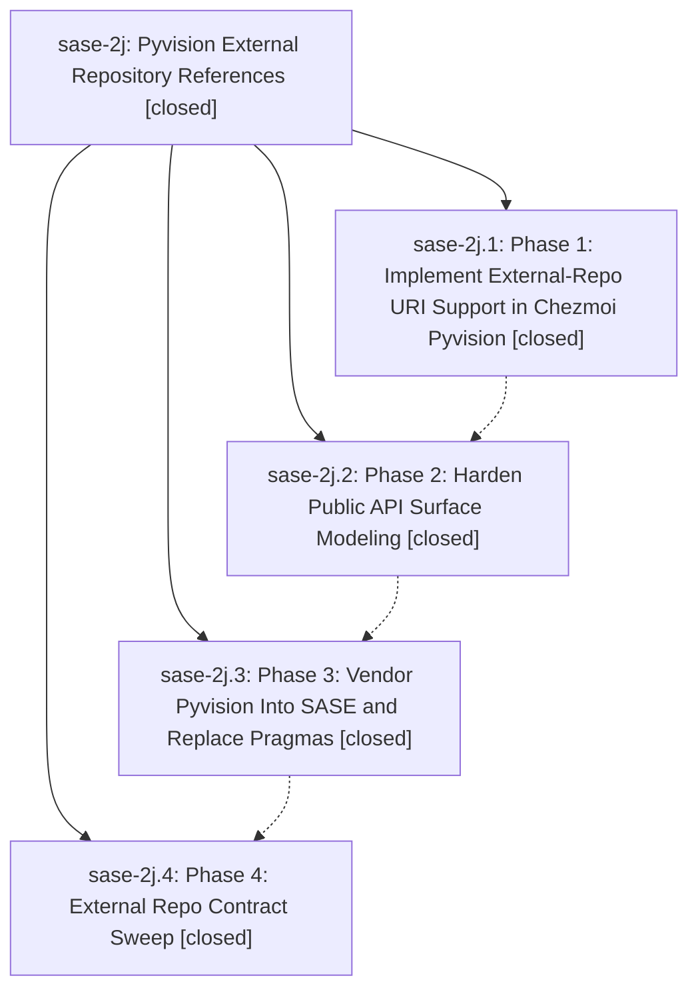

# Bead: sase-2j — Pyvision External Repository References

[Bead Pages](../README.md) / sase-2j

**Status:** ✓ closed · **Resolution:** (unrecorded) · **Type:** plan · **Tier:** epic
**Owner:** `bryanbugyi34@gmail.com`
**Created:** 2026-05-09 22:17:44 UTC · **Closed:** 2026-05-09 22:54:14 UTC
**Plan:** [202605/pyvision\_external\_repos.md](https://github.com/sase-org/sase--plans/blob/main/202605/pyvision_external_repos.md)

## Notes

COMMIT: 3022533d

## Phases

| Bead | Title | Status | Size | Agents | Commits |
|---|---|---|---|---:|---:|
| [sase-2j.1](sase-2j.1.md) | Phase 1: Implement External-Repo URI Support in Chezmoi Pyvision | ✓ closed | small | 0 | 1 |
| [sase-2j.2](sase-2j.2.md) | Phase 2: Harden Public API Surface Modeling | ✓ closed | small | 0 | 1 |
| [sase-2j.3](sase-2j.3.md) | Phase 3: Vendor Pyvision Into SASE and Replace Pragmas | ✓ closed | small | 0 | 1 |
| [sase-2j.4](sase-2j.4.md) | Phase 4: External Repo Contract Sweep | ✓ closed | small | 0 | 0 |

## Lineage

## Commits

| Commit | Subject | Bead | Committed (UTC) |
|---|---|---|---|
| [`2fcd924`](https://github.com/sase-org/sase/commit/2fcd924c1f9579198b437adb9ec63af002adbea4) | chore: close pyvision external repo phase bead (sase-2j.1) | [sase-2j.1](sase-2j.1.md) | 2026-05-09 22:26:30 |
| [`227012c`](https://github.com/sase-org/sase/commit/227012cfe7a55d12e9c898337a922e45f508a950) | chore: close pyvision API modeling phase bead (sase-2j.2) | [sase-2j.2](sase-2j.2.md) | 2026-05-09 22:32:07 |
| [`6cad00f`](https://github.com/sase-org/sase/commit/6cad00fd570ed108d187abac892e420f92bdfb11) | feat: replace pyvision public API whitelist (sase-2j.3) | [sase-2j.3](sase-2j.3.md) | 2026-05-09 22:43:25 |
| [`7901c9d`](https://github.com/sase-org/sase/commit/7901c9d93491fa2bba6b2fd1ec30afd38d1132d2) | chore: close pyvision external repo epic (sase-2j) | [sase-2j](README.md) | 2026-05-09 22:54:27 |
