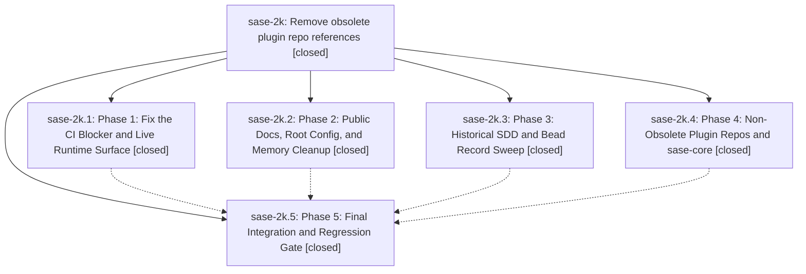

# Bead: sase-2k — Remove obsolete plugin repo references

[Bead Pages](../README.md) / sase-2k

**Status:** ✓ closed · **Resolution:** (unrecorded) · **Type:** plan · **Tier:** epic
**Owner:** `bryanbugyi34@gmail.com`
**Created:** 2026-05-09 23:13:27 UTC
**Plan:** [202605/remove\_obsolete\_plugin\_repos.md](https://github.com/sase-org/sase--plans/blob/main/202605/remove_obsolete_plugin_repos.md)

## Phases

| Bead | Title | Status | Size | Agents | Commits |
|---|---|---|---|---:|---:|
| [sase-2k.1](sase-2k.1.md) | Phase 1: Fix the CI Blocker and Live Runtime Surface | ✓ closed | small | 0 | 1 |
| [sase-2k.2](sase-2k.2.md) | Phase 2: Public Docs, Root Config, and Memory Cleanup | ✓ closed | small | 0 | 1 |
| [sase-2k.3](sase-2k.3.md) | Phase 3: Historical SDD and Bead Record Sweep | ✓ closed | small | 0 | 1 |
| [sase-2k.4](sase-2k.4.md) | Phase 4: Non-Obsolete Plugin Repos and sase-core | ✓ closed | small | 0 | 0 |
| [sase-2k.5](sase-2k.5.md) | Phase 5: Final Integration and Regression Gate | ✓ closed | small | 0 | 1 |

## Lineage

## Commits

| Commit | Subject | Bead | Committed (UTC) |
|---|---|---|---|
| [`0876f92`](https://github.com/sase-org/sase/commit/0876f9282e9d0d17ab2c0eca21f1df59390ae939) | chore: sanitize historical obsolete plugin references (sase-2k.3) | [sase-2k.3](sase-2k.3.md) | 2026-05-09 23:26:27 |
| [`6039f31`](https://github.com/sase-org/sase/commit/6039f31cc995aa52fe0d7eb105ac74f51bf5e866) | fix: remove retired plugin references from live checks (sase-2k.1) | [sase-2k.1](sase-2k.1.md) | 2026-05-09 23:28:24 |
| [`582804e`](https://github.com/sase-org/sase/commit/582804e64c9889b1f92a64c928c0355f6ddba750) | chore: remove obsolete plugin repo references from docs (sase-2k.2) | [sase-2k.2](sase-2k.2.md) | 2026-05-09 23:30:56 |
| [`6b8370a`](https://github.com/sase-org/sase/commit/6b8370a4107444ce98885a1b723fdf412c99c75c) | chore: sanitize obsolete plugin history references (sase-2k.5) | [sase-2k.5](sase-2k.5.md) | 2026-05-09 23:36:51 |
