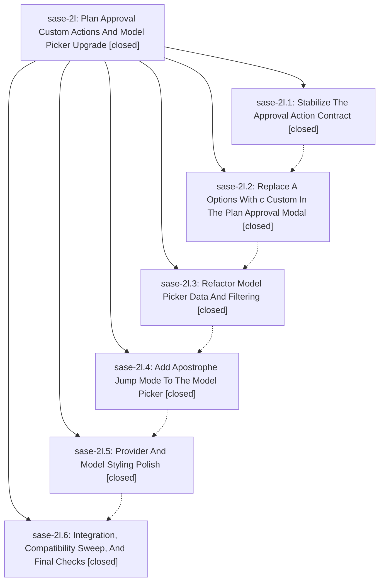

# Bead: sase-2l — Plan Approval Custom Actions And Model Picker Upgrade

[Bead Pages](../README.md) / sase-2l

**Status:** ✓ closed · **Resolution:** (unrecorded) · **Type:** plan · **Tier:** epic
**Owner:** `bryanbugyi34@gmail.com`
**Created:** 2026-05-09 23:35:22 UTC · **Closed:** 2026-05-10 02:20:36 UTC
**Plan:** [202605/plan\_approval\_custom\_model\_picker.md](https://github.com/sase-org/sase--plans/blob/main/202605/plan_approval_custom_model_picker.md)

## Notes

COMMIT: 7ef03add

## Phases

| Bead | Title | Status | Size | Agents | Commits |
|---|---|---|---|---:|---:|
| [sase-2l.1](sase-2l.1.md) | Stabilize The Approval Action Contract | ✓ closed | small | 0 | 1 |
| [sase-2l.2](sase-2l.2.md) | Replace A Options With c Custom In The Plan Approval Modal | ✓ closed | small | 0 | 1 |
| [sase-2l.3](sase-2l.3.md) | Refactor Model Picker Data And Filtering | ✓ closed | small | 0 | 1 |
| [sase-2l.4](sase-2l.4.md) | Add Apostrophe Jump Mode To The Model Picker | ✓ closed | small | 0 | 1 |
| [sase-2l.5](sase-2l.5.md) | Provider And Model Styling Polish | ✓ closed | small | 0 | 1 |
| [sase-2l.6](sase-2l.6.md) | Integration, Compatibility Sweep, And Final Checks | ✓ closed | small | 0 | 1 |

## Lineage

## Commits

| Commit | Subject | Bead | Committed (UTC) |
|---|---|---|---|
| [`42a3a49`](https://github.com/sase-org/sase/commit/42a3a49c99c97c249b0c63bb5bd0e5253d8bc11e) | feat: stabilize plan approval choices (sase-2l.1) | [sase-2l.1](sase-2l.1.md) | 2026-05-09 23:52:38 |
| [`1e92315`](https://github.com/sase-org/sase/commit/1e92315b6b99575f5e3382b8e8d840e4232d09fd) | feat: add custom plan approval actions (sase-2l.2) | [sase-2l.2](sase-2l.2.md) | 2026-05-10 00:02:16 |
| [`7541825`](https://github.com/sase-org/sase/commit/7541825b7584cebb23e2b3ac2078b75720ee6cd1) | feat: add filtering to the model picker (sase-2l.3) | [sase-2l.3](sase-2l.3.md) | 2026-05-10 00:11:03 |
| [`483da10`](https://github.com/sase-org/sase/commit/483da102f31e8391f2bf45e524307c25a2d04514) | feat: add model picker jump mode (sase-2l.4) | [sase-2l.4](sase-2l.4.md) | 2026-05-10 00:18:07 |
| [`c330d30`](https://github.com/sase-org/sase/commit/c330d304485527e0fceee2e04800f316eb98244c) | feat: polish model picker provider styling (sase-2l.5) | [sase-2l.5](sase-2l.5.md) | 2026-05-10 00:26:31 |
| [`7eec2ad`](https://github.com/sase-org/sase/commit/7eec2ad82e7b742d5b9000115c97393cb5cbf4bb) | chore: close custom approval sweep (sase-2l.6) | [sase-2l.6](sase-2l.6.md) | 2026-05-10 00:31:17 |
| [`1701faf`](https://github.com/sase-org/sase/commit/1701fafb8d672cedf6dc945fc20e7a519e388d24) | chore: close plan approval model picker epic (sase-2l) | [sase-2l](README.md) | 2026-05-10 02:20:52 |
