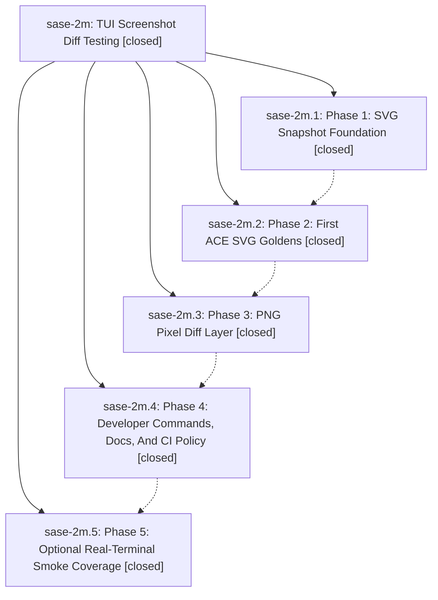

# Bead: sase-2m — TUI Screenshot Diff Testing

[Bead Pages](../README.md) / sase-2m

**Status:** ✓ closed · **Resolution:** (unrecorded) · **Type:** plan · **Tier:** epic
**Owner:** `bryanbugyi34@gmail.com`
**Created:** 2026-05-10 01:11:13 UTC · **Closed:** 2026-05-10 02:07:09 UTC
**Plan:** [202605/tui\_screenshot\_diff\_testing.md](https://github.com/sase-org/sase--plans/blob/main/202605/tui_screenshot_diff_testing.md)

## Notes

COMMIT: a4113f4f

## Phases

| Bead | Title | Status | Size | Agents | Commits |
|---|---|---|---|---:|---:|
| [sase-2m.1](sase-2m.1.md) | Phase 1: SVG Snapshot Foundation | ✓ closed | small | 0 | 1 |
| [sase-2m.2](sase-2m.2.md) | Phase 2: First ACE SVG Goldens | ✓ closed | small | 0 | 1 |
| [sase-2m.3](sase-2m.3.md) | Phase 3: PNG Pixel Diff Layer | ✓ closed | small | 0 | 1 |
| [sase-2m.4](sase-2m.4.md) | Phase 4: Developer Commands, Docs, And CI Policy | ✓ closed | small | 0 | 1 |
| [sase-2m.5](sase-2m.5.md) | Phase 5: Optional Real-Terminal Smoke Coverage | ✓ closed | small | 0 | 1 |

## Lineage

## Commits

| Commit | Subject | Bead | Committed (UTC) |
|---|---|---|---|
| [`e890485`](https://github.com/sase-org/sase/commit/e890485d0878c6f69edb3d33656caa14eddbd2d8) | feat: add ACE SVG snapshot foundation (sase-2m.1) | [sase-2m.1](sase-2m.1.md) | 2026-05-10 01:23:24 |
| [`0e53d2d`](https://github.com/sase-org/sase/commit/0e53d2dfe2e9aeccf9add3b7b7f5ef550147a86e) | chore: add ACE SVG visual goldens (sase-2m.2) | [sase-2m.2](sase-2m.2.md) | 2026-05-10 01:34:12 |
| [`8e44a59`](https://github.com/sase-org/sase/commit/8e44a5970ab862591c87f9673093fd43004ff26b) | feat: add ACE PNG visual diff layer (sase-2m.3) | [sase-2m.3](sase-2m.3.md) | 2026-05-10 01:45:25 |
| [`0a40854`](https://github.com/sase-org/sase/commit/0a408549bb6a5b1016f6c78769ea5b5df51896b8) | chore: add ACE visual test workflow (sase-2m.4) | [sase-2m.4](sase-2m.4.md) | 2026-05-10 01:52:30 |
| [`ff66d05`](https://github.com/sase-org/sase/commit/ff66d05903b7ce2273b7210ce73c7eda7a8e2a67) | chore: add ACE terminal smoke test lane (sase-2m.5) | [sase-2m.5](sase-2m.5.md) | 2026-05-10 02:00:59 |
| [`f1fa64b`](https://github.com/sase-org/sase/commit/f1fa64b90a5a54e7f3ef727aeb5020d45e0be47c) | chore: close TUI screenshot diff epic (sase-2m) | [sase-2m](README.md) | 2026-05-10 02:07:22 |
