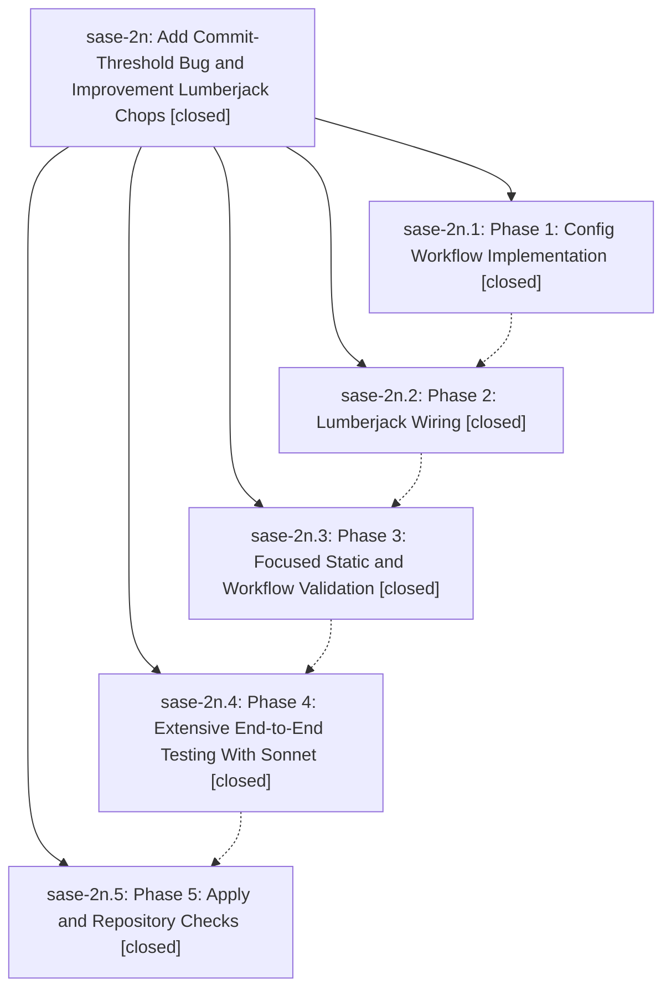

# Bead: sase-2n — Add Commit-Threshold Bug and Improvement Lumberjack Chops

[Bead Pages](../README.md) / sase-2n

**Status:** ✓ closed · **Resolution:** (unrecorded) · **Type:** plan · **Tier:** epic
**Owner:** `bryanbugyi34@gmail.com`
**Created:** 2026-05-10 03:56:26 UTC · **Closed:** 2026-05-10 15:49:15 UTC
**Plan:** [202605/lumberjack\_quality\_chops.md](https://github.com/sase-org/sase--plans/blob/main/202605/lumberjack_quality_chops.md)

## Phases

| Bead | Title | Status | Size | Agents | Commits |
|---|---|---|---|---:|---:|
| [sase-2n.1](sase-2n.1.md) | Phase 1: Config Workflow Implementation | ✓ closed | small | 0 | 0 |
| [sase-2n.2](sase-2n.2.md) | Phase 2: Lumberjack Wiring | ✓ closed | small | 0 | 0 |
| [sase-2n.3](sase-2n.3.md) | Phase 3: Focused Static and Workflow Validation | ✓ closed | small | 0 | 0 |
| [sase-2n.4](sase-2n.4.md) | Phase 4: Extensive End-to-End Testing With Sonnet | ✓ closed | small | 0 | 0 |
| [sase-2n.5](sase-2n.5.md) | Phase 5: Apply and Repository Checks | ✓ closed | small | 0 | 0 |

## Lineage

