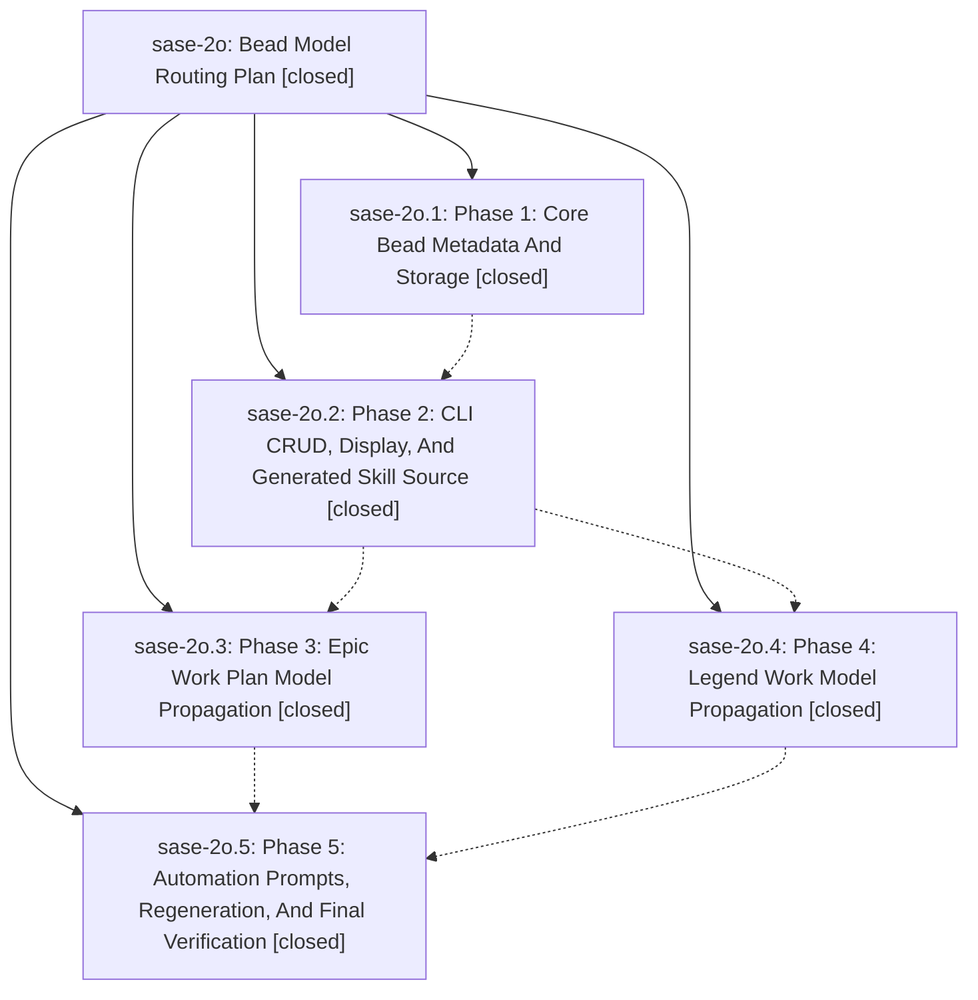

# Bead: sase-2o — Bead Model Routing Plan

[Bead Pages](../README.md) / sase-2o

**Status:** ✓ closed · **Resolution:** (unrecorded) · **Type:** plan · **Tier:** epic
**Owner:** `bryanbugyi34@gmail.com`
**Created:** 2026-05-10 04:08:19 UTC · **Closed:** 2026-05-10 05:01:05 UTC
**Plan:** [202605/bead\_model\_routing.md](https://github.com/sase-org/sase--plans/blob/main/202605/bead_model_routing.md)

## Notes

COMMIT: c817836f

## Phases

| Bead | Title | Status | Size | Agents | Commits |
|---|---|---|---|---:|---:|
| [sase-2o.1](sase-2o.1.md) | Phase 1: Core Bead Metadata And Storage | ✓ closed | small | 0 | 0 |
| [sase-2o.2](sase-2o.2.md) | Phase 2: CLI CRUD, Display, And Generated Skill Source | ✓ closed | small | 0 | 0 |
| [sase-2o.3](sase-2o.3.md) | Phase 3: Epic Work Plan Model Propagation | ✓ closed | small | 0 | 0 |
| [sase-2o.4](sase-2o.4.md) | Phase 4: Legend Work Model Propagation | ✓ closed | small | 0 | 0 |
| [sase-2o.5](sase-2o.5.md) | Phase 5: Automation Prompts, Regeneration, And Final Verification | ✓ closed | small | 0 | 0 |

## Lineage

## Commits

| Commit | Subject | Bead | Committed (UTC) |
|---|---|---|---|
| [`37f1cc1`](https://github.com/sase-org/sase/commit/37f1cc1aad82473ca9e4f64b69c7feb2b49a029c) | chore: Add SDD prompt and plan for complete\_bead\_model\_routing (sase-2o) | [sase-2o](README.md) | 2026-05-10 05:01:20 |
