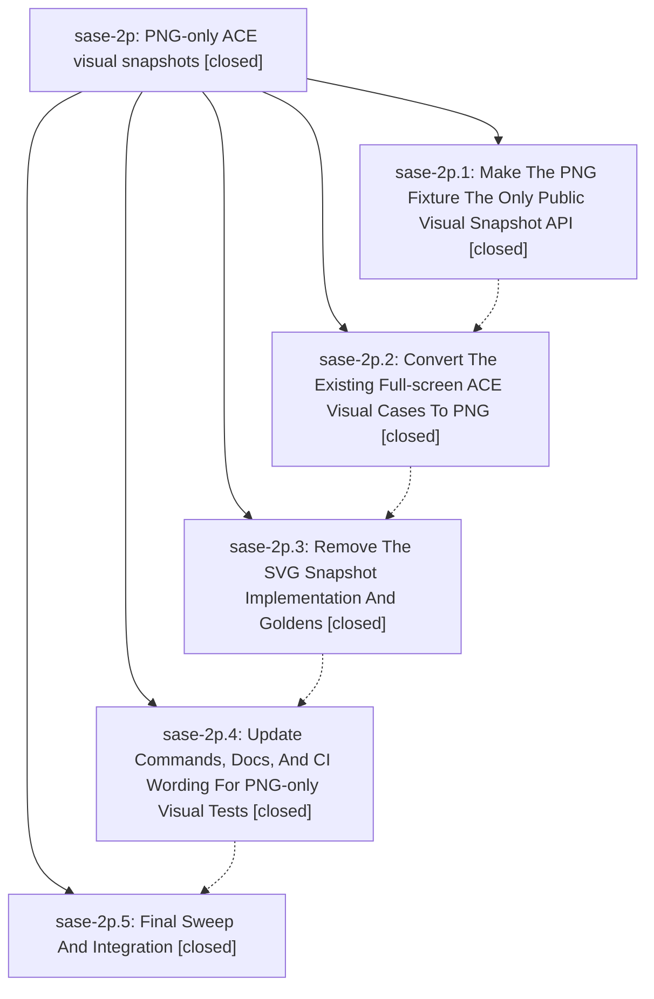

# Bead: sase-2p — PNG-only ACE visual snapshots

[Bead Pages](../README.md) / sase-2p

**Status:** ✓ closed · **Resolution:** (unrecorded) · **Type:** plan · **Tier:** epic
**Owner:** `bryanbugyi34@gmail.com`
**Created:** 2026-05-10 05:06:49 UTC · **Closed:** 2026-05-10 17:22:15 UTC
**Plan:** [202605/png\_only\_visual\_snapshots.md](https://github.com/sase-org/sase--plans/blob/main/202605/png_only_visual_snapshots.md)

## Notes

COMMIT: 3468afc4

## Phases

| Bead | Title | Status | Size | Agents | Commits |
|---|---|---|---|---:|---:|
| [sase-2p.1](sase-2p.1.md) | Make The PNG Fixture The Only Public Visual Snapshot API | ✓ closed | small | 0 | 1 |
| [sase-2p.2](sase-2p.2.md) | Convert The Existing Full-screen ACE Visual Cases To PNG | ✓ closed | small | 0 | 1 |
| [sase-2p.3](sase-2p.3.md) | Remove The SVG Snapshot Implementation And Goldens | ✓ closed | small | 0 | 1 |
| [sase-2p.4](sase-2p.4.md) | Update Commands, Docs, And CI Wording For PNG-only Visual Tests | ✓ closed | small | 0 | 1 |
| [sase-2p.5](sase-2p.5.md) | Final Sweep And Integration | ✓ closed | small | 0 | 1 |

## Lineage

## Commits

| Commit | Subject | Bead | Committed (UTC) |
|---|---|---|---|
| [`7568490`](https://github.com/sase-org/sase/commit/7568490b2ad69378d178c928aade137a068dee70) | chore: Add SDD prompt and plan for png\_only\_visual\_snapshots\_completion (sase-2p) | [sase-2p](README.md) | 2026-05-10 05:38:05 |
| [`47e8110`](https://github.com/sase-org/sase/commit/47e811072a507cc8f07f153150a41ad382f91d26) | feat: make AcePngSnapshotFixture the only public visual snapshot fixture (sase-2p.1) | [sase-2p.1](sase-2p.1.md) | 2026-05-10 16:57:07 |
| [`2d761cc`](https://github.com/sase-org/sase/commit/2d761cc833e3b0549cc46100af10202f1ff96329) | feat: convert full-screen ACE visual cases to PNG snapshots (sase-2p.2) | [sase-2p.2](sase-2p.2.md) | 2026-05-10 17:03:34 |
| [`427ebba`](https://github.com/sase-org/sase/commit/427ebba80c37aacb81f2533256c8661712e623bb) | chore: remove ACE SVG snapshot implementation and goldens (sase-2p.3) | [sase-2p.3](sase-2p.3.md) | 2026-05-10 17:08:31 |
| [`45a2417`](https://github.com/sase-org/sase/commit/45a24175a0fff25cfb1c17407b37747a70d9a594) | chore: align docs and commands wording with PNG-only visual tests (sase-2p.4) | [sase-2p.4](sase-2p.4.md) | 2026-05-10 17:12:56 |
| [`a9c8490`](https://github.com/sase-org/sase/commit/a9c8490497482fdc1c1bd2cae77ddb2476af392b) | chore: close bead sase-2p.5 after PNG-only visual snapshot final sweep (sase-2p.5) | [sase-2p.5](sase-2p.5.md) | 2026-05-10 17:17:06 |
