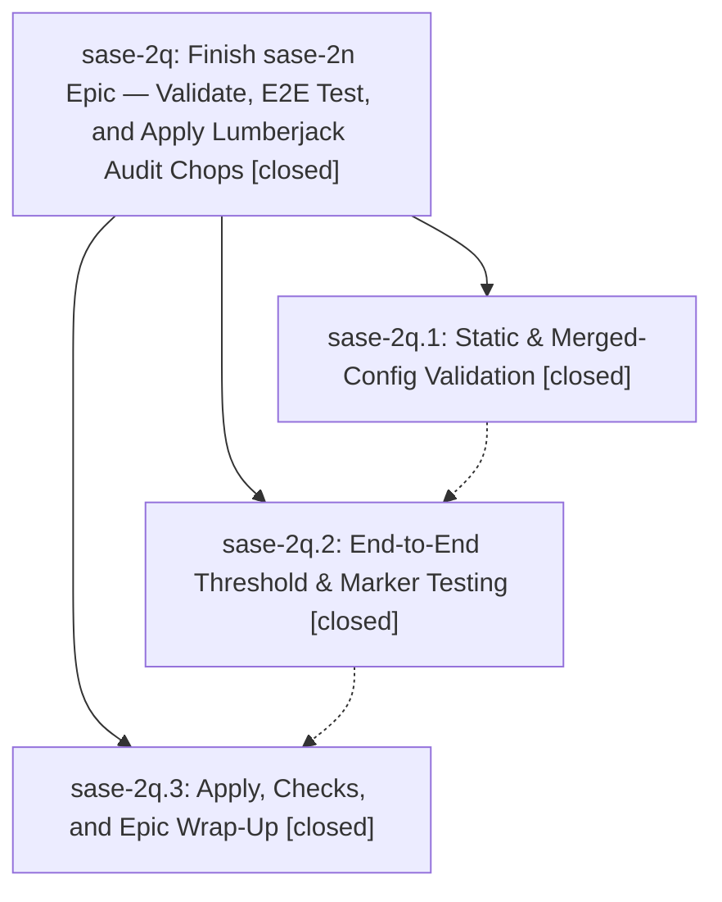

# Bead: sase-2q — Finish sase-2n Epic — Validate, E2E Test, and Apply Lumberjack Audit Chops

[Bead Pages](../README.md) / sase-2q

**Status:** ✓ closed · **Resolution:** (unrecorded) · **Type:** plan · **Tier:** epic
**Owner:** `bryanbugyi34@gmail.com`
**Created:** 2026-05-10 15:24:23 UTC · **Closed:** 2026-05-10 15:53:43 UTC
**Plan:** [202605/finish\_sase\_2n.md](https://github.com/sase-org/sase--plans/blob/main/202605/finish_sase_2n.md)

## Notes

COMMIT: a2e16713

## Phases

| Bead | Title | Status | Size | Agents | Commits |
|---|---|---|---|---:|---:|
| [sase-2q.1](sase-2q.1.md) | Static & Merged-Config Validation | ✓ closed | small | 0 | 0 |
| [sase-2q.2](sase-2q.2.md) | End-to-End Threshold & Marker Testing | ✓ closed | small | 0 | 0 |
| [sase-2q.3](sase-2q.3.md) | Apply, Checks, and Epic Wrap-Up | ✓ closed | small | 0 | 0 |

## Lineage

