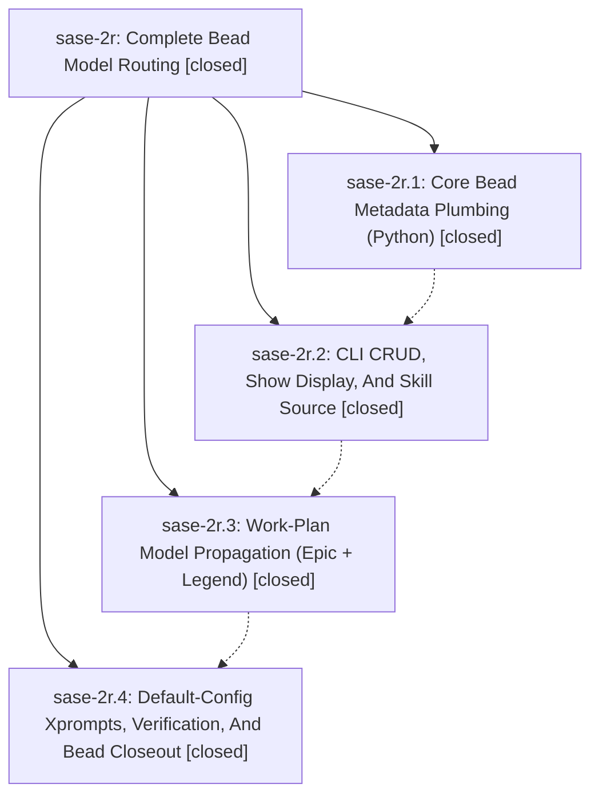

# Bead: sase-2r — Complete Bead Model Routing

[Bead Pages](../README.md) / sase-2r

**Status:** ✓ closed · **Resolution:** (unrecorded) · **Type:** plan · **Tier:** epic
**Owner:** `bryanbugyi34@gmail.com`
**Created:** 2026-05-10 15:30:54 UTC · **Closed:** 2026-05-10 16:28:05 UTC
**Plan:** [202605/complete\_bead\_model\_routing\_1.md](https://github.com/sase-org/sase--plans/blob/main/202605/complete_bead_model_routing_1.md)

## Notes

COMMIT: 4d53c29e

## Phases

| Bead | Title | Status | Size | Agents | Commits |
|---|---|---|---|---:|---:|
| [sase-2r.1](sase-2r.1.md) | Core Bead Metadata Plumbing (Python) | ✓ closed | small | 0 | 1 |
| [sase-2r.2](sase-2r.2.md) | CLI CRUD, Show Display, And Skill Source | ✓ closed | small | 0 | 1 |
| [sase-2r.3](sase-2r.3.md) | Work-Plan Model Propagation (Epic + Legend) | ✓ closed | small | 0 | 1 |
| [sase-2r.4](sase-2r.4.md) | Default-Config Xprompts, Verification, And Bead Closeout | ✓ closed | small | 0 | 1 |

## Lineage

## Commits

| Commit | Subject | Bead | Committed (UTC) |
|---|---|---|---|
| [`61633f8`](https://github.com/sase-org/sase/commit/61633f8c83b013be47374bfa921373ee4a981473) | feat: Plumb bead model field through Python codecs (sase-2r.1) | [sase-2r.1](sase-2r.1.md) | 2026-05-10 15:45:45 |
| [`9ee66fd`](https://github.com/sase-org/sase/commit/9ee66fd4e942de697726a6d9772b81b9f5183b57) | feat: Expose bead model on CLI, show, and skill (sase-2r.2) | [sase-2r.2](sase-2r.2.md) | 2026-05-10 15:58:42 |
| [`4e73e74`](https://github.com/sase-org/sase/commit/4e73e74ec0950da3f6c424a832c3f3a8afdc11d1) | feat: Propagate bead model through epic and legend work plans (sase-2r.3) | [sase-2r.3](sase-2r.3.md) | 2026-05-10 16:08:01 |
| [`5555c4d`](https://github.com/sase-org/sase/commit/5555c4d2405092056898e57e7a0b3dfc7543a8a1) | feat: Teach \`bd/new\_epic\` and \`bd/new\_legend\` xprompts to propagate \`model:\` (sase-2r.4) | [sase-2r.4](sase-2r.4.md) | 2026-05-10 16:14:49 |
