# Bead: sase-2s — Review existing docs diagrams for clarity and accuracy

[Bead Pages](../README.md) / sase-2s

**Status:** ✓ closed · **Resolution:** (unrecorded) · **Type:** plan · **Tier:** epic
**Owner:** `bryanbugyi34@gmail.com`
**Created:** 2026-05-10 17:28:54 UTC · **Closed:** 2026-05-10 18:48:51 UTC
**Plan:** [202605/diagram\_review.md](https://github.com/sase-org/sase--plans/blob/main/202605/diagram_review.md)

## Notes

COMMIT: ce5c31bc

## Phases

| Bead | Title | Status | Size | Agents | Commits |
|---|---|---|---|---:|---:|
| [sase-2s.1](sase-2s.1.md) | Critique diagram: bead-epic-work | ✓ closed | small | 0 | 1 |
| [sase-2s.10](sase-2s.10.md) | Critique diagram: zorg-zettel-vision | ✓ closed | small | 0 | 1 |
| [sase-2s.11](sase-2s.11.md) | Regenerate diagram: bead-epic-work | ✓ closed | small | 0 | 0 |
| [sase-2s.12](sase-2s.12.md) | Regenerate diagram: commit-workflow | ✓ closed | small | 0 | 0 |
| [sase-2s.13](sase-2s.13.md) | Regenerate diagram: rust-backend-boundary | ✓ closed | small | 0 | 0 |
| [sase-2s.14](sase-2s.14.md) | Regenerate diagram: sase-component-communication | ✓ closed | small | 0 | 0 |
| [sase-2s.15](sase-2s.15.md) | Regenerate diagram: sase-rust-core-integration | ✓ closed | small | 0 | 0 |
| [sase-2s.16](sase-2s.16.md) | Regenerate diagram: sase-telegram-integration | ✓ closed | small | 0 | 0 |
| [sase-2s.17](sase-2s.17.md) | Regenerate diagram: sase\_tui\_tabs | ✓ closed | small | 0 | 0 |
| [sase-2s.18](sase-2s.18.md) | Regenerate diagram: xprompt-resolution | ✓ closed | small | 0 | 0 |
| [sase-2s.19](sase-2s.19.md) | Regenerate diagram: workflow-execution | ✓ closed | small | 0 | 0 |
| [sase-2s.2](sase-2s.2.md) | Critique diagram: commit-workflow | ✓ closed | small | 0 | 1 |
| [sase-2s.20](sase-2s.20.md) | Regenerate diagram: zorg-zettel-vision | ✓ closed | small | 0 | 0 |
| [sase-2s.3](sase-2s.3.md) | Critique diagram: rust-backend-boundary | ✓ closed | small | 0 | 1 |
| [sase-2s.4](sase-2s.4.md) | Critique diagram: sase-component-communication | ✓ closed | small | 0 | 1 |
| [sase-2s.5](sase-2s.5.md) | Critique diagram: sase-rust-core-integration | ✓ closed | small | 0 | 1 |
| [sase-2s.6](sase-2s.6.md) | Critique diagram: sase-telegram-integration | ✓ closed | small | 0 | 1 |
| [sase-2s.7](sase-2s.7.md) | Critique diagram: sase\_tui\_tabs | ✓ closed | small | 0 | 1 |
| [sase-2s.8](sase-2s.8.md) | Critique diagram: xprompt-resolution | ✓ closed | small | 0 | 1 |
| [sase-2s.9](sase-2s.9.md) | Critique diagram: workflow-execution | ✓ closed | small | 0 | 1 |

## Lineage

```mermaid
flowchart TD
    n0["sase-2s: Review existing docs diagrams for clarity and accuracy [closed]"]
    n1["sase-2s.1: Critique diagram: bead-epic-work [closed]"]
    n2["sase-2s.10: Critique diagram: zorg-zettel-vision [closed]"]
    n3["sase-2s.11: Regenerate diagram: bead-epic-work [closed]"]
    n4["sase-2s.12: Regenerate diagram: commit-workflow [closed]"]
    n5["sase-2s.13: Regenerate diagram: rust-backend-boundary [closed]"]
    n6["sase-2s.14: Regenerate diagram: sase-component-communication [closed]"]
    n7["sase-2s.15: Regenerate diagram: sase-rust-core-integration [closed]"]
    n8["sase-2s.16: Regenerate diagram: sase-telegram-integration [closed]"]
    n9["sase-2s.17: Regenerate diagram: sase_tui_tabs [closed]"]
    n10["sase-2s.18: Regenerate diagram: xprompt-resolution [closed]"]
    n11["sase-2s.19: Regenerate diagram: workflow-execution [closed]"]
    n12["sase-2s.2: Critique diagram: commit-workflow [closed]"]
    n13["sase-2s.20: Regenerate diagram: zorg-zettel-vision [closed]"]
    n14["sase-2s.3: Critique diagram: rust-backend-boundary [closed]"]
    n15["sase-2s.4: Critique diagram: sase-component-communication [closed]"]
    n16["sase-2s.5: Critique diagram: sase-rust-core-integration [closed]"]
    n17["sase-2s.6: Critique diagram: sase-telegram-integration [closed]"]
    n18["sase-2s.7: Critique diagram: sase_tui_tabs [closed]"]
    n19["sase-2s.8: Critique diagram: xprompt-resolution [closed]"]
    n20["sase-2s.9: Critique diagram: workflow-execution [closed]"]
    n0 --> n1
    n0 --> n2
    n0 --> n3
    n0 --> n4
    n0 --> n5
    n0 --> n6
    n0 --> n7
    n0 --> n8
    n0 --> n9
    n0 --> n10
    n0 --> n11
    n0 --> n12
    n0 --> n13
    n0 --> n14
    n0 --> n15
    n0 --> n16
    n0 --> n17
    n0 --> n18
    n0 --> n19
    n0 --> n20
    n1 -.-> n3
    n1 -.-> n18
    n2 -.-> n8
    n2 -.-> n13
    n3 -.-> n9
    n4 -.-> n10
    n5 -.-> n11
    n6 -.-> n13
    n12 -.-> n19
    n14 -.-> n20
```

## Commits

| Commit | Subject | Bead | Committed (UTC) |
|---|---|---|---|
| [`73a766e`](https://github.com/sase-org/sase/commit/73a766e9a0fbd08b3df4c6950123ce29f68a4192) | chore: Critique commit-workflow infographic (sase-2s.2) | [sase-2s.2](sase-2s.2.md) | 2026-05-10 18:06:10 |
| [`39ec07e`](https://github.com/sase-org/sase/commit/39ec07e3183fa789a0654378ec0c5e799596818d) | chore: critique bead-epic-work infographic (sase-2s.1) | [sase-2s.1](sase-2s.1.md) | 2026-05-10 18:07:16 |
| [`6202264`](https://github.com/sase-org/sase/commit/6202264fae22817d78e08dd62fc32fa73bc15faf) | chore: critique sase-rust-core-integration diagram (sase-2s.5) | [sase-2s.5](sase-2s.5.md) | 2026-05-10 18:09:07 |
| [`fb15921`](https://github.com/sase-org/sase/commit/fb15921b03c8809c75900638963031feaf5bbf02) | chore: Critique rust-backend-boundary infographic (sase-2s.3) | [sase-2s.3](sase-2s.3.md) | 2026-05-10 18:10:09 |
| [`aa58744`](https://github.com/sase-org/sase/commit/aa587449e3a0fd7ae772e7274217ce665ccd0119) | chore: Add critique for sase-telegram-integration diagram (sase-2s.6) | [sase-2s.6](sase-2s.6.md) | 2026-05-10 18:11:29 |
| [`8cb5e51`](https://github.com/sase-org/sase/commit/8cb5e517743f59d44ffe5a0de2ef379cac280abb) | chore: Add critique for sase-component-communication diagram (sase-2s.4) | [sase-2s.4](sase-2s.4.md) | 2026-05-10 18:13:03 |
| [`8cbe0d5`](https://github.com/sase-org/sase/commit/8cbe0d53e83021f107020557a20461c371bbf999) | chore: Critique diagram: xprompt-resolution (sase-2s.8) | [sase-2s.8](sase-2s.8.md) | 2026-05-10 18:14:47 |
| [`835635f`](https://github.com/sase-org/sase/commit/835635ffd60b78bcdf2af130a86d15894ed542eb) | chore: Critique sase\_tui\_tabs infographic (sase-2s.7) | [sase-2s.7](sase-2s.7.md) | 2026-05-10 18:16:55 |
| [`b9f365c`](https://github.com/sase-org/sase/commit/b9f365c4299e6df4e2d090c8b5c31f61508400b9) | chore: critique workflow-execution infographic (sase-2s.9) | [sase-2s.9](sase-2s.9.md) | 2026-05-10 18:19:21 |
| [`ddd007c`](https://github.com/sase-org/sase/commit/ddd007c496705c6edfa02f71638f6176e3f6374a) | chore: Add critique for zorg-zettel-vision diagram (sase-2s.10) | [sase-2s.10](sase-2s.10.md) | 2026-05-10 18:20:39 |
| [`ea6e46d`](https://github.com/sase-org/sase/commit/ea6e46d90db85b521397de1308757a2898d79108) | chore: Add SDD prompt and plan for complete\_sase\_2s (sase-2s) | [sase-2s](README.md) | 2026-05-10 18:41:02 |
| [`21a04a2`](https://github.com/sase-org/sase/commit/21a04a2c4e29409ea778b2e07e0669e188b30558) | chore: regenerate bead-epic-work infographic (sase-2s.11) (sase-2s) | [sase-2s](README.md) | 2026-05-10 18:43:03 |
| [`cef00df`](https://github.com/sase-org/sase/commit/cef00df52651e6d284f5e501fd4049b8f7b39a7e) | chore: regenerate commit-workflow infographic (sase-2s.12) (sase-2s) | [sase-2s](README.md) | 2026-05-10 18:43:38 |
| [`e483553`](https://github.com/sase-org/sase/commit/e483553370588490d16e79ce65987c8bed6dc0a2) | chore: regenerate rust-backend-boundary infographic (sase-2s.13) (sase-2s) | [sase-2s](README.md) | 2026-05-10 18:44:06 |
| [`e1ef48d`](https://github.com/sase-org/sase/commit/e1ef48d99499306e3f2849dfff795a3b95d402d5) | chore: regenerate sase-component-communication infographic (sase-2s.14) (sase-2s) | [sase-2s](README.md) | 2026-05-10 18:44:25 |
| [`6203915`](https://github.com/sase-org/sase/commit/6203915f0b00e52357b322c21a1401d3df85aa6d) | chore: regenerate sase-rust-core-integration infographic (sase-2s.15) (sase-2s) | [sase-2s](README.md) | 2026-05-10 18:44:54 |
| [`935f462`](https://github.com/sase-org/sase/commit/935f46281f4a907110159b7cf00e1d8cd2ee62da) | chore: regenerate sase-telegram-integration infographic (sase-2s.16) (sase-2s) | [sase-2s](README.md) | 2026-05-10 18:45:13 |
| [`7de6e4f`](https://github.com/sase-org/sase/commit/7de6e4ff0109017c6d55935f096d95aaeb979897) | chore: regenerate sase\_tui\_tabs infographic (sase-2s.17) (sase-2s) | [sase-2s](README.md) | 2026-05-10 18:45:39 |
| [`8d6a5fa`](https://github.com/sase-org/sase/commit/8d6a5fa0d3480cd28c7b4b03f65d5c797fe2494a) | chore: regenerate xprompt-resolution infographic (sase-2s.18) (sase-2s) | [sase-2s](README.md) | 2026-05-10 18:45:58 |
| [`8eee03b`](https://github.com/sase-org/sase/commit/8eee03b3878bb8d0f69f36d3d6d85f6434f72160) | chore: regenerate workflow-execution infographic (sase-2s.19) (sase-2s) | [sase-2s](README.md) | 2026-05-10 18:46:16 |
| [`8eed3d8`](https://github.com/sase-org/sase/commit/8eed3d8f3c42ca15241daf410b974d4a963786f3) | chore: regenerate zorg-zettel-vision infographic (sase-2s.20) (sase-2s) | [sase-2s](README.md) | 2026-05-10 18:46:34 |
| [`2b56882`](https://github.com/sase-org/sase/commit/2b56882f657a102f1625e358daec54db7d5c3ee3) | chore: mark sase-2s diagram-review epic done (sase-2s) | [sase-2s](README.md) | 2026-05-10 18:49:05 |
