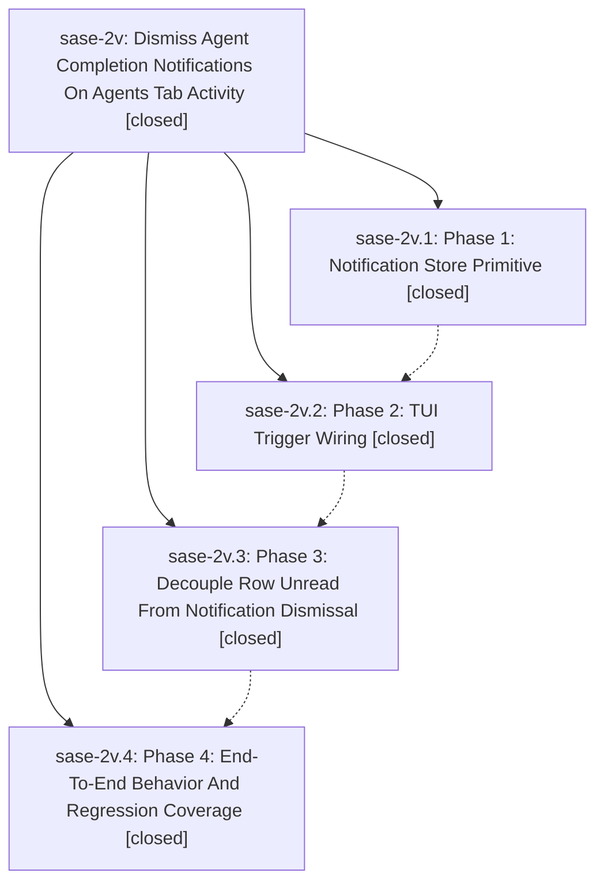

# Bead: sase-2v — Dismiss Agent Completion Notifications On Agents Tab Activity

[Bead Pages](../README.md) / sase-2v

**Status:** ✓ closed · **Resolution:** (unrecorded) · **Type:** plan · **Tier:** epic
**Owner:** `bryanbugyi34@gmail.com`
**Created:** 2026-05-11 18:28:28 UTC · **Closed:** 2026-05-11 19:19:55 UTC
**Plan:** [202605/agents\_tab\_completion\_notification\_dismissal.md](https://github.com/sase-org/sase--plans/blob/main/202605/agents_tab_completion_notification_dismissal.md)

## Notes

COMMIT: c8f12842

## Phases

| Bead | Title | Status | Size | Agents | Commits |
|---|---|---|---|---:|---:|
| [sase-2v.1](sase-2v.1.md) | Phase 1: Notification Store Primitive | ✓ closed | small | 0 | 2 |
| [sase-2v.2](sase-2v.2.md) | Phase 2: TUI Trigger Wiring | ✓ closed | small | 0 | 1 |
| [sase-2v.3](sase-2v.3.md) | Phase 3: Decouple Row Unread From Notification Dismissal | ✓ closed | small | 0 | 1 |
| [sase-2v.4](sase-2v.4.md) | Phase 4: End-To-End Behavior And Regression Coverage | ✓ closed | small | 0 | 1 |

## Lineage

## Commits

| Commit | Subject | Bead | Committed (UTC) |
|---|---|---|---|
| [`600cbe0`](https://github.com/sase-org/sase/commit/600cbe08ff619a6e6dbfbbc86c0a78978087e43f) | feat: add dismiss\_agent\_completion\_notifications wrapper (sase-2v.1) | [sase-2v.1](sase-2v.1.md) | 2026-05-11 18:40:55 |
| [`sase-core@ce58097`](https://github.com/sase-org/sase-core/commit/ce58097ea832c5dafd1f63eba3e5e57dbc2936ca) | feat: add DismissAgentCompletions notification store primitive (sase-2v.1) | [sase-2v.1](sase-2v.1.md) | 2026-05-11 18:41:24 |
| [`b9f525a`](https://github.com/sase-org/sase/commit/b9f525a0b7e7f7ab704e7727dfff1b356670686b) | feat: wire Agents-tab activity to bulk-dismiss completion notifications (sase-2v.2) | [sase-2v.2](sase-2v.2.md) | 2026-05-11 18:55:04 |
| [`be49b75`](https://github.com/sase-org/sase/commit/be49b75ba3ae7e19c95539ff60caca0bd7b39dbd) | ref: decouple per-row unread acknowledgement from notification dismissal (sase-2v.3) | [sase-2v.3](sase-2v.3.md) | 2026-05-11 19:03:52 |
| [`b95707f`](https://github.com/sase-org/sase/commit/b95707f31aa810664967ec5c95c29680892def74) | test: add end-to-end regression coverage for Agents-tab completion dismissal (sase-2v.4) | [sase-2v.4](sase-2v.4.md) | 2026-05-11 19:13:30 |
